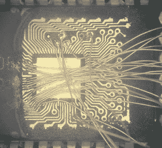

# 艰难地甩掉街机游戏

> 原文：<https://hackaday.com/2018/04/12/dumping-arcade-roms-the-hard-way/>

怀旧是一件有趣的事情。我们都渴望重温过去的记忆，这种渴望会让你做一些在其他情况下不可能做到的事情。当涉及到旧的电子游戏时，这种影响似乎更加强烈。你还能如何解释每次相同的游戏被“重制”用于下一代游戏机时，你会一遍又一遍地购买它们？但是如果那些复刻版不够好呢？

 如果你非常想玩一款 100%准确版本的老式街机游戏，你可能会有自己的工作要做。从这些机器中获取精确的 rom 非常困难，正如[CAPS0ff]博客上解释的那样，有时[需要近乎超人的工程技术](http://caps0ff.blogspot.com/2018/03/taito-c-chip-data-by-lobotomy.html)。

正如博文中解释的那样，侵入性较小的进入 Taito C-Chip 内部的方法已经被研究过了，但仍然缺乏。尽管尽了最大努力，向芯片发送解锁命令并没有产生预期的效果。如果你不能用通常的方式阅读 ROM，你需要有点创造性。

这一过程从磨掉芯片外壳开始，直到集成电路*刚好*开始变得可见。然后用酸充分暴露痕迹。然后，迹线被镀锡，并进行一些非常精细的焊接，将芯片连接到阅读器上。用这种方法从开始到结束总共要花三个小时。但最终当你能玩到 100%准确版本的*彩虹群岛*时，这一切都是值得的。至少我们是这么听说的。

如果你不知道的话，[这不是第一次](https://hackaday.com/2017/01/01/rebonding-an-ic-to-save-tatakae-big-fighter/)芯片[在【CAPS0ff】博客上被这样剥开](https://hackaday.com/2016/12/27/extracting-sounds-with-acid-and-uv/)。