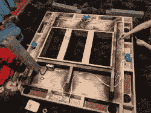

# 龙与地下城电视桌面！

> 原文：<https://hackaday.com/2018/02/20/dungeons-and-dragons-tv-tabletop/>

除了笔、纸、骰子和想象力，一群朋友可以把自己传送到另一个位面，玩涉及龙与地下城的恶作剧。Imgurian [CapnJackHarkness]是 D&D 的狂热粉丝，也是一名崭露头角的木工，他决定为他们的首个项目制作一个内嵌电视的游戏桌。

桌面是一块 4'x4 '的胶合板，从下面加固，并切割出  以容纳电视的支撑盒。每条腿都是由四块 1'x4 '的木头层压在一起，并切割成一个通道，用于桌子的电源线。外面的壁架上有骰子托盘——如果在今天的[世界](https://hackaday.com/2012/02/09/dice-gauntlet-joins-cosplay-with-dd-gaming/)还需要的话——为所有那些 20 多岁的人准备好了，还有杯托，因为没人喜欢为洒了的饮料哭泣，还有给设备充电的电源插座。泡沫方块覆盖在桌面上，如果需要的话，可以很容易地移除和清洗——但一秒钟后会有更多。[CapnJackHarkness]在木头拒绝了许多染色尝试的情况下给桌子涂上了颜色，但他们对结果很满意。

[CapnJackHarkness]以[gaming eek](https://www.youtube.com/watch?v=spdescYFqIE)制作的桌子为基础，根据他们的空间和需求进行改造。主要区别？这一点都不“便宜”除了需要购买工具和一台 39 英寸的电视，他们的成本约为 1000 美元——仅杨树就在 200-400 美元之间。此外，到目前为止，这些泡沫垫一直是一个功能性的麻烦，所以他们计划用速度布或毛毡来取代它们。

虽然电视上显示的游戏空间由 roll20 处理，但这并不意味着[CapnJackHarkness]或他们的朋友不能在他们的会话中添加一些额外的道具。

[通过[/遥控/游戏](https://www.reddit.com/r/gaming/comments/7ym90w/cheap_dd_table_build_log/)