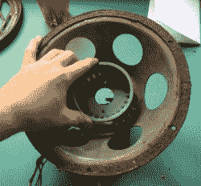

# Echo Dot 在装饰艺术风格的扬声器中找到了时髦的新家

> 原文：<https://hackaday.com/2017/10/16/echo-dot-finds-swanky-new-home-in-art-deco-speaker/>

短语*“他们不再像以前那样制造产品了”*可能最好的例子是两类产品:汽车和消费电子产品。当然，我们现在拥有的交通工具和小工具是如此先进，以至于与它们的前辈相比，它们也可以被归类为科幻小说，但是那种*风格呢？*我们的现代硬件很少能与你过去能从“*西尔斯、罗巴克和公司”*目录中买到的那种装备相提并论。

因此，当[民主党]拥有一个邪恶的复古装饰艺术风格的扬声器时，毫不奇怪，他认为这是一个绝佳的机会，通过以亚马逊 Echo Dot 为核心重建它，将一些旧学校风格带入 21 世纪。事实上，最初的设备是一个扬声器，而不是一个完整的收音机，使转换变得容易得多，并将使每个人都在庭院销售几个月，试图找到一个捐助者扬声器来建立自己的。

为了开始这个过程，[民主]打开面板，撕掉扬声器纸盆和线圈的剩余部分。幸运的是，司机过去常去的那个开口大小刚好可以放在回声点上。通过他在 Thingiverse 上找到的一个 3D 打印支架和环氧树脂的自由应用，这个点可以像它本来就应该在那里一样被扣进扬声器。

[民主]然后拿起一些绝对华丽的扬声器布在易贝和热粘在面板的内部。大概是音量旋钮被拉出底部，结果是一个完美的地方运行点的 USB 电缆。

一个稍逊一筹的人可能会称这个项目已经完成，但是[民主党]知道，如果没有彩色闪烁的发光二极管，任何黑客都不是真正完整的。内部安装了 RGB LED 灯条，光线通过布片扩散，营造出令人愉悦的微妙效果。你几乎可以想象几个真空管在里面发光。从最终产品来看，毫不奇怪[民主]有相当多的经验[将音频设备拖进现代时代](https://www.etsy.com/shop/Democracity)。

这不是第一次[我们看到一个旧的音频设备得到高科技输血](https://hackaday.com/2016/08/13/retrofitted-retro-radio/)，甚至不是第一次[我们看到 Dot 用来做这件事](https://hackaday.com/2016/08/19/retrofitting-a-vintage-intercom-to-run-amazon-alexa/)。但它肯定是我们最想看到放在书架上的。