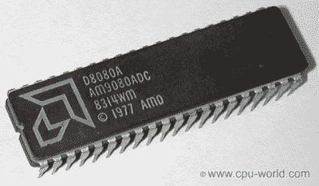
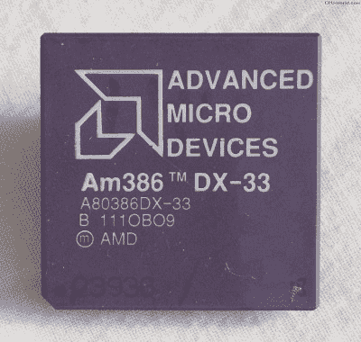
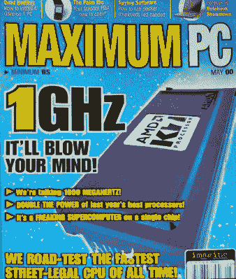
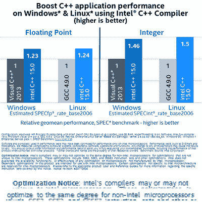

# 兔子的回声:AMD 如何赢，然后输

> 原文：<https://hackaday.com/2015/12/09/echo-of-the-bunnymen-how-amd-won-then-lost/>

2003 年，没有什么能阻止 AMD。这家公司从 20 世纪 80 年代以二次采购英特尔设计为基础的半导体公司，仅仅 15 年后就成为财富 500 强公司。AMD 火了，几乎占据了台式机 CPU 50%的市场份额，是英特尔宝座的真正挑战者。

An AMD 8080A. [source](http://www.cpu-world.com/CPUs/8080/AMD-D8080A.html).

AMD 像许多其他半导体公司一样开始了它的公司历史:从许多其他公司二次采购许多其他设计。1970 年销售的第一个 AMD 芯片只是一个四位移位寄存器。从那里，AMD 开始生产 1024 位静态 ram，更复杂的集成电路，并在 1974 年发布了 Am9080，这是英特尔 8080 的反向工程版本。

AMD 已经开始做一些伟大的事情。该公司由飞兆半导体的电气工程师[杰里·桑德斯]创建。1969 年[桑德斯]离开飞兆时，[戈登·摩尔]和[罗伯特·诺伊斯]也是飞兆的前雇员，一年前他们成立了英特尔。

虽然 AMD 和英特尔有着共同的传统，但历史证明只有一家公司会成为半导体之王。这些公司成立 20 年后，它们会发现自己处于激烈的竞争中，而在它们成立 30 年后，它们都会看到自己的命运发生变化。在很短的时间内，AMD 将取代英特尔成为 CPU 之王，但却一次又一次地跌跌撞撞，市场份额只有 10%到 20%。成功只需要优秀的工程，但 AMD 是怎么失败的？答案是英特尔。通过非法行为和道德上有问题的工程决策，英特尔将成功成为当前半导体世界的领导者。

### 摆脱二次采购 CPU

Cyrix’s P166+, a CPU faster than an equivalent Intel Pentium clocked at 166MHz. source

20 世纪 90 年代早期到中期对于微处理器和桌面计算来说是一个奇怪的时代。到那时，未来肯定掌握在英特尔手中。搭载摩托罗拉芯片的 Amiga 已经死亡，苹果已经转向 IBM 的 PowerPC 架构，但仍然只占有家用电脑市场的几个百分点。ARM 只是少数英国人眼中的一束微光，充当着被嘲笑的苹果牛顿的核心和 RiscPC 的大脑。像现在一样，计算的未来完全掌握在英特尔的几个无名工程师手中。

显然，精华已经上升到顶端，标准已经确定，新来者很快就掌握了最新的印钞方法。1995 年，Cyrix 发布了 6×86 处理器，在某些情况下，该处理器的性能超过了英特尔的同类产品。

虽然 Cyrix 在 1995 年已经存在了近十年，但他们早期的产品只有 x87 协处理器、浮点单元和 386 升级版。6×86 的发布给 Cyrix 带来了来自原始设备制造商的第一批订单，在低价的 Compaqs、Packard Bells 和 eMachines 台式机上安装了该芯片。对于成千上万的人来说，在 Cyrix CPU 的帮助下，他们的第一点互联网将通过电话线泄漏。

The Performance of a 486 for your old 386\. [source](http://www.cpu-world.com/CPUs/80386/AMD-A80386DX-33.html)

在此期间，AMD 也看到了他们的第二来源英特尔芯片的爆炸式增长。AMD 和英特尔在 1982 年达成的一项协议允许双方达成一项为期 10 年的技术交换协议，该协议赋予双方制造对方开发的产品的权利。对于 AMD 来说，这意味着克隆 8086 和 286 芯片。对英特尔来说，这意味着开发芯片背后的技术。

1992 年意味着 AMD 和英特尔之间协议的终结。在过去的十年里，原始设备制造商吞噬了英特尔 286 处理器的克隆产品，让 AMD 有资源开发自己的 CPU。其中最棒的是 Am386，它是英特尔 386 的克隆产品，速度几乎与 486 一样快，但价格却低得多。

### 一切都与奔腾有关

AMD 中断 Am386 的二次采购给英特尔营销团队带来了一个问题。从 8086 到被遗忘的 80186、286 和 486 的进程无法继续。80586 需要一个名字。在花费了几十万美元之后，一家营销公司意识到 *pent-* 是希腊语中五的前缀，于是奔腾诞生了。

奔腾是中央处理器设计上的一次巨变。386、486 和摩托罗拉的 68k 系列是相对简单的标量处理器。在这些早期的 CPU 中有一个 ALU，一个移位器和一个乘法器。万物一体，各司其职。实际上，这些处理器与《我的世界》的 CPU 没有太大区别。

 英特尔的奔腾向大众推出了第一款超标量处理器。在这种架构中，多个 alu、浮点单元、乘法器和移位器存在于同一个芯片上。解码器会在同一时钟周期内将数据转移到不同的 alu。这是当今四核处理器的架构先例，但完全不同。如果拥有两辆汽车相当于一个双核处理器，那么将两个引擎放在同一辆汽车上就相当于一个超标量处理器。

到了 90 年代末，AMD 理所当然地赢得了处理器至少与英特尔产品一样强大的声誉，而计算机杂志则报道 AMD 将取代英特尔成为最佳 CPU 制造商的消息。AMD 的股票从 1992 年的 4.25 美元增长到 2000 年初的十倍。那一年，AMD 正式赢得了千兆赫的竞赛:它推出了运行速度为 1000 MHz 的 Athlon CPU。用臭名昭著的 *Maximum PC* 封面的话说，它是有史以来世界上最快的合法 CPU。

### 英特尔的秘密

从 2000 年开始，Gateway、Dell、Compaq 和所有其他 OEM 厂商都将 AMD 芯片与 Intel 产品一起发运。这些 AMD 芯片即使与英特尔的同类产品相比也很有竞争力，但在性价比方面，AMD 将它们远远甩在了后面。大部分证据今天仍然在我们身边；在 overclockers.com 和汤姆斯硬件公司的档案深处，老布什政府默认的游戏和高性能 CPU 是 AMD。

对于英特尔来说，这是一个问题。CPU 的未来一直是高性能计算，这是对摩尔定律不可动摇的信念和应用程序将扩展到填满所有剩余 CPU 周期这一不可避免的事实赋予我们的同义反复。如果英特尔在性能竞赛中失利，一切都将结束。

因此，英特尔开始了他们的秘密策略。从 2003 年到 2006 年，英特尔向戴尔支付了 10 亿美元，作为交换，戴尔不得运送任何使用 AMD 制造的 CPU 的电脑。英特尔向原始设备制造商勒索赎金，鼓励他们只通过批量折扣的方式发运英特尔 CPU，并威胁原始设备制造商在 CPU 短缺期间给予低优先级。英特尔参与虚假广告，并歪曲基准测试结果。在美国联邦贸易委员会的一项和解协议和美国证券交易委员会的一项调查披露英特尔每年向戴尔(T2)支付高达 10 亿美元不使用 AMD 芯片后，这件事曝光了。

除了英特尔支付给 OEM 厂商回扣，让他们只销售特定的处理器之外，英特尔甚至以低于成本的价格出售他们的 CPU 和芯片组。虽然在联邦贸易委员会的和解协议中披露这一消息时，没有人真正感到惊讶，但这一消息直到 2010 年才传出，也就是英特尔开始向原始设备制造商付款的七年后。人们可能会认为，在美国联邦贸易委员会和美国证券交易委员会让 AMD 经受考验后，它的市场份额会有所增加。事实并非如此；自 2007 年以来，英特尔占据了大约 70%的 CPU 市场份额，AMD 占据了另外 25%的份额。这是英特尔在 2003 年左右为他们的编译器所做的事情，这将为 AMD 赢得一枚永久的银牌。

### 编译器的战争

英特尔做的不仅仅是芯片。隐藏在他们设计中心的是 x86 的管理者，这包括为 x86 处理器编写编译器的人。构建编译器是一项极其复杂的工作，通过适当的优化，编译器可以将代码转化为巨大的可执行文件，能够在最新的 Skylake 处理器和最早的 Pentiums 处理器上运行，代码针对中间的每个处理器进行了优化。

Intel’s compilers are the best in their class, provided you use Intel CPUs. [source](https://software.intel.com/en-us/c-compilers/iss)

虽然相隔十年制造的处理器可以看到主要的架构变化，相隔几年制造的处理器可以看到芯片特征尺寸的变化，但从中期来看，芯片制造商总是在增加指令。这些新指令——迄今为止最著名的例子是英特尔推出的 MMX 指令——为芯片提供了新的功能。新功能带来了更多的编译器优化，以及构建编译器的更多复杂性。这种针对不同 CPU 的优化和分析远不止是 GCC 中的-O3 标志；英特尔生产最快的编译器是有原因的，这完全归功于这些编译器提供的优化和评测。

从 1999 年的奔腾 III 开始，英特尔将 SSE 指令引入处理器。这组大约 70 条新指令为单精度浮点运算提供了更快的计算速度。2001 年 Pentium 4 中引入的 SSE2 扩展极大地扩展了浮点计算，AMD 被迫从 2003 年开始在其 AMD64 CPUs 中包含这些指令。

虽然英特尔和 AMD 都生产了可以充分利用这些新指令的芯片，但官方的英特尔编译器经过优化，只允许英特尔 CPU 使用这些指令。因为编译器可以针对不同的处理器优化每段代码的多个版本，所以对于英特尔编译器来说，选择不在非英特尔处理器上使用改进的 SSE、SSE2 和 SSE3 指令是一件很简单的事情。只需检查 CPU 的供应商 ID 是否为“GenuineIntel”，就可以使用优化的代码。如果找不到供应商 ID，则使用较慢的代码，即使 CPU 支持更快更有效的指令。

这是在玩基准测试，虽然英特尔编译器的这种伎俩自 2005 年以来就为人所知，但这是一种获得市场份额的令人惊讶的有害方法。

我们会被这个困住一段时间。这是因为利用这一技巧的英特尔编译器生成的所有代码都会对非英特尔 CPU 产生性能影响，使用英特尔编译器开发的每个应用在非英特尔硬件上的性能都会更差。这不是英特尔为他们的芯片编写编译器的情况；英特尔正在为英特尔和 AMD 产品中的指令编写编译器，但忽略了 AMD CPUs 中的指令。

### AMD 的未来是一个禅宗观点

我们每天都在使用两大科技巨头的产品:微软和英特尔。1997 年，微软以 1.5 亿美元的无投票权股票投资拯救了苹果。虽然回想起来这是一项伟大的投资——如果微软持有这些股票，它们将价值数十亿美元——但微软对苹果的兴趣从来都不是为了钱。这是关于不是垄断。只要苹果拥有几个百分点的市场份额，微软就可以指着库比蒂诺说他们不是垄断者。

这就是英特尔对 AMD 的兴趣。在 20 世纪 80 年代，英特尔有必要对其处理器进行二次采购。到 90 年代初，很明显 x86 将是桌面计算的未来，拥有整个市场是国会听证会和与美国电话电报公司进行比较的捷径。该系统一直运行良好，直到 AMD 开始创新，远远超出英特尔的能力。毫不奇怪，英特尔的不诚实始于 AMD 的沙拉时代，英特尔亏本出售 CPU 的做法一旦夺回市场就结束了。通过编译器优化永久禁用 AMD 处理器确保了 AMD 不会很快夺回这一市场份额。

AMD 不死符合英特尔的利益，为此，AMD 必须继续创新。这意味着抓住他们能抓住的任何市场——索尼、微软和任天堂的所有当代游戏机都采用 AMD 芯片组。这也意味着 AMD 必须卷土重来，在不到一年的时间里，这种新的芯片，Zen 架构，将登陆我们的插座。

2012 年初，最初的 Athlon 64 处理器的设计师回到 AMD 设计 Zen，这是 AMD 的最新架构，也是第一个采用 14 纳米工艺制造的架构。仅在几个月前，[Zen 的流片已经完成](http://www.kitguru.net/components/graphic-cards/anton-shilov/amd-we-have-taped-out-our-first-finfet-products/)，这些芯片应该会在一年内面向公众发布。

这是 AMD 对英特尔十年欺骗的回答吗？是也不是。人们会希望 Zen 和 K12 设计是重生的开始，这将导致自 2004 年以来从未见过的真正竞争。这些发展的产品还没有被看到，但是市场已经为竞争做好了准备。