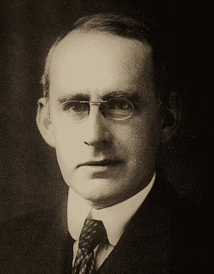
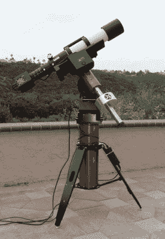

# 日食 2017:爱因斯坦是对的吗？

> 原文：<https://hackaday.com/2017/08/16/eclipse-2017-was-einstein-right/>

虽然大多数人在下周的美国大日食中跋涉到全食的道路上，随着天象的展开，他们会盯着天空，但我们怀疑许多人会试图发布一张以日食为背景的鸭脸自拍。但是至少有一个人会狂热地倾向于一项实验。

在怀俄明州的一个偏僻的山顶上，唐·布伦斯博士将试图复制一个著名的实验。如果他成功了，他不仅会完成以前只做过两次的事情，他还会提供更多的证据证明爱因斯坦是对的。

### 爱丁顿的探险

早在 1915 年，阿尔伯特·爱因斯坦首次提出了一组他研究了八年的场方程。在发表他的狭义相对论后，他寻找将引力纳入他的新框架的方法，并最终发现了一组非线性和极其困难的方程，描述了空间和时间在物质和辐射的影响下如何弯曲。

Arthur Eddington. Source:
[Wikimedia Commons](https://commons.wikimedia.org/wiki/File%3AArthur_Stanley_Eddington.jpg)

物理学界对爱因斯坦的广义相对论产生了浓厚的兴趣，并开始寻找证明它的方法。该理论的预测之一是引力透镜化，或大质量物体对光的偏转(透镜化也是牛顿物理学的预测，但爱因斯坦的场方程预测的光偏转约为经典模型的两倍)。然而，测量这种效应并不容易，主要是因为有一样东西足够大，足够近，足以使光发生可量化的弯曲，而且它本身也非常明亮——那就是太阳。

我们需要的是一次日全食，而且非常方便的是，1919 年 5 月会发生一次日全食。只剩下四年时间，世界被战争撕裂，亚瑟·斯坦利·爱丁顿爵士计划对非洲西海岸的普林西比岛进行一次科学考察。他拍摄了一系列 Hyades 星团中恒星的照片，并通过仔细测量发现爱因斯坦的预测是正确的。第二年他的成果的发表在大众媒体上引起了巨大的轰动，立即将爱因斯坦抛入公众的视线，并开启了相对论时代。

### 说来容易做起来难

奇怪的是，尽管后来进行了许多其他实验来进一步支持广义相对论，但爱丁顿日食实验直到半个多世纪后才被重复。不过，这很容易理解为什么。首先，日全食并不是很常见的现象，在容易到达的地方着陆，至少有望获得良好的观测条件的现象确实很少。直到最近，捕捉高质量图像所需的设备还很笨重，要求苛刻，并且足够精确，以测量我们这颗不大的恒星微不足道的引力影响。爱丁顿实验的唯一重复是 1973 年的一次探险，也是去非洲，使用了 6 吨重的设备在 12 英寸的玻璃板上产生了一个可用的图像。不过，来自图像的数据足以证实爱丁顿的结果。

光学的进步使得复制最初的实验最近变得更加容易，但是对于一个在过去一个世纪已经被其他方法反复验证的理论，没有太多的要求进行光学验证。事实上，为了证实广义相对论和狭义相对论，你只需要看看你的智能手机，它使用这两个方程来校正来自头顶轨道运行的 GPS 卫星云的时间信号。这是每天每一秒对理论的数百万次验证。

### 何必呢？

Don Brun’s eclipse rig: refractor telescope, CCD camera, heavy mount, and tripod. Concrete pad not included. Source: [Sky and Telescope](http://www.skyandtelescope.com/sky-and-telescope-magazine/beyond-the-printed-page/my-do-it-yourself-relativity-test/)

那么，唐·布伦斯为什么要烦恼呢？为什么他会在怀俄明的山上，祈求晴朗的天空和微风？为什么他收集了他能找到的最好的业余天文设备，进行了多次演习，侦察了位置，甚至得到许可浇注混凝土垫以确保他的望远镜在两分钟的全食期间不会移动？为什么他会走上极端？

唐的简短回答是，他这样做是为了迎接挑战。当他第一次开始考虑这个项目时，似乎自 1973 年以来光学、CCD 和计算机的进步，更不用说自 1919 年以来，将使复制变得轻而易举。事实证明，对唐来说，2017 年不会是一个天文数字。很少有足够靠近太阳的明亮恒星能提供好的参考点，而且它们的非偏转坐标数据往往精度很低。他需要测量 0.01 弧秒量级的偏转。换个角度来看，这就像在巴黎测量一支铅笔的长度，而在纽约观察它。

除了这些挑战之外，唐只有两分钟多一点的全食时间，这对日全食来说是相当短的，一片飘忽不定的云，怀俄明州高峰上的一阵风，或者一个被遗忘的细节都可能毁掉多年的努力。无论你的背景如何，作为黑客，我们都可以看到唐为自己设定了一个崇高的目标，我们都可以理解当月亮的影子在 8 月 21 日奔向他的仪表栖木时他将感受到的压力。当我在爱达荷州的有利位置观看全食结束时，我会想到唐，并希望当一切正常，你的数据让你一瞥大自然的运作时，压力会变成欢欣鼓舞。