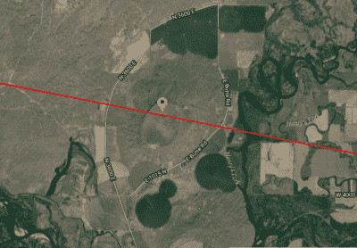

# 日食 2017:太阳走了你会在哪里？

> 原文：<https://hackaday.com/2017/08/02/eclipse-2017-where-will-you-be-when-the-sun-goes-away/>

在不到一个月的时间里，2017 年 8 月 21 日，月球将在地球上投下阴影，这是一个直径只有 60 英里的相对小点。该阴影将从北美的太平洋开始，在俄勒冈州的波特兰南部登陆，并沿对角线横扫美国。以每小时 2000 英里的速度向东南方向冲去，全食路径将经过 12 个州，然后在南卡罗莱纳州的查尔斯顿附近进入大西洋。

这些是日食的干巴巴的事实，一个 47 年来大多数美国人看不到的事件的地点和时间。但是除了科学和天体排列的自然奇观之外，还有一个简单的问题:当太阳离开时，你会在哪里？

### 火山引起的日蚀

Bullseye! The center of totality passes right through North Menan Butte in Rexburg, ID.

对我来说，答案很简单:我将位于爱达荷州东部一座死火山的顶部，正好处于全食的中间。观看日食是非常酷的；站在一个独特的地质特征上看着天空的机制在你头顶上工作会酷得多。

从我们在狭长地带的家出发，我和我的家人要花八个小时开车去梅南巴特峰。爱达荷州是一个幅员辽阔的州。我们将在南部孤峰外的私人土地上露营，可能是在相当乡村的条件下，没有很多粗糙的露营经验。好吧，没有。但我不在乎，因为我想看全食，如果我们呆在家里，我们会看到 92%的全食，但这是不够的。

当重要时刻到来时，大多数人可能会用他们廉价的纸板和塑料日蚀眼镜或遮光焊接镜头将目光投向天空，而我的眼睛将锁定在我们有利位置以西的地面上。梅南孤峰位于平坦、毫无特色的斯内克河平原上方约 500 英尺处，我打算看着月亮的影子穿过地球向我们飞来。这是对我的吸引，我希望我能看到它。

这并不是说，一旦阴影笼罩在我们身上，我就不会仰望天空，惊奇地凝视着我们的太阳大气在突然变暗的天空下的炽热舞蹈。我会沐浴在不自然的暮色中，听着我的观察者同伴的喘息和欢呼，感受突然的温度下降，这在东爱达荷旱地应该很明显。在影子向东奔向绝大多数美国人之前，我们将有大约两分钟的全食时间，我计划享受其中的每一秒钟。

### 黑客日月食聚会

除了观看日食，还有很多其他的事情可以做。全国各地的 Hackaday.io 成员正在举办[hack aday Eclipse meetings](http://hackaday.com/2017/07/21/hackaday-eclipse-meetups/)，在这里志同道合的人可以在月食前进行交流。如果你知道你将在哪里观看日食——比如一座死火山——并且你不介意与你的一些爱好者分享你的经历，一定要在[日食聚会页面](https://hackaday.io/meetup/3-hackaday-eclipse-meetups)上发布一个聚会。制作您的活动页面，我们将为您和您的客人发送一些侧面带有 Jolly Wrencher 的 eclipse 眼镜。

你开始考虑带什么去看电影了吗？有很多日食项目，从安全观看日食的针孔摄像机，到将利用局部电离层变化进行远距离联系的 Ham 操作员。我们这些有望远镜的人可能想要建造一个低成本的太阳能过滤器。有人可能会试图在总体性的道路上证明广义相对论，我们很乐意看到这种情况。毫无疑问，从智能手机到专业电影摄像机，将会有数 Pb 的照片和视频。我们希望听到您的计划并看到您的设置。即使你有一些与 eclipse 无关的很酷的东西，也要带上它。对于黑客来说，这总是一个谈生意的好时机。

### 来到黑暗面

“有什么大不了的？”你说。“整个国家至少会被日偏食覆盖。天要黑了，我要休息几分钟去看一看，哒哒哒，回到地面。”这是看待它的一种方式，也可能是大多数美国人会采取的方式。我意识到，并不是每个人都足够幸运，生活在小路附近。但是考虑到全食穿越了如此多的州，并且一旦它穿过密西西比河，路径穿过或接近许多主要的大都市地区，相当比例的美国人口可以想象到它的最佳观看位置。如果你有办法到达那里，你真的应该努力。

的确，日偏食将覆盖美国的每一平方英寸以及更远的地方，而且日偏食将比全食持续更长时间。天会黑下来，你会看到月亮在太阳表面移动。但是你会错过全食的核心景象和声音，你肯定会错过与数百万人分享独特经历所带来的友情。

不相信我的恳求吗？我不能说我责怪你。毕竟，我只是一个从未完整过的狂热的太空极客。我没有什么可以说服你的，除了我对整体将会是什么样子的期望。所以不要从我这里拿走它；请看 12 次日全食的老手:

> 对于那些在路径之外的人来说，没有戏剧性的全食时刻，没有贝利珠在月亮圆盘边缘的舞蹈，没有天空的强烈变暗，没有恒星和行星在不可能的黄昏中突然显露出来，没有日冕闪现在视野中(这种超凡脱俗的美甚至让经验丰富的月全食观察者惊讶地喘息)，也没有原始的恐惧，即使是现代人的心也如此轻微地下沉。没有漆黑的太阳圆盘，没有可辨别的温度下降，没有白天不可能的夜晚，没有闪烁的色球层或辉煌的日珥，没有地平线周围 360 度的日落效果，没有聚集的人群情绪超载的无法控制的叫喊，没有挥之不去的日食后的感觉，确定你刚刚做了你一生中最酷的事情之一。
> 
> 日偏食很有趣但容易被遗忘，而日全食是一个难忘的、改变生活的事件，它会燃烧在记忆中，永不褪色。

如果这还不能说服你尽一切努力进入整体之路，我不知道还有什么可以。我会在那里，我希望你也在那条横跨美国的 60 英里宽的道路上的某个地方。

【动画图片来源:[美国宇航局戈达德太空飞行中心/Genna Duberstein 拍摄的月球阴影路径可视化图](https://www.youtube.com/watch?v=MJgXaqW3md8)