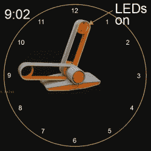
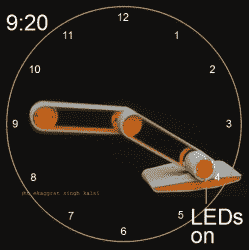
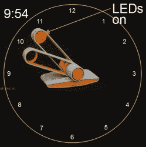

# Edgytokei 的令人难以置信的机制显示时间没有脸

> 原文：<https://hackaday.com/2018/01/09/edgytokei-time-on-the-edge/>

从日本双截棍中获得灵感，[ekaggrat singh kalsi]设计出了[一个仅使用时针和分针来显示时间的出色时钟](https://hackaday.io/project/29509-edgytokei)，当然还有一个供他们坐在上面的底座。时针在特定的时间似乎漂浮在空中，或者如他所说，坐在它们的边缘，因此得名 Edgytokei，翻译为“边缘时钟”。

一开始看时间有点困难，除非你像我们这样画了一个带数字的钟面。9:02 和 9:54 足够简单，但是 9:20 和 9:33 乍一看可能很难转化为时间。因为要使机械装置工作，两只手的长度必须相同，那么如何区分两只手呢？[ekaggrat]在底部的轮毂上有一圈发光二极管，在一只指针的末端有另一圈发光二极管。无论哪一圈发光二极管亮起，都表示分针的尖端。但是了解它如何工作的最好方法是观看下面的视频。

我们不得不佩服他实现的简单和干净。肘部和底部的轮毂都隐藏了一个带齿轮的步进电机。指针内部的齿轮轨道与电机齿轮相互作用来移动指针。为了保持清洁，电力传输使用外部的铜带。

在 Hackaday.io 页面上,[ekaggrat]谈到了提出算法的难度，特别是将指针归位到 12:00 位置的代码，因为指针可以在任何方向启动归位。手的位置用 g 代码编码，一个借来的 g 代码解析器运行在底部的 Arduino Nano 上控制着一切。

[ekaggrat]似乎是制造这种创意时钟的大师。看看这个[涂鸦钟，它使用了一个含有铁屑的磁性书写板](https://hackaday.com/2015/10/06/robot-clock-writes-time-over-and-over-and-over/)，还有这个 [TORLO 钟，它的指针在艺术暴露的定时齿轮的控制下沿着边缘运行](https://hackaday.com/2017/06/08/torlo-is-a-beautiful-3d-printed-clock/)。

 [https://www.youtube.com/embed/k-Uw58mxLV4?version=3&rel=1&showsearch=0&showinfo=1&iv_load_policy=1&fs=1&hl=en-US&autohide=2&wmode=transparent](https://www.youtube.com/embed/k-Uw58mxLV4?version=3&rel=1&showsearch=0&showinfo=1&iv_load_policy=1&fs=1&hl=en-US&autohide=2&wmode=transparent)

