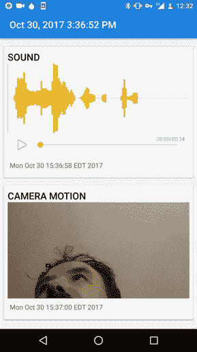

# 爱德华·斯诺登为间谍引进婴儿监视器

> 原文：<https://hackaday.com/2017/12/24/edward-snowden-introduces-baby-monitor-for-spies/>

著名的告密者【爱德华·斯诺登】[最近在 YouTube 上宣布了 Haven](https://www.youtube.com/watch?v=Fr0wEsISRUw) :一个开源应用程序，旨在让注重安全的用户免费将旧的未使用的 Android 智能手机和平板电脑变成高科技监控设备。虽然可以说 Haven 没有做任何市场上已经不可能的软件，但事实上它是开源的，并且完全是为了安全而设计的，这使得它比迄今为止可用的软件更有吸引力。

由[新闻自由基金会](https://freedom.press)开发的  ，Haven 被宣传为监视国家的某种角色转换。Haven 允许用户使用这些传感器来进行自己的监控，而不是智能手机的麦克风和摄像头来监视其所有者。它也不局限于摄像头和麦克风，Haven 还可以从智能手机的环境光传感器和加速度计中提取数据，以帮助确定何时有人移动了设备或进入了房间。甚至还支持监控设备的电源状态:因此，如果有人试图拔掉设备或切断房间的电源，切换到电池将触发监控活动。

由于 Haven 的开源性质，希望继续开发(社区和其他)将会看到应用程序功能的扩展。为了给出一个潜在增强的例子，[斯诺登]提到了使用智能手机的气压计来检测门窗打开的可能性。

对于大多数商用运动激活监控系统，如 Nest Cam，该设备需要持续的互联网连接和订阅。另一方面，Haven 被设计为在本地设备上做任何事情，而不需要连接到互联网，因此入侵者不能只是破坏你的 Wi-Fi 来扼杀你的所有监控。一旦 Haven 看到或听到一些它想让你知道的事情，它可以通过标准的短信发送警报，或者如果你真的关心安全，端到端加密的[信号](https://signal.org)。

需要广告中所说的那种安全避难所的人数可能很少；除非你是一名报道腐败案件的记者，或者是一名策划政变的革命者，否则你可能会对现有的解决方案感到满意。也就是说，我们在自己的页面上介绍了许多[个人，他们花费了大量的时间和精力](https://hackaday.com/2017/10/21/fruitnanny-the-raspberry-pi-baby-monitor-for-geeks/)开发[他们自己的远程监控解决方案，这些解决方案似乎与 Haven](https://hackaday.com/2017/12/08/a-wireless-webcam-without-a-cumbersome-cloud-service/) 的目标重叠。

因此，即使你的日常生活更像是无名氏而不是詹姆斯·邦德，你也可能想去看看 Haven 的 GitHub 页面，或者甚至是 T2，把它安装在市面上一部极其便宜的 Android 手机上，然后试一试。

 [https://www.youtube.com/embed/Fr0wEsISRUw?version=3&rel=1&showsearch=0&showinfo=1&iv_load_policy=1&fs=1&hl=en-US&autohide=2&wmode=transparent](https://www.youtube.com/embed/Fr0wEsISRUw?version=3&rel=1&showsearch=0&showinfo=1&iv_load_policy=1&fs=1&hl=en-US&autohide=2&wmode=transparent)

