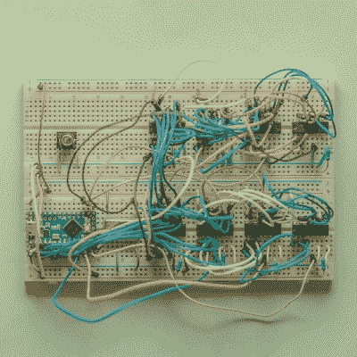

# 八首 SEGAs 演唱

> 原文：<https://hackaday.com/2018/01/08/eight-segas-singing/>

早在黑暗时代，在普通电脑能够播放高质量的录音之前，事情的处理方式是不同的。音乐和声音作为指令存储在音频合成芯片上，内置于 80 年代和 90 年代的计算机和控制台中。这些芯片和它们独特的声音有一种特殊的怀旧情绪，这是这个时代的关键，使它们在今天很受欢迎。为此， [[little-scale]决定从世嘉 Master 系统中连线 8 个芯片来取悦你的耳朵。](http://little-scale.blogspot.com.au/2018/01/oct-sn76489-midi-array.html)

The chips, laid out on a breadboard with a Teensy LC running the show.

问题中的芯片是 SN76489，[我们也注意到它也用于世嘉 Genesis。](https://hackaday.com/2017/02/17/sega-genesis-chiptunes-player-uses-original-chips/)它包含 3 个方波音调发生器，以及一个噪声通道。加上八个可以玩的，总共有 32 个频道。为了驾驶这些车，[小规模]决定走 MIDI 路线。为了避开 16 个通道的 MIDI 限制，他决定将频率范围分成两半。每个 MIDI 通道寻址两个 SN76489 通道，高音用于一个通道，低音用于另一个通道。所有这些 MIDI 数据都被传递到一个 Teensy LC，它处理音符数据的移调以使一切恢复正常，并处理八个芯片以创建一个美丽的方波交响乐。

这是一种以令人愉快的复古方式创造不和谐声音的好方法，如果你想重现这一壮举，可以使用[代码。](http://milkcrate.com.au/_other/downloads/arduino/oct_sn76489.ino)我们想知道的是——去年你最喜欢的声音芯片是哪一个，你有多希望其中的八个能唱得如此和谐？

 [https://www.youtube.com/embed/AirUEPoIYxo?version=3&rel=1&showsearch=0&showinfo=1&iv_load_policy=1&fs=1&hl=en-US&autohide=2&wmode=transparent](https://www.youtube.com/embed/AirUEPoIYxo?version=3&rel=1&showsearch=0&showinfo=1&iv_load_policy=1&fs=1&hl=en-US&autohide=2&wmode=transparent)

