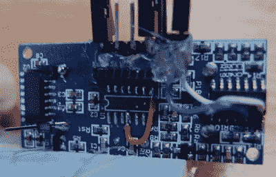
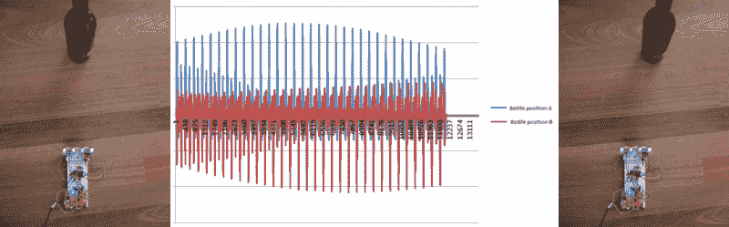

# 埃尔齐普相控阵声纳

> 原文：<https://hackaday.com/2015/12/04/el-cheapo-phased-array-sonar/>

声纳是一个很好的传感器，可以添加到任何小型机器人项目中。只需几美元，无处不在的 HC-SR04 模块就能轻松实现。但是，如果你曾经使用过这些简单的声纳装置，你无疑会注意到，你只能获得一条信息——说话者指向的最近物体的距离。不一定非要那样。[Graham Chow] [使用两个 SR04 模块](https://www.hackster.io/graham_chow/spread-spectrum-phased-array-sonar-018e22)构建了一个简单的相控阵，看起来他得到了不错的结果。

 这种黑客从拔掉微控制器并直接驱动电路板开始，这种黑客的灵感来自[【Emil】对 SR04s](http://hackaday.com/2014/03/17/good-vibrations-giving-the-hc-sr04-a-brain-transplant/) 的逆向工程。一旦[格雷厄姆]能够控制声纳脉冲并读取结果，有趣的事情就开始了。

[Graham]使用 [TI 的 Cortex M4F LaunchPad 评估套件](http://www.ti.com/tool/ek-tm4c123gxl)产生 ping 并接收反射。使用普通声纳时，从发送 ping 到接收到 ping 的时间取决于到目标的距离。在一个[相控阵](https://en.wikipedia.org/wiki/Phased_array)中，在这种情况下只有两个模块，ping 返回到每个模块所用的时间差被用来确定到目标的角度。

如果你精通 DSP，[Graham]使用的是相移方波信号，因此发送和返回信号的相关性具有更好的峰值。这也有助于阵列中两个 SR04s 的相关峰值。我们认为[格雷厄姆]在移动他的酒瓶时，解决了几度的角度分离，这非常棒。有了几个 SR04 单元，[格雷厄姆]可以开始[获取高度信息。](http://hackaday.com/2014/08/24/a-virtual-touchscreen-3d-ultrasonic-radar/)

没有太多的划痕，[格雷厄姆]自己有一个实验设置，让他玩一些相当沉重的信号处理。我们印象深刻，迫不及待地想知道接下来会发生什么。特别感谢[Graham]张贴[代码](https://www.hackster.io/graham_chow/spread-spectrum-phased-array-sonar-018e22#code)。

谢谢[joo]的提示！