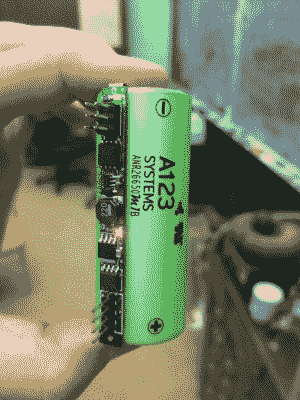

# 拥有全新一切的电动长板

> 原文：<https://hackaday.com/2017/08/21/electric-longboard-with-all-new-everything/>

我们爱【lolomolo】的开源[电长板](https://hackaday.io/project/26899-electric-longboard-markii)项目。为什么？因为他在整个大学期间都在做这个项目，完全重新设计了一切。他解决了每一个挑战，无论是电子的还是机械的，最终他自己制造了一切。

48 英寸 x 13 英寸的甲板采用了碳纤维和波罗的海桦木，是一种相当独特的结构。在测试甲板时，[lolomol]发现在 500 磅的情况下挠度不到一英寸。在另一端。他修改了 Caliber II 卡车，增加了四个 2250W Turnigy Aerodrive 无刷外转轮，在皮带的帮助下驱动车轮。电机由 VESC 控制，这是一个开源的速度控制器。有很多有趣的细节，像 A123 锂电池配备了定制的电池管理系统 PCB。

该电路板配备了 5W RGBW 大灯，非常亮，他只能在 10%的 PWM 下运行，加上 RGB LED 照明。所有这一切都由板载 Linux 系统控制。您可以查看[lolomolo]的 [GitHub 库](https://github.com/lolomolo/LongboardMarkII)中的代码、原理图和 CAD 文件。他对这个项目的指导也有更多的设计笔记和想法。

如果甜美的长板是你的囊中之物，那就看看我们之前发布的 [3D 打印长板](https://hackaday.com/2016/10/11/3d-printed-electric-longboard-courtesy-of-stratasys/)和[长距离电动长板](https://hackaday.com/2017/01/04/another-electric-longboard-goes-the-distance/)。