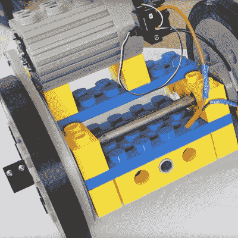

# 电动滑板摇滚巨型乐高

> 原文：<https://hackaday.com/2017/07/21/electric-skateboard-rocks-the-giant-lego/>

[詹姆斯·布鲁顿]用他自己打印的超大乐高积木制作了一个电动滑板，并为滑板配备了一个经典电机的完美再现。

他开始从 Thingiverse 下载砖块、齿轮和滑轮设计，并将其打印成正常尺寸的五倍，耗时 600 小时。桥面由 8 米长的技术砖和 4 米宽的横向砖组成，顶部覆盖有板。甚至还有一个 5×6 的巨型盘子，这显然是由参数化砖块设计提供的，因为你在乐高的官方零件中找不到这种配置。

 这个项目最酷的部分可能是【詹姆斯】对一个老式乐高马达的再创造。他估算了一个 6216M Technic 电机，该电机最初额定为 4.5V，在一个 1.5 kW、24V 的电机中，该电机由一个 120A ESC 控制，并由一对串联的 Turnigy 5000mAh LiPos 供电。

[James]不得不在 Blender 中设计自己的外壳，因为找不到原始乐高零件的文件——pro tip for the future，LDraw 有 [6216 设计](http://www.ldraw.org/cgi-bin/ptdetail.cgi?f=parts/6216m.dat),可以放入 Blender 中。

另一个不错的接触是车轮，轮毂基于加大的 40 齿技术齿轮，配有 Ninjaflex 轮胎，每个轮胎重 0.5 公斤，花了 32 个小时打印。

我们已经出版了很多[詹姆斯]的作品，包括他的 [BB-8 模型](http://hackaday.com/2016/01/09/very-detailed-bb-8-robot-build/)和他的一些[其他星球大战模型](http://hackaday.com/2016/12/10/speed-run-james-brutons-star-wars-builds/)。

 [https://www.youtube.com/embed/8BO0VNhUZu8?version=3&rel=1&showsearch=0&showinfo=1&iv_load_policy=1&fs=1&hl=en-US&autohide=2&wmode=transparent](https://www.youtube.com/embed/8BO0VNhUZu8?version=3&rel=1&showsearch=0&showinfo=1&iv_load_policy=1&fs=1&hl=en-US&autohide=2&wmode=transparent)

 [https://www.youtube.com/embed/-IoDfen-_kg?version=3&rel=1&showsearch=0&showinfo=1&iv_load_policy=1&fs=1&hl=en-US&autohide=2&wmode=transparent](https://www.youtube.com/embed/-IoDfen-_kg?version=3&rel=1&showsearch=0&showinfo=1&iv_load_policy=1&fs=1&hl=en-US&autohide=2&wmode=transparent)

