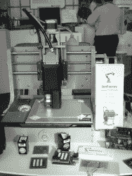
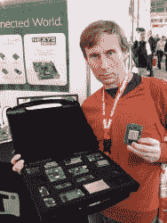
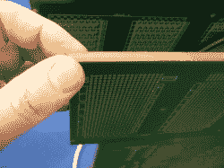
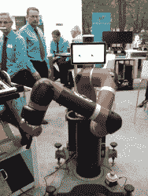
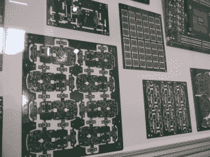
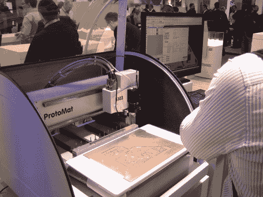
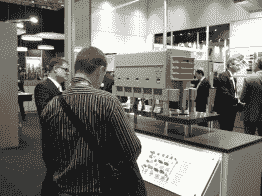
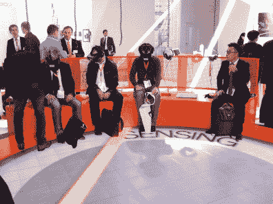
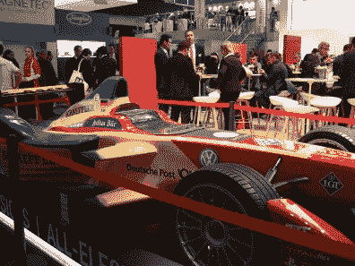

# 2016 年电子展:太多的电子产品

> 原文：<https://hackaday.com/2016/11/14/electronica-2016-too-much-electronics/>

慕尼黑的电子展规模如此之大，以至于每两年才举办一次。每一个电子产品的制造商、经销商和制造者都在那里。为了对事物的规模有一个感觉，电子展分布在 12 个大型展厅中，由两个独立的地铁站提供服务，一端一个。你不会想到世界上会有这么多电感制造商，但你错了。

这是硬件极客的天堂，尽管它的目的更多的是促进行业联系，而不是为卑微的黑客服务。但是很高兴看到那里有什么，询问我们最喜欢的芯片制造商的代表他们正在做什么，并且只是到处逛逛。你可能无法在日常生活中使用几千兆赫的望远镜，但你可以在电子展上亲自动手操作。尽管直接与我们的大型制造商的代表交谈很酷，但检查一下那些你以前从未听说过的公司的创意边缘可能更有趣，尽管他们有很好的想法。

### 标签连接

标签连接(Tag-Connect)是一个简单的想法，完美地解决了我们个人一直存在的一个问题:暂时将编程或调试引脚连接到 PCB 上。它基本上是一个完整的编程引脚夹具和一个连接器之间的交叉:几个定位销穿过电路板上的孔，用于将 pogo 引脚与其目标完美对齐。诀窍在于，这使得编程接头的成本几乎为零——几个孔和一些铜焊盘——就像完整的引脚接头或测试夹具一样容易对齐。他们最酷的连接器有小夹子，当电路板在工作台上时，夹子可以把连接器固定在电路板上。

[尼尔·谢尔曼]本人也在那里，他似乎有点惊讶，我会直接告诉他，我非常喜欢他的想法，以至于我已经在家里试验过了，但当我提到它是在自制的 PCB 上供个人使用时，他又放心了。如果你开始寻找，你会发现他的连接器足迹无处不在:在 TI、Microchip 和其他公司的开发板上。

### 僵尸工厂

 我们还碰到了一些僵尸工厂的人。我们之前实际上已经报道过他们的[多功能一体 PCB 机](http://hackaday.com/2014/08/14/circuit-printer-doubles-as-a-pick-and-place/)，但是亲自看到它还是很有趣的。它放置导电墨水和焊膏，然后有一个可以填充新迹线的取放头和一个可以将零件回流焊接到位的加热床。原则上，这是一台完整的 PCB 制造机器。这台机器几乎是自我复制的:生产印刷电路板是外包的，但他们在自己的制造链中使用它的取放和焊接功能，这最终比在室外完成更便宜。酷毙了。

## 安蒂·卢卡茨

 在 Digilent 展台查看原型制作板时，我们遇到了【Antti Lukats】，他是 [Hackaday 奖决赛选手](https://hackaday.io/project/6592-dipsy)，也是一个说到 FPGA 就应该知道的全能好人。在他的黑匣子里有一个[疯狂的多核 Zynq 板](http://www.trenz-electronic.de/products/fpga-boards/trenz-electronic/te0808-zynq-ultrascale.html)，它有 14 个 DC/DC 转换器和 13 个 LDO 来支持它的所有电源域。

我们还聊了聊开源 FPGA 工具链的状态，只有晶格 Ice40 芯片的 [Icestorm](https://hackaday.com/tag/icestorm/) 。他表示，我们即将为一些未指定的 Xilinx FPGAs 获得开源流，这将是一个巨大的惊喜。[ [克利福德](https://hackaday.com/2015/12/29/32c3-a-free-and-open-source-verilog-to-bitstream-flow-for-ice40-fpgas/)，如果你在那里，想给我们发送提示，你有[我们的电子邮件地址](mailto:tips@hackaday.com?subject=[FPGA])。

### 40 层 PCB

 定制 PCB 板屋[来自法国的 Cibel](http://www.cibel.com/en) 让我们看到了他们的展示:一块约一厘米厚的 PCB。我们走到它面前，拿出我们的相机，他们的代表甚至在我们提问之前就回答了我们的问题:40 层。他们为 IC 制造业制造高密度测试板，他们需要那么多层来制造基本上是桌面大小的分线板。

除了 Cibel 之外，还有一整个展厅的 PCB 制造商在展示他们的产品，竞争最高的分辨率，在最奇怪的基底上印刷，并切割出最复杂的轮廓。我们不必在 Hackaday 这里隐藏我们的秘密耻辱:它太美了！

### 激光焊接

我们不知道有自动激光焊接机，它的工作原理是将一团焊膏分配到一个引脚上，然后用红外激光猛烈撞击，足以熔化一个接头。但我们得去看看实际情况。这也将是一个整洁的 DIY 设备，因为它基本上只是一个 3D 打印机底盘，带有一个牙膏分配器和一个高瓦数的红外二极管激光器，绑在你能找到热端的地方。

它每秒可以完成一个接头，主要优势是它只加热一个特定的接头，因此电路板上的其他温度敏感器件不受影响。这位代表说它被用于汽车行业，但是我们想要一个家用的。我们拍不出好照片，因为一切都发生在一个不透明的盒子里，这是使用高功率激光的好方法。

### 机器人和自动化

 测试馆里有许多令人惊叹的自动化，但机器人已经接管的最确定的标志是看着 [Sawyer 机器人](http://www.rethinkrobotics.com/sawyer-intera-3/)做它的事情。如果你关注巴克斯特机器人的发展，它有望成为一个与人类兼容的轻工业机器人，可以快速训练，自动完成简单的重复性任务。Sawyer 是一只独臂 Baxter，但是在那只手臂上有额外的自由度。这是一个柔顺的机器人——在马达和手臂的坚硬部分之间有弹簧——你可以看到它在移动时轻微的颤动。

弹簧和机器人其他部分的意义在于，当它遇到意想不到的阻力时，比如当它撞到你或你抓住它的手臂时，它可以感觉到。在后一种情况下，它会停下来，等着你操纵它，教它一个新的动作。它有摄像头，旋钮和更多的软件智能，使重新训练机器人看起来非常容易。我们不开法拉利，但如果我们甚至想这样做，我们会买三个这样的机械臂。

## 随机图库

我们拍了许多照片。这些是我们公开展示的。如果你曾经在 11 月份的偶数日来到德国，你应该来参加电子音乐节。给我们写封短信，我们一起出去玩！

  Washable LED Yarn  Do Not Eat the Ferrites  PCB Porn  One of Many PCB Mills  You Like Plastic Standoffs?  This Connector is Too Large  Jacking In to the Matrix  One of Three Fancy Race Cars: This one Electric

横幅和缩略图由 Electronica 2016 提供