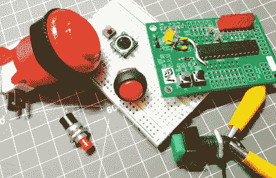
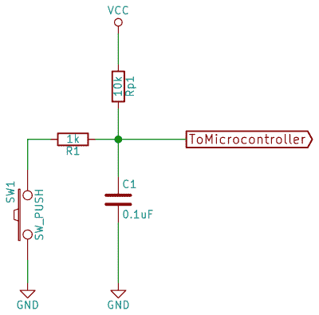
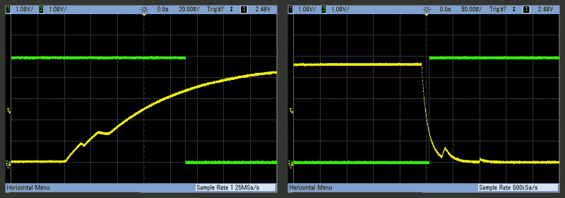

# 嵌入埃利奥特:消除你嘈杂的按钮，第一部分

> 原文：<https://hackaday.com/2015/12/09/embed-with-elliot-debounce-your-noisy-buttons-part-i/>

“嘶…嘿伙计！想看看斯波坎这边最甜蜜的小跳跳吗？过来这边。跨过那些移位运算符，它们不会咬人。现在看看这位美女:我称她为终极反跳者！”

每个使用微控制器的人最终都会遇到[开关弹跳](https://en.wikipedia.org/wiki/Switch#Contact_bounce)或“抖动”的问题，几乎每个人都有自己喜欢的解决方案。有些人用硬件解决，有些人用软件解决。一些黑客理解 chatter，而其他人只是剪切和粘贴经典的套路。有些人甚至试图忽略它，他们甚至可能很幸运，但每个人的运气都有耗尽的时候。

在接下来的两期“嵌入 Elliot”文章中，我将稍微介绍一下弹跳，研究一下用简单的方法和正确的方法实现硬件去抖，并构建一个基本的软件例程，演示一些原理并运行良好，尽管它没有经过优化。我们会打好基础。

在下一期文章中，我将介绍我个人最喜欢的去抖程序。这是对标准的一个小改动，但加入了一些值得传播的特殊调料。我称之为终极去抖器(tm)，但它能经得起黑客评论者的审查吗？(这是一个扣人心弦的故事吗？！？)

不过，现在让我们来看看开关弹跳以及在硬件和软件中解决这个问题的标准方法。

## 问题是

对你和我来说，当你按下一个按钮时，它从一个开路变成一个闭路，这个单一的转换定义了按钮“按下”。但对我们来说如此清晰的原因是因为我们对事物的感知相当缓慢。对于微控制器来说，每秒钟可以测试几百万次按钮的状态，这根本不是开关。

当你按下一个普通的按钮时，两块金属会相互接触。如果这两个微小的金属片不是完全平的或完全对齐的(它们不是)，那么它们可以接触和断开几次，然后足够牢固地挤压在一起，使它们总是导电。对于一个微控制器来说，当你认为你只按了一次的时候，这个按钮看起来是在极短的时间内被按了很多次。去抖就是确保您和微控制器在按钮按下或释放事件发生时达成一致。

[](https://hackaday.com/wp-content/uploads/2015/11/debounce_bouncing.png)

这是我按下和释放连接到微控制器的普通触觉开关的一些示波器曲线。这个特殊的按钮在发布时比在按下时更糟糕，几乎每次都来回跳动，时间也更长。以至于我不得不在瞄准镜上使用不同的时间刻度来显示它们。但是，看看电压在最终稳定下来之前是如何在逻辑高电平和逻辑低电平之间转换的吧？这就是弹跳。

在解决去抖问题之前，让我们停下来想一想按钮反弹什么时候重要。如上所述，我们和微控制器不一致的只是按钮按压的有效*次数*。几毫秒后，我们都同意这个按钮当前是否被按下。只有在快速转变的过程中，我们才会产生分歧。

[](https://hackaday.com/wp-content/uploads/2015/12/button_collection.jpg) 所以如果你的代码只需要确定一个按钮已经被按下*，按钮反弹可能并不那么重要。要在按下按钮时点亮 LED 并在松开按钮时关闭 LED，您不需要去抖；看着光的人不会注意到它的闪烁如此短暂。您的代码可能会在开和关状态之间来回浪费一些周期，但这不太可能是灾难性的。*

 *当你关心计算按钮被按下的次数时，按钮弹跳是最重要的。我们都知道去抖性能差的旋转编码器跳步的挫败感——从 90 年代中期开始，我遇到过的几乎所有汽车收音机都受到这种困扰。如果具有超高分辨率世界观的微控制器比我们看到更多的转换，事情就会出错。我们需要解决这个问题。

## 用硬件修复它

关于接触反弹的好消息是，它可以通过一点点硬件完全消除。你可以做得“足够好”或者你可以做得正确，但是如果你要物理地去抖你的按钮，你可以阅读这一节的其余部分，然后继续工作，忽略下面的软件傻瓜，甚至这个系列的第二部分。硬件问题的硬件解决方案有一定的逻辑。

大多数微控制器都有内部上拉电阻，可以针对任何给定的 GPIO 引脚激活。当按钮没有被按下时，通过将电压从地电位拉回来，你可以在按钮上建立一个明确的逻辑状态。功能更强大的微控制器允许您选择引脚上的上拉或下拉电阻，甚至选择可能的电阻值等。重要的是，我们有一个值为`R[p1]`的内部或外部上拉电阻，当按钮未接地时，它将按钮的微控制器端保持在逻辑高状态。

然后我们按下按钮。在最终稳定下来之前，按钮连接和断开接地。我们希望消除这些波动。或者如频域工程师所说，我们希望对输入进行低通滤波。无论从哪个角度看，解决方案都很简单，只需增加一个电阻和一个电容。

[](https://hackaday.com/wp-content/uploads/2015/11/debounce-sch.png)

最简单的硬件解决方案是用一个电阻和电容去抖，这在大多数时候*是有效的*。这是一种低成本解决方案，采用表贴器件，占用的电路板空间很小。实际上，您选择`R`和`C`，以便乘积`R*C`(分别以欧姆和法拉为单位)在您想要去抖的时间范围内。这里，我使用微控制器的内部上拉电阻，约为 10K 欧姆，以及一个 100nF 的电容，释放时间为 0.001 秒(1 毫秒)。印刷机使用一个 1K 电阻，它必须显著低于上拉电阻，以保证开关建立在低电压上。这是必要的，因为直接通过开关释放电容会产生不必要的高频电压噪声。

然而，简单的`RC`过滤器仍然只是部分解决方案。例如，如果它在 5V 下运行，您的微控制器希望在 2.5V 时在逻辑低电平和高电平之间切换。虽然滤波器可以很好地平滑事情，但它不能保证您不会在电容器上的电压达到 2.5 V 时发生不幸的反弹。如果您选择足够大的`RC`乘积，大多数情况下您都不会受到影响。

### 滞后:全面解决方案

为了始终保持正确，您需要的是一个尽可能快速地通过模糊的中轨电压区域的电压信号。使用具有[迟滞](https://en.wikipedia.org/wiki/hysteresis)的预处理逻辑芯片来清理开关动作是很常见的。像 74HC14 或 40106 这样的逻辑芯片将为您做到这一点。

[](https://hackaday.com/wp-content/uploads/2015/11/hysteresis1.png) 在我们的例子中，迟滞意味着不是一个电压阈值，就在中间，有两个:最大逻辑电压的三分之一和三分之二是常见的。具有迟滞的开关在上次处于低状态时使用上限阈值，在处于高状态时使用下限阈值。这使得两个阈值之间的范围成为一个“死区”，不会发生切换，这完美地解决了我们的问题。

(请注意，自动调温器正是这样工作的——它们在低于设定值的情况下启动加热器，然后再关闭加热器。如果恒温器不这样工作，你的加热器就会随着一度的微小变化而来回摆动。)

理想的硬件解决方案很简单:一个电阻和一个电容来平滑纹波，一个 74HC14 来提供迟滞。一个五毛钱的芯片和一把无源器件就可以轻松搞定最多六个按键，软件方面完全不用考虑。挑剔的人会注意到，我们的下拉电流是上拉电流的两倍。没关系——按钮通常在松开时比按下时反弹得更多。

这里，黄色轨迹是`RC`滤波器的平滑输出，绿色轨迹是通过反相器后的信号。你可以看到，在按下和释放时有相当大的反弹——这是我收集的最差的按钮——但它基本上被过滤器平滑掉了。你也可以看到动作的迟滞。请注意反相器使用的两个电压阈值:上升时，它在 3.3V 左右切换，下降时，在 1.5V 左右切换。

[](https://hackaday.com/wp-content/uploads/2015/11/proper_debouncing_scope.png)

我为这里的图表挑选了这两个相当糟糕的过渡——我可能按了 50 次按钮才得到这两个例子。但它们也说明了当你只过滤反弹时会出什么问题。左侧按钮按下事件中的纹波危险地接近 2.5V 中轨开关阈值。这就是为什么你要在微控制器之前使用一个带迟滞的反相器。

总之，在硬件中修复接触反弹很简单，至少在这个时间尺度上是这样。如果你觉得幸运，你可以用一个电阻和电容过滤按钮的信号。如果你的按钮真的很脏，或者你只是想把工作做好，一个带滞后的逆变器可以让你放心，而且只需 50 美分就可以覆盖 6 个按钮。

## 用软件修复它

我通常喜欢用硬件解决硬件问题，而不是软件。另一方面，除了不需要额外的部件之外，软件解决方案的美妙之处在于它是一劳永逸的解决方案:让自己适应特定的去抖例程，然后就可以在余生中导入那个库。或者你想要几个。无论如何，编写代码是一项前期成本，您只需支付一次。此外，去抖套路也可以很有趣。

但请记住上面的硬件示例，并确保在我们研究算法时，您看到的是未经过滤的有弹性的信号。毕竟，这是我们正在努力应对的现实。

概括地说，我见过三种类型的去抖程序。(可能还有更多！)

1.  第一种，也是最简单的一种，试图等到弹跳停止后再声明按钮按下或释放。如果开关在一段延迟时间后仍在跳动，它会再次延迟，直到开关稳定。出于显而易见的原因，我将这些例程称为**延迟去抖器**，这就是我今天要解决的问题。
2.  还有**基于计数器或积分器的去抖器**，开关阈值有或没有迟滞。这些分别相当于上面的`RC`滤波器或带反相器的`RC`滤波器。我们不会详细讨论这些，但我有下面的链接。
3.  最后，我们将在下一期讨论基于**模式的去抖器**，它考虑了相对较长时间内开关电压输出的整体模式。(我说的太多了！)

### 休息一会儿

基于延迟的去抖器等待弹跳出来。毕竟，人类时间和计算机时间的不匹配并没有那么长。比方说，你的按钮从来不会弹跳超过五毫秒。当微控制器因为弹跳阶段开始而注意到向下转换时，我们让它等待 5 毫秒，然后再次测试。如果它仍然被按下，则声明已经发生了一次按下。如果不是，那只是一次反弹，所以我们重复这个循环。

不过，请注意这需要什么。要检测单个按钮按下事件，我们需要知道按钮在按下之前的状态，现在是什么状态，然后我们需要等待并再次检查。即使在“最简单”的例行公事中，也有很多事情要做。我们不仅需要跟踪按钮的当前状态，还需要跟踪它过去的状态。

为了清楚起见，我假设您知道如何读取特定微控制器上的按钮状态，函数`read_button()`会处理这些。对于上拉电阻，按下按钮将读取逻辑低，因此您可能还需要反转逻辑。对于 AVR 目标来说，这可能和测试`( (PORTD & (1 << PD2)) == 0 );`一样简单。对于 Arduino，我们说的是`digitalRead(pin_whatever) == 0`。

```

enum ButtonStates { UP, DOWN, PRESS, RELEASE };

enum ButtonStates delay_debounce(enum ButtonStates button_state) {        
    if (read_button()){                      /* if pressed     */
        if (button_state == PRESS){
            button_state = DOWN;
        } 
        if (button_state == UP){
            _delay_ms(5);
            if (read_button() == 1){
                button_state = PRESS;
            }
        } 
    } else {                                 /* if not pressed */
        if (button_state == RELEASE){
            button_state = UP;
        } 
        if (button_state == DOWN){
            if (read_button() == 0){
                _delay_ms(5);
                if (read_button() == 0){
                    button_state = RELEASE;
                }
            }
        }
    }
    return button_state;
}

```

我们为按钮定义了四种可能的状态:静止状态`UP`和`DOWN`以及过渡状态`PRESS`和`RELEASE`。请注意，该函数既接受输入又返回一个`ButtonStates`值——您的代码像这样调用该函数`bs = delay_debounce(bs);`。使用这种策略，调用代码存储按钮状态，去抖器知道它被调用时的前一个状态。

如果按钮当前被按下，有两种可能性很重要——要么按钮上次被按下，我们处于按下状态，要么按钮上次被按下，我们进入可能的按下事件。代码在得出任何结论之前等待并重新测试按钮。未按下按钮的代码是类似但相反的逻辑。

注意，对去抖例程的连续调用将它从刚按下的过渡状态转移到“按钮已按下”状态，在这种状态下，当有人敲击它时，它将花费大量时间。如果您的应用程序代码是计算按钮按压次数，那就简单了:只需在更新后测试`if (bs == PRESS)`。保证每次按键只处于`PRESS`状态一次，下一次调用会将其推入`DOWN`。呜！

### 缺陷

这个简单片段的基本缺点是，您必须知道最长的反弹事件将持续多长时间。这很棘手。触点中的灰尘或油污、空气中的湿度和老化部件等因素会改变设备使用寿命中所需的暂停时间。您可能会高估反弹超时，而不是低估它。五毫秒够吗？十点怎么样？杰克·甘斯勒喜欢 20 到 50 毫秒。

我上面写的特定代码的其他缺点是它很慢——所有那些嵌套的`if`语句都很昂贵。您可以通过使用`else` s 来去掉几个，我经常这么做，但是这会使代码可读性稍微差一点。

我还对延迟使用了阻塞等待，这意味着在按钮被解决之前，CPU 不能完成任何工作。那可不行。Arduino“Bounce”库使用了类似的方法，用非阻塞的`millis()`来计算时间，这绝对是一个改进。一般来说，如果您手头有一个系统时钟，这是比使用阻塞等待更好的选择。对于主频为兆赫的 CPU 来说，浪费五毫秒的时间是一个永恒。

### 野外软件去抖器

如果一个去抖程序对你来说还不够，看看我们 2010 年的超级去抖综述。有趣的是，它们中的大多数都是这里介绍的延迟去抖的改进实现:它们感知变化，并在几毫秒内查看它是否仍然正确。即使只关注这一个策略，您也有许多实现选项。

一对是积分器类型的。特别是[【肯尼斯·库恩】的去抖套路](http://www.kennethkuhn.com/electronics/debounce.c)非常好听。每当看到按钮被按下时，它就增加一个计数器，当按钮没有被按下时，它就减少一个计数器。通过使用像七个计数之类的阈值，它避免了对初始摆动的响应。

通过累加一段时间内按钮的计数，它的行为就像我们的`RC`过滤器硬件示例一样——平滑掉否则会有尖峰的反弹。就像简单的`RC`滤波器示例一样，计数器可能会达到阈值，然后摆动。好的设计会选择合适的时机，因此这种情况几乎不会发生，这可能是这个去抖器工作如此出色的原因，但我们可以改进它。

这个去抖例程所缺少的是理想硬件去抖器的迟滞，但这是一个简单的修复。只需跟踪按钮的当前状态(向上或向下)并使用不同的阈值来检测按钮的按下或释放。不幸的是，这使得原本非常简单的程序变得复杂，但是这是一个非常可靠的选择。如果我不能使用我最喜欢的去抖策略，我会使用这个。

## 结论和引子

到目前为止，我已经介绍了几个去抖选项:一个“足够好的”`RC`滤波器解决方案，一个带有滤波器和迟滞开关的“有保证的”硬件解决方案，以及一个标准的基于延迟的软件去抖器，它实际上比你想象的要好，因为它可以跟踪按钮当前所处的状态。

但是除非我有更好的想法，否则我不会写这个专栏。跟踪你正在去抖的每个按钮的状态是一件麻烦的事情，例如，如果你只对检测按钮按压感兴趣，那么花在检测释放上的时间就是浪费时间。但是没有状态的系统很难加入迟滞。或者是？

在第二部分中，我将向您展示一个软件去抖器，它受一个绝对经典的策略(我还没有在这里展示)的启发，但有一些简单的改进。它基于识别弹跳开关的整体模式，并添加迟滞以使其工作，但它足够简单，可以直接在逻辑中实现(例如，在 FPGA 或 CPLD 或类似器件中)。我称之为终极去抖器(tm)！下次加入我们，看看它是否经得起炒作。*