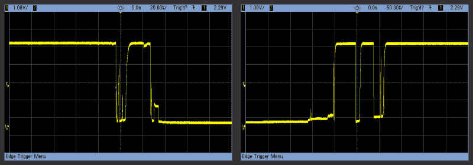
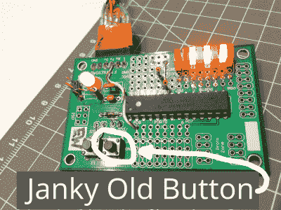

# 嵌入埃利奥特:去抖你嘈杂的按钮，第二部分

> 原文：<https://hackaday.com/2015/12/10/embed-with-elliot-debounce-your-noisy-buttons-part-ii/>

如果你曾经转动旋转编码器或按下光标按钮，并让它跳过一两步，你就直接遭受了按钮反弹。我以前的汽车音响和现在的车载 GPS 导航仪都有这个问题，这让我抓狂。一次按键应该是一次按键。做对有多难？

在《与 Elliot 一起嵌入》的上一期节目中，[我们研究了做正确的事情到底有多难](http://hackaday.com/2015/12/09/embed-with-elliot-debounce-your-noisy-buttons-part-i/)，并得出结论，只要你愿意在这个问题上投入一些电路，或者接受软件中的一些迟缓，事情其实并没有那么糟糕。但是工程师们在硬件设计上偷工减料，零件老化变脏。用超高速微控制器制造像按钮一样“简单”的东西最终会变得不简单。

毫不奇怪，对于这个普遍存在的问题，有无数的解决方案。有的好，有的不好，有的只是有取舍。在这一期中，我们将关注一些特别的东西:一个使用最少资源的去抖器，它的操作相当简单，但它可以和最好的去抖器一起去抖。

总之我给大家介绍一下我认为的终极去抖器(tm)！如果你在这篇文章结束前不同意，我会把钱还给你。

## 去抖动

首先，快速回顾一下。当你按下一个物理按钮时，两个金属表面相互接触。在它们明确分开的时间和它们如此好地融合在一起以至于它们在多个位置接触的时间之间，由于两个表面中的轻微缺陷，有一小段时间按钮进行接触和断开接触。

[](https://hackaday.com/wp-content/uploads/2015/11/debounce_bouncing.png)

结果是，在几毫秒的时间里，开关端子上的电压水平是不稳定的，并且在开和关之间闪烁。例如，如果您的代码通过查找从高到低的电压转换来检测按钮按下，它可能会看到多次这样的转换，而您认为这只是一次按下。

你可以用经典的`RC`滤波器加带迟滞的逆变器组合在硬件中[清除这个问题，或者你可以尝试用去抖程序在软件中修复它。上一次，我根据它们的工作方式将软件例程分成三类:延迟直到反弹完成，平滑(整合)反弹，或者尝试整体匹配按钮模式。](http://wp.me/pk3lN-KSb#fix-it-in-hardware)

## 基于差值的去抖器

在进入终极之前，我们先来看看“倒数第二个去抖器”。多年前，我从杰克·甘斯勒(Jack Ganssle)关于按钮反弹(第二部分)的惊人的两部分论文(T1)中学到了这个技巧，它几乎是完美的。我们将首先研究他的版本，因为它本身在大多数时候已经足够好了，也因为它是一个很好的起点。

[Jack]建议的去抖程序之一特别简单。微控制器定期轮询按钮，并在存储器中不仅存储其当前状态，还存储按钮逻辑电压电平的更长历史。那么，检测按钮按压的技巧就是识别哪个特定历史对应于哪个按钮事件(按压或释放)或哪个长期运行状态(向上或向下)。这就是为什么我认为这是一个“模式匹配”去抖程序，但我不认为[杰克]当时知道这一点。

这个算法的优点是它被整齐地分成两部分:一个存储按钮历史的更新器，和寻找相应模式的各种分析函数。我们的 API 将如下所示:

```

void update_button(uint8_t *button_history);

uint8_t is_button_up(uint8_t *button_history);
uint8_t is_button_down(uint8_t *button_history);
uint8_t is_button_press(uint8_t *button_history);
uint8_t is_button_release(uint8_t *button_history);

uint8_t read_button(void);

```

您的代码只需周期性地调用更新函数——从每毫秒到每十毫秒的任何时间都可以。如果它实际上是定期的，并且更新函数足够短，您可以从系统 tick 例程中调用它，那就最好了。

然后，当你想知道按钮在做什么时，你只需调用相应的函数，它们就会返回 1 或 0。我实现它的方式是，按钮的历史在主例程中定义，然后通过指针传递给各个按钮例程，但这是一个选择的问题。如果你正在实现许多按钮，或者有一个奇怪的架构，你无论如何都要改变这些东西。

例如，如果您使用的不是 8 位微控制器，那么这些例程在处理 16 位或 32 位宽的历史记录时效果会更好。

我还假设您有一个`read_button()`函数，如果按钮引脚上当前有对应于按钮按压的电压，则返回 1，否则返回 0。在 AVR C 中，这就像`( (PORTD & (1<<PD2)) == 0 )`一样简单。在 Arduino 上，这将是`digitalRead(pin) == 0;`。

### 存储历史

首先让我们考虑更新。一个按钮只有两种电状态:高电压和低电压。随着时间的推移，它可能在两者之间跳跃，但我们可以把它的状态想象成一个比特。在真正的嵌入式编程形式中，我们将在一个字节(或字)中一次存储一位。使用移位操作，这被证明是非常容易的，而且它在大多数微控制器上运行得非常快。

```

void update_button(uint8_t *button_history){
    *button_history = *button_history &lt;&lt; 1;
    *button_history |= read_button();
}

```

我们只是做了我们需要做的最少的事情。updater 函数获取(指向)按钮历史记录，第一行是一个位移，从右边滚入一个零。如果`history = 0b00110101`在班次之前，`history = 0b01101010`在班次之后。我们的`read_button()`函数的结果被写入新打开的第一位位置。这就是全部了。

与延迟去抖的更新功能中[错综复杂的`if...then`语句相比，这一个快得令人眼花缭乱。它足够短，如果你愿意，你可以把它直接合并到一个系统时钟中断程序中。剩下的工作是解释比特序列，这就是秘方所在的地方。](http://wp.me/pk3lN-KSb#take-a-time-out)

### 寻找按钮按下

所以我们得到了这个不断更新的 1 和 0 流。[Jack]的想法是寻找与按钮按压相对应的位模式。在不透露太多的情况下，这将把检测各种按钮状态的问题简化为简单地将`button_history`与特定值进行比较。

想象一下对应于非弹跳按钮按压的比特流:`...0000000011111111111...`等等。你可以测试像`00001111`这样的比特流，你可以检测到压力。但是想想一个弹跳按钮看起来是什么样子:`...0000100101111111111...`。至关重要的八位是`01111111`——反弹的最后一位，随后是稳定的压入值流。下面是[Jack]的按键检测器的 8 位版本:

```

uint8_t is_button_pressed(uint8_t button_history){
    return (button_history == 0b01111111);
}

```

哇，这很简单——整个例程只是检查`button_history`是否是`0b01111111`。检测释放是对`0b10000000`的测试，上升和下降状态分别是`0b00000000`和`0b11111111`。内存开销很小，所有函数本质上都是一行程序，更新和测试函数是可分离的。没有必要跟踪按钮处于什么状态，或者看起来是什么状态，因为`0b01111111`已经包含了未按下和按下之间的状态变化的概念。而且效果出奇的好。至少为了去抖动的特定目的。

[](https://hackaday.com/wp-content/uploads/2015/11/img_20151130_205836_annotated.png)

但是我在我的垃圾抽屉里发现了一些古怪的按钮，揭示了逻辑上的一个微妙的缺陷。例如，我有一个按钮，当你按住它时，它偶尔会发出小故障。即使我一直按着按钮，它也会发出类似`...11110111111...`的位模式。更糟糕的是，它会在按钮被按下几十到几百毫秒后才这样做。

我的间歇按钮在[Jack]的去抖器中触发了一个虚假的按钮按压事件。比特流中的一个零按理说不应该重新触发按钮按下事件，但在这个算法中，它总是这样。类似地，单个高压尖峰会在历史中插入一个 1，导致错误的双释放，但我认为这不太可能。

请注意，延迟去抖器不会支持这一点。它跟踪按钮的状态，并且只在按钮处于“向上”状态时测试按钮按下事件。我们的小故障`1111111011111`不会愚弄它，因为按钮已经处于“按下”状态，你不能按下一个已经按下的按钮。事实上，除了代码膨胀之外，延迟去抖器似乎非常健壮，因为它有内部状态机。这个方法一点也不差。

## 终极去抖器(tm)

但是我们可以做得更好。诀窍是从[Jack]的去抖器中提取基本逻辑，但改进检测功能。这实际上并不难，因为[杰克]所做的所有测试都是区分数据——测试持续的变化。但是如果我们观察整个反弹会发生什么呢？

[](https://hackaday.com/wp-content/uploads/2015/11/debounce_bouncing1.png)

人们是伟大的模式识别者。你在反弹图中看到了什么？你会看到三种状态——一种是电压恒定，一种是电压波动，还有一种是电压恒定，但与初始状态相反。让我们在此基础上再接再厉；我们将测试一段时间的高点，然后扔掉一些中间的垃圾，然后测试一段时间的低点。根据我们采样的位置，示例按钮按压可能看起来像`111110100000`或`111110110000`。这两者都与 8 位值`11xxx000`相匹配，其中`x`表示无关位。同样，这里的发布类似于`0000011011111`或`000001010111111`或类似的东西。这些将匹配`00xxx111`，优点是我们的间歇毛刺序列`1111110111111`永远不会匹配它。现在我们有进展了。(好吧，两个周期的间歇*将*匹配——要么更新得更慢，要么存储更多的历史位。)

不过，我们还没完。一旦我们检测到一个新闻或发布事件，我们需要清除不关心的部分。否则，我们会检测到多次按压。例如，无反弹转换在历史中移动时将触发四次:`00000111`、`00001111`、`00011111`和`00111111`都对应于有效的按压事件。因此，一旦检测到有效的按压，我们需要重置历史记录。这就像将它重置为`11111111`一样简单——对应于“按下”状态的历史，这在按钮被按下后具有逻辑意义。

除了防止(错误的)重新触发之外，这种历史的重写给我们带来了一点滞后。在此之前，可能会有充满活力的零隐藏在任何一个无关紧要的地方，等着在短时间内把我们绊倒。但是现在所有的东西都写成了 1，所以 0 要花更多的时间才能到达左边。我们让按钮释放事件在按下后更容易被检测到，这正是我们想要的。

### 履行

去抖器的其余部分是细节。我将通过将比较中的中间位设置为零来实现无关区域，然后在那里测试零。重置按钮历史将要求我们的测试函数能够写入和读取按钮历史，这意味着历史再次通过指针传递给这些函数。

下面是一个测试按钮按压的函数:

```

#define MASK   0b11000111

uint8_t is_button_pressed(uint8_t *button_history){
    uint8_t pressed = 0;    
    if ((*button_history &amp; MASK) == 0b00000111){ 
        pressed = 1;
        *button_history = 0b11111111;
    }
    return pressed;
}

```

与[Jack]的检测代码相比，它看起来复杂得多，但实际上只慢了几个周期。该函数接收(指向)按钮历史记录，然后将其与我们的掩码进行逻辑“与”运算。其效果是，当掩码为 1 时，保存每一位，当掩码为 0 时，将每一位清零，但这在微控制器上非常有效。

将此更改的历史值与前面有 0、无关区域有 0、后面有 1 的数字进行比较。这与我们对比特流的预反弹、反弹和反弹后分割的想法完全一致。最后但同样重要的是，当检测到按压时，我们重写按钮历史，并返回一个 1。

为了完整起见，这里是检测代码的其余部分，尽管您不会对其中的任何部分感到惊讶。总的来说，这种代码只比[Jack]快得令人眼花缭乱的去抖动略慢，而且它提供了一定程度的抗噪性，而这是他的代码所没有的。

```

uint8_t is_released(uint8_t *button_history){
        uint8_t released = 0;   
        if (mask_bits(*button_history) == 0b11000000){ 
                released = 1;
                *button_history = 0b00000000;
        }
        return released;
}
uint8_t is_button_down(uint8_t *button_history){
        return (*button_history == 0b11111111);
}
uint8_t is_button_up(uint8_t *button_history){
        return (*button_history == 0b00000000);
}

```

你可以这样使用它:

```

int main(void) 
{
        uint8_t button_history=0;
        uint8_t press_count=0;
        uint8_t release_count=0;

        while (1) {

        do_important_stuff();

        update_button(&amp;button_history);
        if (is_button_pressed(&amp;button_history)){
                        press_count++;
        }
        if (is_button_released(&amp;button_history)){
                        release_count++;
        }
        if (is_button_down(&amp;button_history)){
            light_LED_or_something();
        }
    }
}

```

将检测功能与更新功能分开的优点是，您不需要测试您不关心的状态或事件，这与延迟去抖器不同，延迟去抖器依赖于知道它处于哪个状态并测试所有可能的转换。这使得它更精简、更快速，并且您只使用您需要的东西。另一方面，如果您只想测试按钮按下的情况，您可以将整个过程简化为一个函数，如下所示:

```

uint8_t test_for_press_only(void){

    static uint8_t button_history = 0;
    uint8_t pressed = 0;    

    button_history = button_history &lt;&lt; 1;
    button_history |= read_button();
    if (button_history &amp; 0b11000111 == 0b00000111)){ 
        pressed = 1;
        button_history = 0b11111111;
    }
    return pressed;
}

```

效率怎么样？没有参数，没有指针，完全独立，它可以编译成大约 20 条机器指令。只要确保每隔 5 到 10 毫秒调用一次，就大功告成了:在一个函数中实现去抖动和去毛刺。嘭！它甚至足够短，以至于我会毫不犹豫地在毫秒级的中断例程中调用它。

### 调谐

对于延迟去抖器，您必须决定等待弹跳稳定下来的时间，这也会影响微控制器对按钮按压的反应速度。因此，虽然你可能想延迟 100 毫秒，但用户会注意到你的设备感觉迟钝。大约在 5 到 20 毫秒的范围内可能是正确的。

终极去抖器(tm)也是如此。在上面的 8 位版本中，我们允许三个无关位用于弹跳，因此如果最差情况的弹跳需要 10 毫秒左右，我们希望每 5 毫秒更新一次，以留出一些余量。因为我们需要在反弹窗口后进行三次良好的观察，这个例程将在至少 15 毫秒加上实际反弹的持续时间内做出反应。较不频繁的更新会增加噪声和反弹免疫力，但自然会减少响应时间。

如果您使用 16 位或更多位作为历史记录，例如在更现代的微控制器上，那么反弹前、反弹和反弹后时序的比率就有更大的发挥空间。例如，`0b00000xxxxx111111`与我们在这里使用的大致相似，但是`0b00xxxxxxxx11111`允许更长的反弹期。通过交换左侧位和无关位，你交换了长时间反弹的故障免疫。在实践中，您不太可能需要担心这种优化，但是很高兴知道您可以这样做。

## 结论

那么这真的是终极去抖器吗？我真的很喜欢它，而且故障免疫已经在我拥有的至少一个间歇按钮上证明了它的价值。它可以被校准为与更常见的延迟型去抖器一样具有鉴别力，但它的响应速度更快，需要的内存和 CPU 周期更少。你的 CPU 有比去抖按钮更重要的事情要做。

一旦你完成了代码，就没那么糟糕了，但是我承认二进制常量一开始有点不可读。我不太喜欢依赖注释来保持可读性的代码，这些函数在这个方向上走得太远了。

但是不要相信我的话。尝试一下，让我知道你的想法。