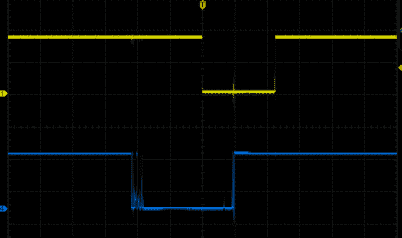
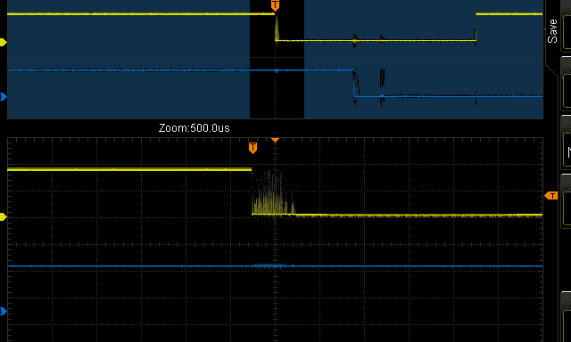

# 编码器让我们原地打转

> 原文：<https://hackaday.com/2017/01/11/encoders-spin-us-right-round/>

旋转编码器是很棒的设备。只需监控几个引脚，您就可以轻松快速地读取用户输入的旋转和方向(以及许多其他应用程序)。但是和任何事情一样，也有一些警告。我最近有机会深入了解旋转编码器的一些优点和缺点，以及如何使用它们。

我经常和学生一起做不同层次的电子项目。一个学生项目需要一个旋转编码器。这些有机械和光学两种形式。在某种程度上，它们是非常简单的设备。另一方面，它们有一些复杂的细微差别。目标板是 ST Nucleo。这种特殊的板具有小型 ARM 处理器，可以使用 mbed 环境进行开发和编程。该板本身可以采用 Arduino 子板，并为 ST morpho 板(无论是什么板)提供额外的引脚。

mbed 系统是 ARM 对 Arduino 的回应。一个基于 web 的 IDE 可以让你用大量的支持库来编写 C++代码。该板看起来像一个 USB 驱动器，所以你将程序下载到这个代用驱动器上，该板就被编程了。不久前，我在一个类似的板上发布了 mbed 的介绍，所以如果你想重温一下，你可能想[阅读第一篇](http://hackaday.com/2015/08/11/getting-started-with-arm-using-mbed/)。

## 读取编码器

我们的编码器在一个小 PCB 上，你可以从中国购买 Arduino 37 传感器套件。(顺便说一句，如果你正在寻找关于这些类型的板的文档，[看这里](https://tkkrlab.nl/wiki/Arduino_37_sensors)。；特别是，这是一个 [KY-040 模块](https://tkkrlab.nl/wiki/Arduino_KY-040_Rotary_encoder_module)。)该板有电源和接地引脚，以及三个引脚。其中一个引脚是当您按下编码器轴时接地的开关闭合。另外两个编码轴旋转的方向和速度。有三个上拉电阻，每个输出一个。

我希望解释一下这个设备是如何工作的，然后用一个很好的例子来帮助编写一些代码，这个例子包括去抖动、使用 pin 变化中断，当然还有一些其他神秘的知识。事实证明这完全没有必要。嗯……算是吧。

## 抽象推理

我忘记了 Arduino、mbed 和其他类似的平台有丰富的(通常是用户贡献的)库。我在导入对话框中快速搜索了一下，找到了几个看起来很像的库。突出显示的项目(来自[Karl Zweimüller])是今年更新的，所以我认为这是一个安全的赌注。按下屏幕右上方那个大得离谱的导入按钮就搞定了。

[](https://hackaday.com/wp-content/uploads/2016/12/import.png)

有了项目中的库，问题就变成了:如何使用它？幸运的是，内置了文档。当您导航您的项目时，一些节点是源代码，一些是文档(它们看起来像导航器中的蓝色小文档)。单击 mRotaryEncoder 节点会显示一个有用的帮助文档(如下所示)。你还需要知道什么？

[](https://hackaday.com/wp-content/uploads/2016/12/doc.png)

## 代码

有了这些，只需要写几行代码。这个设置编码器:

```
mRotaryEncoder enc(D7,D8, D4,PullNone);
```

D7、D8 和 D4 常数定义了引脚数(D7 和 D8 是编码器引脚，D4 是我实际上没有使用的开关)。PullNone 防止 CPU 使能内部上拉电阻，因为电路板已经有了这些电阻。

接下来，我们可以分配库在某些事件上调用的函数。特别是:

```
void cw()
{
  dutycycle+=0.1;
  if (dutycycle>1.0) dutycycle=1.0;
}

void ccw()
{
  dutycycle-=0.1;
  if (dutycycle<0.0) dutycycle=0.0;
}
```

你可能已经推断出我聪明的命名方案。cw 功能处理顺时针运动，ccw 功能处理相反的运动。图书馆怎么知道叫什么？它需要在程序的主函数中进行一些设置:

```
enc.attachROTCW(cw);
enc.attachROTCCW(ccw);
```

## 但是等一下！

当然，那很简单。这是一个很好的抽象，可以处理很多复杂的问题。但是这样做你能学到什么呢？不多。据你所知，编码器上可能有一个微处理器，并通过一些串行协议发送数据(实际上，这是一个不错的主意，因为处理器现在很便宜)。

我认为仅仅推出一个现成的库是不够的。我取出示波器，我们将编码器放在通道 1 和通道 4 上(遗憾的是通道 2 和通道 4 在探头环上的颜色几乎相同)。这是顺时针和逆时针扭转轴的结果:

 [](https://hackaday.com/2017/01/11/encoders-spin-us-right-round/newfile6/) Clockwise Rotation [](https://hackaday.com/2017/01/11/encoders-spin-us-right-round/newfile7/) Counter Clockwise Rotation

关键是看顶迹的下降沿。请注意，在顺时针情况下(左图)，底部轨迹此时为高电平。在逆时针的情况下(右图)，它是低的。如果您愿意，您实际上可以在两边都进行检测，但是对于大多数目的来说，这就足够了，而且真的就是这么简单。注意边缘，注意另一个信号的状态，这就能告诉你方向。很明显，边缘出现得越快，转轴旋转得越快。

这就是所谓的正交编码，因为两个信号的相位相差 90 度。

## 蹦蹦跳跳

在一个理想的世界里，这很容易。然而，世界远非理想。如果你仔细观察，你会发现信号中有一些噪声。让我们放大:

[](https://hackaday.com/wp-content/uploads/2016/12/newfile5.png)

你不想把所有这些都当成下降沿！你需要去抖一下。理想情况下，你应该等待信号变低，等一会儿，确保它仍然很低，然后做出反应。那么你就不会再去寻找其他的超时延迟。

这可能很棘手，因为您通常不希望轮询边缘。您希望使用类似于 pin 改变中断的东西，当 pin 改变状态时，它调用您的代码。

由于 mbed 库包含源代码，所以很容易了解实际情况。这个库不使用中断。它使用一个名为 PinDetect 的类(由[Andy Kirkham]开发)，该类在一个定时器上轮询(默认情况下，每 20 毫秒一次)。

代码没有任何注释，所以我在下面的部分代码中添加了一些注释:

```
void isr(void) {
  int currentState = _in->read();  // get current pin state

  if ( currentState != _prevState ) {  // if the state has changed
      if ( _samplesTillAssert == 0 ) {   // see if that was long enough
        _prevState = currentState;       // remember state for next time
        _samplesTillHeld = _samplesTillHeldReload;  // reset hold time
        if ( currentState == _assertValue ) // call correct callback
          _callbackAsserted.call();
        else 
          _callbackDeasserted.call();
      }
      else {
        _samplesTillAssert--;  // state held, so keep counting down
      }
    }
  else {
    _samplesTillAssert = _samplesTillAssertReload;  // reset
  }
...

```

记住，这段代码每 20 毫秒运行一次。它会查看输入是否与上次有所不同，并做出适当的决定。

实际的编码器对象很简单，只要你有去抖的数据。下面是当主输入变低时 PinDetect 调用的函数:

```
void mRotaryEncoder::fall(void) {
  // debouncing does PinDetect for us
  //pinA still low?
  if (*m_pinA == 0) {
    if (*m_pinB == 1) {  // state of 2nd pin tells us CW or CCW
      m_position++;
      rotCWIsr.call();  // notify user code
    } else {
      m_position--;
      rotCCWIsr.call();  // notify user code
    }
    rotIsr.call(); // call the isr for rotation; notify user code
  }
}
```

当然，您可能不会提供所有的回调，这不是问题。该库也有一段类似的上升沿代码。如果你想在不创建项目的情况下浏览整个库，你可以在网上找到整个库。

只是为了把这一切的角度来看，我加入了 KY-040 编码器模块与 KY-016 RGB LED。我选择了 Nucleo 板上的引脚，所以 LED 模块将直接插入，但您仍然需要编码器的电线。你可以在 mbed 网站上找到代码[，代码中的注释描述了接线。](https://developer.mbed.org/users/wd5gnr/code/Nucleo_Encoder_RGB/)

这个想法很简单。您可以使用编码器来设置 LED 发出的红光级别。推动编码器的轴，你可以控制绿色水平。另一个按钮设置蓝色级别。随后的推动重复该循环。一个简单的程序，但奇怪的娱乐性，以奇怪的颜色拨号(如粉红色或浅绿色)。下面的视频中有一个快速肮脏的演示。

## 同时

我经常说，你不必知道发动机如何工作来驾驶汽车。但是最好的司机都知道。出于同样的原因，使用这个库来读取编码器非常容易，如果您想要的只是结果，那就走这条路。毕竟，所有的工程都可以归结为抽象。也许你懂汇编语言。也许你可以设计一个逻辑门级别的 CPU。甚至可能在设备级别。但是你可能不会自己生长硅晶体，研磨晶片，并在此基础上制造器件。即便如此，你还是依赖于关于电子如何流动的抽象概念，或许还有其他一些概念。

然而，如果您至少对这些抽象中的每一个是如何工作的有一点感觉，这可能不会有什么坏处。我不认为让学生避免理解旋转编码器的工作原理是一件好事。即使你选择使用一个库来隐藏细节，理解真正发生的事情也是有好处的。

顺便说一句，如果你快用完引脚了，你可能会对这个真正的替代方法感兴趣。同时，我可能应该吃我自己的药，建立[我自己的编码器](http://hackaday.com/2016/01/08/video-gives-you-the-basics-of-diy-rotary-encoders/)。

 [https://www.youtube.com/embed/m704Vw2pmtM?version=3&rel=1&showsearch=0&showinfo=1&iv_load_policy=1&fs=1&hl=en-US&autohide=2&wmode=transparent](https://www.youtube.com/embed/m704Vw2pmtM?version=3&rel=1&showsearch=0&showinfo=1&iv_load_policy=1&fs=1&hl=en-US&autohide=2&wmode=transparent)

