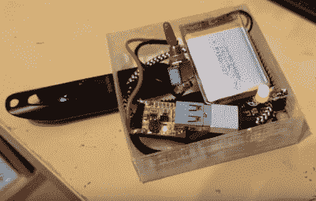

# 使用 Cryptopuck 在 Pi 上动态加密数据

> 原文：<https://hackaday.com/2017/10/13/encrypt-data-on-the-fly-on-a-pi-with-cryptopuck/>

曾几何时，加密几乎是一个肮脏的词；这个概念只适用于有所隐瞒的人。如果你说你想加密你的硬盘，这也可能是承认犯罪。但现在比以往任何时候都清楚的是，加密，无论是在我们的个人设备上还是在网络上，都是数字社会的基本必需品。大数据时代正在到来，除非你特别喜欢成为数据库中的一行，否则你需要尽一切努力来限制你拥有的明文数据的数量。

当然，有时候说起来容易做起来难。并不是每个人都有时间或愿望去学习不同的加密软件包是如何工作的，其他人可能在根本没有这个能力的系统上工作。当你想加密一些文件，但是传统的方法无法实现时，你会怎么做？

[进入【Dimitris Platis】的最新项目:Cryptopuck。](https://platis.solutions/blog/2017/10/10/cryptopuck-encrypt-removable-media-on-the-fly/)通过将多功能的 Raspberry Pi Zero、一些聪明的 Python 程序和一些零碎的东西结合在一个 3D 打印的盒子中，他创建了一个完全独立的加密设备，任何人都可以使用。插入一个 USB 闪存驱动器，等待 LED 停止闪烁，现在你所有的文件都被安全加密，只有拥有私钥的人才能访问。[Dimitris]设想像这样的设备对于前线的记者和摄影师、抗议者或者真正需要一种谨慎的方式来快速保护数据但可能无法使用计算机的任何人来说都是无价的。

硬件方面实际上只是 Pi、一个开关、一个用于通知的 LED 和一块电池。真正的魔力来自软件，其中[迪米特里斯]利用 [PyCrypto](https://www.dlitz.net/software/pycrypto/doc/) 来执行 AES-256 加密，并结合 [pyinotify](https://github.com/seb-m/pyinotify) 和 [udiskie](https://github.com/coldfix/udiskie) 来检测新安装的卷并对其采取行动。组成 Cryptopuck 套件的各种 Python 脚本都可以在该项目的 GitHub 页面上获得，但【Dimitris】非常明确地表示，该软件将被视为概念证明，尚未经过任何形式的安全审计。

关于 Cryptopuck 使用的软件如何工作的一些背景信息[，你可能想看看几年前的这本优秀的入门书](https://hackaday.com/2012/09/25/cryptography-learn-what-its-all-about/)；虽然如果你想了解为什么加密如此重要，[你不需要追溯到那么久以前。](https://hackaday.com/2016/04/11/apple-aftermath-senate-entertains-a-new-encryption-bill/)

 [https://www.youtube.com/embed/A1yopv8Kl34?version=3&rel=1&showsearch=0&showinfo=1&iv_load_policy=1&fs=1&hl=en-US&autohide=2&wmode=transparent](https://www.youtube.com/embed/A1yopv8Kl34?version=3&rel=1&showsearch=0&showinfo=1&iv_load_policy=1&fs=1&hl=en-US&autohide=2&wmode=transparent)

