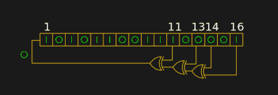
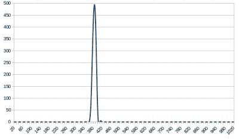
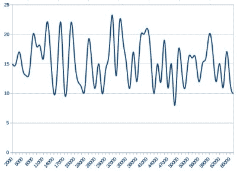

# 熵和 Arduino:当时钟抖动有用时

> 原文：<https://hackaday.com/2018/01/08/entropy-and-the-arduino/>

当你在编程中需要一个随机数时，你会怎么做？您可能会利用环境的功能来完成这项工作，通常是 rand()或类似的东西。这会返回所需的数字，然后您就可以愉快地上路了。

一个移位寄存器配置成一个伪随机
数发生器。[by[kcauxy 4 p](https://commons.wikimedia.org/wiki/File:LFSR-F16.svg)CC0 1.0】

当然，现实并不那么简单，正如你们许多人所知，这一切都归结于你所需要的随机性水平。在软件中生成随机数最简单的方法是通过伪随机数发生器，或 PRNG。如果你更喜欢从硬件角度考虑，最基本的 PRNG 是一个移位寄存器，其中两个单元通过一个异或门形成一个反馈回路。虽然它提供了稳定的位流，但它有一个致命的缺陷，那就是这个位流是一个不断重复的序列，而不是真正随机的。PRNG 的随机性足以在电脑游戏中提供一定程度的机会，但这种可预测性使其完全不适合用于金融交易的加密安全。

有一种简便的方法可以处理 PRNG 可预测性问题，那就是确保它的随机数生成从一个随机点开始。想象一下，上一段中的移位寄存器是用一个随机数而不是一串零来初始化的。这个随机点被称为种子，如果 PRNG 算法可以从一个真正不可预测的来源获得的种子开始，那么它的输出就不再是可预测的了。

### 选择不可预测的种子

因此，使用 PRNG 的计算机系统除了 rand()函数之外，通常还会有某种形式的 seed()函数。有时这将接受一个数字作为参数，允许用户提供他们自己的随机数，有时他们将从他们自己的某个来源接受一个随机数。例如，Sinclair 8 位家用电脑的种子来自对开机后电视画面数量的计数。

The not-very-random result of a thousand analogRead() calls.

Arduino Uno 有一个 random()函数，它从 PRNG 中返回一个随机数，正如您所料，它还有一个 randomSeed()函数，以确保 PRNG 被播种了一些支持其随机性的东西。你可能会想，这一切都很好，但遗憾的是，它所依赖的 Atmel 处理器没有硬件熵源来获取种子。用户只能搜索自己的随机数，遗憾的是，当@scanlime 和@cybergibbons 在 Twitter 上的一段对话[提醒我们时，这就是事情开始出错的地方。randomSeed()的文档建议](https://twitter.com/cybergibbons/status/937069707173253120)[通过 analogRead()](https://www.arduino.cc/reference/en/language/functions/random-numbers/randomseed/) 读取未使用引脚上的随机噪声，使用该数字不会返回任何类似于所需熵水平的结果。使用[Arduino 图形示例](https://www.arduino.cc/en/Tutorial/Graph)的一个非常快速的测试产生了一个管脚的一系列读数，将几千个读数聚集到一个电子表格中显示了一个非常窄的分布。显然需要一个更好的来源。

### 嘈杂的硬件或抖动的时钟

作为一个有点老派的电子工程师，我的想法直接转向一个硬件。源一个漂亮的高噪声锗二极管，给它几个运算放大器来放大和过滤噪声，然后馈入 Arduino 引脚。也许你当时想到的是放射性衰变和盖革计数器，甚至是弹跳球。然而不幸的是，即使他们抓住了制造一件有趣的工程的冲动，这些硬件也有变得过于复杂甚至有点混乱的风险。

The significantly more random result of a thousand Arduino Entropy Library calls.

Twitter 帖子中的最佳建议将我们带到了 [Arduino 熵库](https://github.com/pmjdebruijn/Arduino-Entropy-Library)，它使用微控制器时钟中的抖动来生成真正的随机数，可以用作种子。从库的随机数例子中提取代码给了我们一个连续的数字流，取 1000 个数字进行相同的电子表格处理显示了一个更加均匀的分布。虽然应该注意到这不是一种特别快速的生成随机数的方法，但是这个库的运行是正常的。

因此，如果您在 Arduino 草图中需要一个真正随机的数字，而不是一个看起来足够随机的数字，您现在知道可以安全地忽略文档中的随机种子，而使用熵库。当然，这是以在你的草图上增加一个额外的库为代价的，但是如果空间非常宝贵，你仍然可以选择某种形式的硬件噪声发生器。与此同时，也许是时候让 Arduino 人重新评估他们的文档了。

熵和生成随机数的主题已经在这些页面上出现了很多次。[Voja Antonic]使用未初始化的 RAM 作为微控制器的熵源进行了深入研究[。如果你对理解 Linux 熵有贪得无厌的胃口，我们建议你去](https://hackaday.com/2015/06/29/true-random-number-generator-for-a-true-hacker/)[【埃利奥特·威廉姆斯】](https://hackaday.com/2017/11/02/what-is-entropy-and-how-do-i-get-more-of-it/)的“综合考试”。

[Arduino image: DustyDingo [公共领域](https://commons.wikimedia.org/wiki/File:Arduino_crystal-1.jpg)