# ERRF 18:伟大事业的开始

> 原文：<https://hackaday.com/2018/07/18/errf-18-the-start-of-something-great/>

多年来，桌面 3D 打印会议无可争议的国王是中西部 RepRap 节(MRRF)。主办地是印第安纳州歌珊的热带天堂，MRRF 从一开始就没有竞争对手。还有其他会议专注于 3D 打印领域的工业和专业领域，当然你会发现一两个 Prusa 或多或少出现在任何黑客大会上；但是 MRRF 专注于探索一旦个人能够从熔化的塑料中显现出实物，他们能做什么。

 但是 2018 年 6 月 23 日，MRRF 终于有了一些正当的竞争。顾名思义，[东海岸说唱音乐节(ERRF)](http://eastcoastreprapfestival.com) 是一项深受其前身印第安纳州启发的活动。马里兰州贝尔艾尔举行，美国右侧的黑客首次有机会参加真正的 3D 打印节，而不必登上飞机。不是说这是一个街区聚会；来自全国各地，实际上是全球各地的人们来到 APG 联邦信用合作社竞技场，参加为期两天的塑料制品庆祝活动。

委婉地说，首届 ERRF 是一次巨大的成功。几个 Hackaday 现场代理出席了会议，考虑到这是第一次尝试，我们肯定对这次活动印象深刻。我们看到了证据表明[可打印打印机的梦想仍然很强烈](https://wp.me/pk3lN-1jD8)，一群[新打印机和产品将在今年窥探你的钱包](https://wp.me/pk3lN-1jFW)，以及[一家挑战传统智慧的美国制造的酒店](https://wp.me/pk3lN-1jFA)。当然，我们也看到了大量的 3D 打印狂热分子，他们渴望展示他们的最新创作。

我们毫不怀疑 ERRF 明年会再次回归，但在那之前，你必须满足于今年节目中精选的以下集锦。

## 印花纺织品

我们对[David Shorey]在织物上进行 3D 打印的工作并不陌生，但近距离观看总是令人惊叹。这里的概念实际上很简单:几层后暂停打印，在床上拉一片薄纱(新娘面纱的材料)，然后让打印完成。面料夹在印花的两层之间，只要你不太用力，它会很好地粘在一起。

 [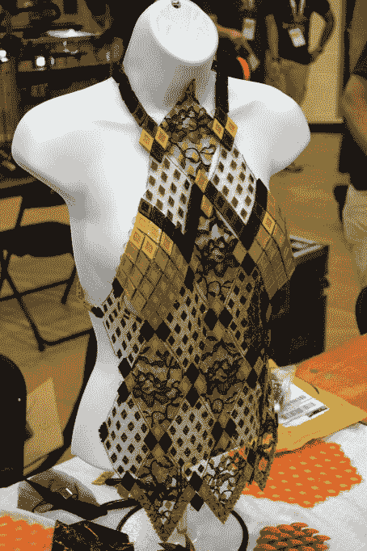](https://i0.wp.com/hackaday.com/wp-content/uploads/2018/07/errf_fabric4.jpg?ssl=1)  [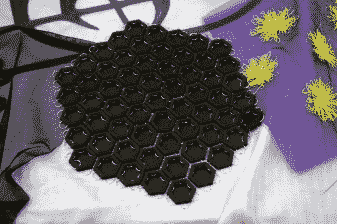](https://i0.wp.com/hackaday.com/wp-content/uploads/2018/07/errf_fabric1.jpg?ssl=1)    [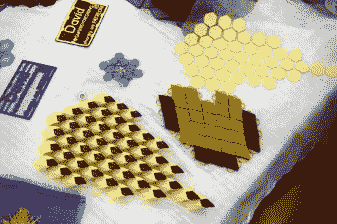](https://i0.wp.com/hackaday.com/wp-content/uploads/2018/07/errf_fabric2.jpg?ssl=1) 

[【David】并不是唯一有这种想法的人](https://hackaday.com/2018/01/06/3d-printing-wearables-with-a-net/)，但他显然走在了完善这一想法的前列。也许这项技术最有趣的地方在于，任何拥有 3D 打印机和附近布料商店的人都可以尝试一下。

## 液体机器人变成固体打印机

展出的更有趣的自制打印机之一是自由 Evo 75“液体处理机器人”，由[Paul Paukstelis]转换成大幅面 3D 打印机。最初这台机器的价格相当于一辆汽车，但它被从废品堆中拯救出来，并通过添加一些新的电子设备获得了新生。每个轴都有一个 Arduino Pro Micro 控制一个带耦合旋转编码器的 DC 伺服电机，有趣的是[受到他在 Hackaday](https://hackaday.com/2015/01/20/closed-loop-control-for-3d-printers/) 上读到的一些东西的启发。

 [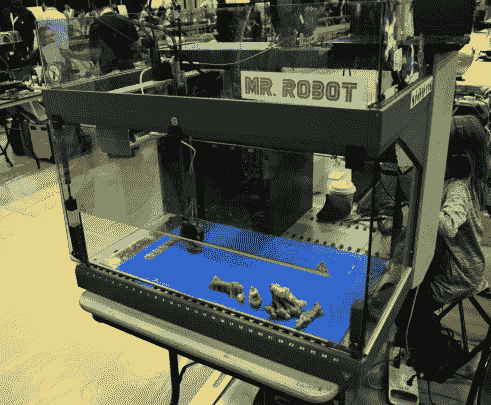](https://i0.wp.com/hackaday.com/wp-content/uploads/2018/07/errf_evo1.jpg?ssl=1)  [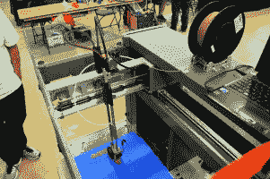](https://i0.wp.com/hackaday.com/wp-content/uploads/2018/07/errf_evo2.jpg?ssl=1)  [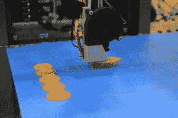](https://i0.wp.com/hackaday.com/wp-content/uploads/2018/07/errf_evo4.jpg?ssl=1) 

这台打印机有许多简洁的功能，例如在所有三维空间中使用电机失速检测代替终点挡板。[Paul]也急于展示闭环控制系统的好处:猛拉 hotend，将其从印刷品上拉下来，结果它自动回到了它应该在的地方。

## 印刷带在这里

[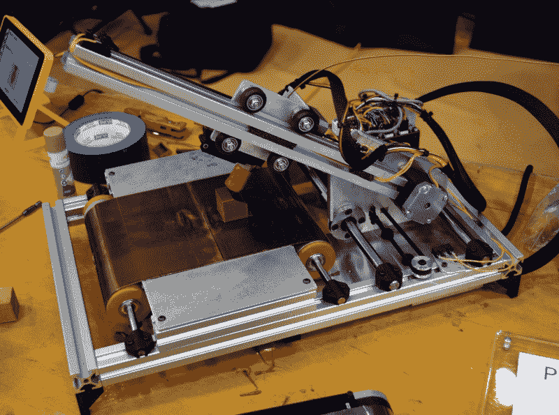](https://hackaday.com/wp-content/uploads/2018/07/errf_printrbelt.jpg) 这并不是 PrintrBot 首席执行官【Brook Drumm】第一次展示他的 infinite build volume 打印机，但这最终是美国体积受限的工人可以购买的机器版本。与今年早些时候他在 MRRF 展示的相比，这是一个[非常不同的外观，更针对 DIY 黑客，而不是那些寻求交钥匙体验的人。这可能是最好的，因为这是一种尖端的 3D 打印，可以说还没有为大众做好准备。](https://hackaday.com/2018/03/26/cutting-edge-of-3d-printing-revealed-at-last-weekends-mrrf/)

[Brook]将最终的印刷带安装并运行，生产出源源不断的小青铜立方体。但它确实需要偶尔的帮助。零件并不总是干净地从皮带边缘脱落，第一层似乎需要每打印几页就重新调整一次。没有节目停止，但显然这项技术仍处于早期阶段。

如果桌面 3D 打印是小众的，那么像 Printrbelt 这样的机器就是超小众的。但是我们不怀疑有人对拥有自己的生产线非常感兴趣。如果你足够勇敢，现在可以买到 Printrbelt 的套件和组装版本。

## 一台打印机

[Kuntry 3D]在那里展示他的 3D 打印机，实际上是由打印挤压制成的。他想看看是否有可能简单地采用基于铝挤压的 3D 打印机设计，并将其全部替换为 3D 打印传真，至少可以说，结果令人印象深刻。虽然我们不建议你为你的下一个版本打印挤压图，但我们不能否认你可以这样做。

   [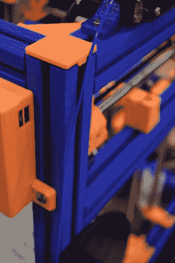](https://i0.wp.com/hackaday.com/wp-content/uploads/2018/07/errf_kuntry2.jpg?ssl=1) 

当然[我们在过去也听说过类似的机器](https://hackaday.com/2018/02/03/3d-print-a-3d-printer-frame/)，但是看到这些项目之一在现实世界中突突前进总是令人愉快的。

## 3D 打印德比

在一个有趣的新旧结合的例子中，ERRF 举行了一场 3D 打印版的经典“松木德比”比赛。美国童子军的官方规则在适当的地方进行了修改，电脑控制的跑道和计时系统是标准的德比装备。虽然在轴距和长度等方面有严格的限制，但参赛者的设计却千差万别:从光滑的空气动力学楔形到完全完工和涂漆的模型。

正如你可能预料的那样，考虑到它是在 3D 打印节这样的书呆子聚会上举行的，许多参赛者都展示了一些相当*非传统的*外观。

 [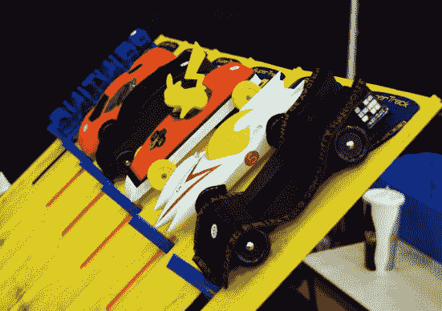](https://i0.wp.com/hackaday.com/wp-content/uploads/2018/07/errf_derby1.jpg?ssl=1)  [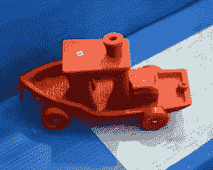](https://i0.wp.com/hackaday.com/wp-content/uploads/2018/07/errf_derby4.jpg?ssl=1)  [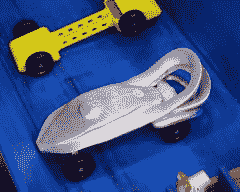](https://i0.wp.com/hackaday.com/wp-content/uploads/2018/07/errf_derby3.jpg?ssl=1)  [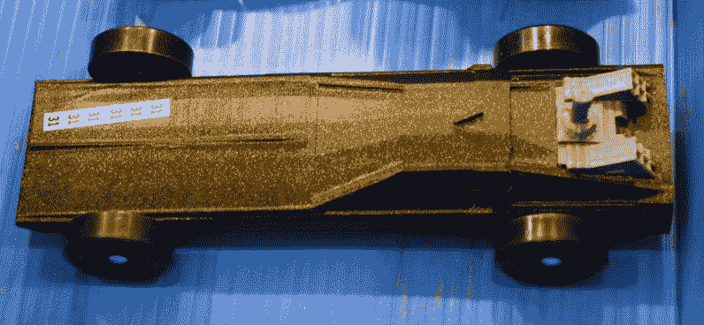](https://i0.wp.com/hackaday.com/wp-content/uploads/2018/07/errf_derby21.jpg?ssl=1) 

## 塑料奇妙

如果没有摆满令人难以置信的印刷品的桌子，这就不是一个 3D 打印节，ERRF 当然不会让人失望。这里只是展出的一些照片，让我们意识到这些人在这方面比我们好得多。

 [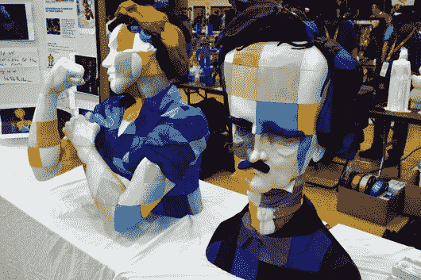](https://i0.wp.com/hackaday.com/wp-content/uploads/2018/07/errf_print10.jpg?ssl=1)  [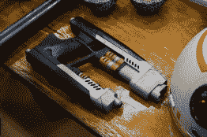](https://i0.wp.com/hackaday.com/wp-content/uploads/2018/07/errf_print2.jpg?ssl=1)  [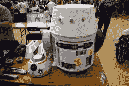](https://i0.wp.com/hackaday.com/wp-content/uploads/2018/07/errf_print3.jpg?ssl=1)  [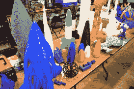](https://i0.wp.com/hackaday.com/wp-content/uploads/2018/07/errf_print5.jpg?ssl=1)  [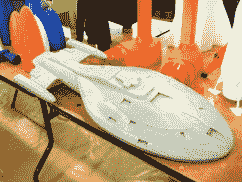](https://i0.wp.com/hackaday.com/wp-content/uploads/2018/07/errf_print121.jpg?ssl=1)  [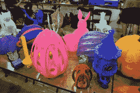](https://i0.wp.com/hackaday.com/wp-content/uploads/2018/07/errf_print6.jpg?ssl=1)  [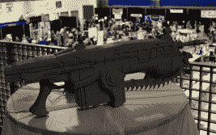](https://i0.wp.com/hackaday.com/wp-content/uploads/2018/07/errf_print71.jpg?ssl=1)  [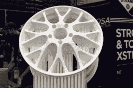](https://i0.wp.com/hackaday.com/wp-content/uploads/2018/07/errf_print11.jpg?ssl=1)  [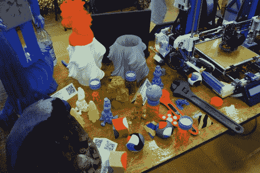](https://i0.wp.com/hackaday.com/wp-content/uploads/2018/07/errf_print9.jpg?ssl=1)  [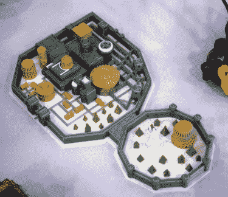](https://i0.wp.com/hackaday.com/wp-content/uploads/2018/07/errf_print8.jpg?ssl=1)  [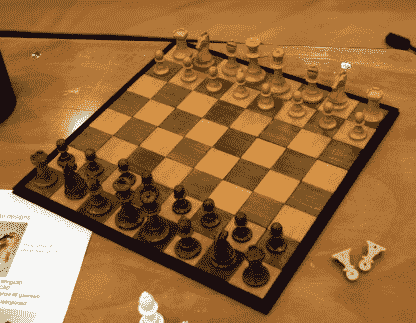](https://i0.wp.com/hackaday.com/wp-content/uploads/2018/07/errf_print4.jpg?ssl=1)   

## 极好的第一步

没有人会说第一届 ERRF 是成功的，但当然没有什么是完美的。我们听到了一些对场地本身的抱怨。一些人不喜欢外面食物的政策，带着微型黑客的与会者哀叹婴儿车不允许进入大楼的事实。同样显而易见的是，不少供应商和参展商在最后一刻放弃了这个活动:上面有名片的空桌子很难被忽略。

尽管有一些小故障，这场演出真的好得不能再好了。我们渴望看到东海岸说唱音乐节的未来。