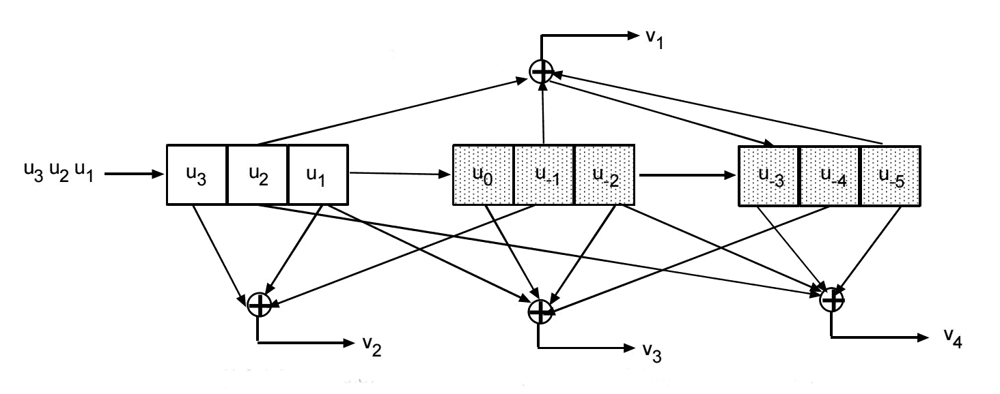
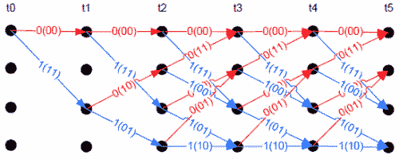
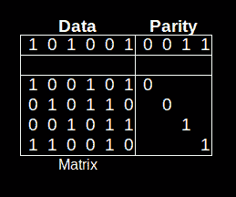

# 错误检测和纠正:里德-所罗门，卷积和格子图

> 原文：<https://hackaday.com/2016/02/10/error-detection-and-correction-reed-solomon-convolution-and-trellis-diagrams/>

在有大量背景噪声的情况下，准确无误地传输数据是一项挑战。Claude E. Shannon 博士在 1948 年提出了他的理论，解决了存在噪声时通信信道的容量问题。他的工作很快从通信扩展到其他领域。甚至计算机使用的其他方面也受到了影响。一个例子是从存储介质(如硬盘或 CD-ROM)传输数据。这些介质及其传感器不是 100%可靠，因此会出现错误。正如香农的工作定义了通信信道容量一样，它也定义了从介质表面到读取头的传输速率。

香农告诉我们有多少可以通过一个渠道，但没有说如何。自 1948 年以来，大量的研究工作投入到准确检测错误和纠正错误。纠错码(ECC)在消息中增加了额外的比特，但是它们的代价是解决错误的能力。例如，如果没有 ECC，现在离开我们太阳系的两艘航海家号宇宙飞船将无法用电话把它们收集的信息带回家，因为噪音会淹没它们的信号。通常在硬件中，如内存，纠错被称为 ECC。在通信中，使用术语前向纠错(FEC)。

强大的通信或数据传输是花哨的软件和复杂的信号处理的结合。在本文中，我将重点讨论软件方面。您可能会发现这些技术中的一些在设备间传递数据时很有用。虽然我将使用术语*通信*,但请记住这适用于一般的数据传输。

# 错误处理问题

稳健的通信需要多层协议。这些层中的任何一层或所有层都可能具有误差校正，误差校正的类型可能不同。一层将解决通过电线、光纤或射频的物理数据传输。另一个可能解决消息路由和传输到其他系统的问题。每一层都有特定的错误处理类型和错误发生时的处理方式。因此，我无法提供一个明确的声明，说明当检测到错误时应该做什么，因为这取决于协议的预期。为了说明层次，比较[开放系统互连/参考模型](https://en.wikipedia.org/wiki/OSI_model)和[互联网协议组](https://en.wikipedia.org/wiki/Internet_protocol_suite)。

错误可以通过两种方式改变位。一个位可以翻转，即 1 变成 0 或 0 变成 1。或者可以擦除一个比特。由于互连设备的 [RS-232 标准](https://en.wikipedia.org/wiki/RS-232)将 0 定义为> 3V，将 1 定义为< -3V，因此可能会发生擦除。这两者之间的任何东西都是未定义的，导致擦除。错误也可能出现在突发中，一次取出多个位，或者出现在单个位上。

我们习惯于用字节来思考通信。通常，当应用数学分析时，通信协议分析与比特流一起工作。幸运的是，对于我们这些电脑高手来说，这些抽象可以被翻译成字节操作，但这也增加了它自身的复杂性。进程是小端还是大端的？比特流是从第一个还是最后一个接收的比特开始处理的？这些不会改变数学，但会改变实现。我们不会深入细节，但会意识到问题的存在。

在我们进入细节之前，让我们再看一下 Shannon 的通信图。我们产生的信息被传送到一个发射器，在那里被编码。编码信息通过引入噪声的通信信道。接收器收集被噪声修改的编码数据，并以信息的无错误传递为目标对其进行解码。

# 误差检测

在你修复一个错误之前，你必须知道它发生了。一个基本的错误检测器是奇偶校验。在设置串行端口时，您可能会遇到奇偶校验位，您必须选择奇偶校验位。奇偶校验位用于错误检测。如果通道改变了一个位、数据或奇偶校验，奇偶校验将是错误的，并标记一个错误。奇偶校验的一个缺点是，如果多个位翻转相互抵消，它可能检测不到。

与奇偶校验相关的是*校验和。*校验和对消息中的所有字节进行异或运算。校验和被附加到消息中。当数据到达时，接收器也计算校验和，并将其与接收值进行比较。如果值不匹配，则消息有错误。与奇偶校验一样，校验和不能检测到多个相互抵消的错误。

校验和的另一个用途是验证嵌入式系统中 PROMs 的完整性。一个可悲的事实是，PROM 中的位偶尔会失败，从而破坏程序代码。有效代码的校验和被写入 PROM 存储器的一端，以便在启动时验证，并在运行代码时定期验证。

奇偶校验与校验和实际上是循环冗余校验 (CRC)的最简单形式。在数学术语中，CRC 是对消息进行多项式模运算(模 2)的结果。你必须看到它才能意识到它并不复杂。下面是一个使用 0010110101010111 位除以 CRC 位模式 100101 的消息的示例:

```
0 0 1 0 1 1 0 1 0 1 0 1 0 1 1 1
    1 0 0 1 0 1        
    0 0 1 0 0 0 0 1      
        1 0 0 1 0 1      
        0 0 0 1 0 0 0 1 0   
              1 0 0 1 0 1   
              0 0 0 1 1 1 1 1 1
                    1 0 0 1 0 1
                    0 1 1 0 1 0 = 0x1A

```

粗体值是流程中每一步的结果。该消息的 CRC 为 0x1A。该过程从最左边的 1 位开始，并执行 XOR 运算。它向右移动到下一个 1 位，并再次执行 XOR 运算，如有必要，使用消息中的附加位。这一直持续到最后一位被包括在计算中。

CRC 的实际实现实际上不做这种划分。大多数使用查找表，将表值与消息值进行异或运算。你可以在网上的很多地方找到例子。如果你正在实现一个特定的协议，可能有标准的程序可用，因为 CRC 位模式，实际上称为多项式，是特定于每个协议的。协议使用的多项式处理可能发生的错误类型。一些多项式更好地处理突发错误，而另一些多项式更好地处理单比特错误。

依赖 CRC、奇偶校验或校验和的协议不提供纠错功能，通常用于噪声不是大问题的场合。一个典型的应用是数据流，丢失的值并不重要，因为它的下一个副本很快就会出现。另一个选项是，如果出现错误，可以重复消息。这些是自动重复请求(ARQ)协议。消息被发送到接收器，如果没有检测到错误，接收器发回肯定确认(ack ),否则发送否定确认(NAK)。由于这些缩写，你可能会听到他们所谓的 ACK/NAK 代码。如果收到 ACK，则发送下一条消息。如果发送回 NAK，则重复当前消息。

ARQ 的缺点是接收方确认消息造成的时间延迟，以及错误发生时重复造成的更长的延迟。这导致了滑动窗口的发展，在滑动窗口中可以不间断地发送多个消息，例如 7 个。接收方将发送回一个带有最后一个好消息序列号的 ack。发送方将继续发送确认消息后的下一条消息。

# 纠错

纠正错误的能力对于获得最大吞吐量至关重要。FEC 的引入可以等同于增加发射信号的功率。FEC 引入 3dB 增益并不少见，这相当于发射功率翻倍。(A [dB 是分贝](https://en.wikipedia.org/wiki/Decibel)，一种用于表示功率或振幅比的对数标度。)分贝用于确定协议有多接近香农极限。

有两种外汇券。*卷积码*在传输时处理比特。*分组码*作用于整个消息块。有许多两种类型的代码。

几乎*事实上*的[分组码标准是](https://en.wikipedia.org/wiki/Reed%E2%80%93Solomon_error_correction)[欧文·s·里德](https://en.wikipedia.org/wiki/Irving_S._Reed)和[古斯塔夫·所罗门](https://en.wikipedia.org/wiki/Gustave_Solomon)在 1960 年开发的里德-所罗门(RS) 。您可以在 CD 和 DVD、DSL 和 WiMax、卫星通信和数字电视中找到 RS 码。其他分组码有汉明码和格雷码。

## 里德-所罗门

RS 码与包含数据符号和附加到数据的一组奇偶符号的消息一起工作。细节由 *{n，k}* 指定，其中 *n* 是消息长度， *k* 是数据长度。RS 并不局限于对作为符号的字节进行操作，但我们将只考虑 8 位的例子。常见的 RS 码是具有 8 位符号的{255，223}。这将创建一个 255 字节的消息，其中包含 223 个数据字节和 32 个奇偶校验字节。利用这 32 个字节，RS 可以纠正消息中 16 个字节的错误。这意味着在 16 个不同的字节中，单个位或所有 8 个位可能是错误的，RS 将纠正它们。奇偶符号的个数，称为 *2t* ，总是符号个数的两倍，正好是可以纠正的 *t，*。

## 卷积码

卷积码作用于数据流中的比特。它们可以用类似于块码规范的三个参数来指定。{7，3，3}码使用 3 比特的存储器，基于 3 比特的输入向输出流添加 7 比特。正如 CRC 码一样，它们使用多项式对输入位进行编码，以创建输出流。

短卷积码很容易进行硬件编码。对于我们的{7，3，3}码，使用 9 位的移位寄存器(9 位乘以 3 个存储器)。移位寄存器引脚的输出以多项式定义的模式连接到 XOR 门网络。



Hardware Convolution Encoding

输入比特流一次 3 比特地被移入移位寄存器。在每次移位时，输入位和异或门输出位以每 3 个输入 7 个输出的速率放入输出流中。除了新的 3 个输入位之外，这种类型的代码使用存储器、先前的 6 个位来产生输出。

另一种技术是“穿孔”代码。这将从输出流中丢弃一些位，以提高传输消息的速度。协议定义被设计成使得这些比特容易作为 FEC 的一部分被恢复。丢弃比特增加了总吞吐量。



Trellis Diagram

卷积码是一种状态机。这样，可以构建一个称为*格子图*的图。该图顶部是时间，侧面是位状态。它表示在特定时间比特流中可能出现的合法比特模式。可以使用软件代替硬件，通过遍历该图来生成输出流。卷积码的解码几乎总是使用网格码在软件中完成。

纠错发生在解码中，因为在图上的任何节点上只有有限的合法状态可用。当比特流包含非法代码时，解码器知道发生了错误。假设解码器使用来自流的 2 个输入比特来遍历图形。它遇到一个节点，其中只有 00 或 11 是合法的，但输入是 10。软件猜测它应该是 11，并在递增错误计数器后继续该假设。当遇到非法状态时，该过程继续进行猜测，在每次猜测时递增错误计数器。当出现太多错误时，该过程退回到先前的猜测，并采取另一条路径。在我们的例子中，回溯之后，解码器将采用 00 输入指示的路径。当解码器到达表的末尾时，流的这一部分被完全解码。解码器再次从表的开始处开始处理流的剩余部分。

高通的创始人 Andrew Viterbi 开发了一种更复杂的解码方法，它沿着多条路径在网络中移动。对每条路径进行加权，并且在处理过程中有时会丢弃低权重的路径。

这些方法是*硬判决*解码，因为接收到的比特不是 0 就是 1。一种*软判决*解码方法使用比特值的概率。在 RS-232 标准中，高于 3V 的信号有 100%的概率是 0，但是 2.5v 的信号有 80%的概率是 0。这个概率指导了网络中的遍历。

## 低密度奇偶校验

[低密度奇偶校验(LDPC)的发展很有趣](https://en.wikipedia.org/wiki/Low-density_parity-check_code)。1996 年，大卫·麦凯和拉德福德·m·尼尔重新发现并发表了一篇关于它们的论文。随后，人们发现罗伯特·g·加拉格尔(Robert G. Gallager)最初在他 1963 年的博士论文中发现并描述了它们。它们休眠了这么多年，因为 1963 年的计算机没有能力在合理的时间内处理它们。LDPC 被证明优于使用 RS 分层的卷积码，接近香农极限。LDPC 仍在继续开发，现在已用于通信系统。有人认为 LDPCs 是所有 FEC 的基础。例如，RS 码可以显示为 LDPC。

仅在几年前，引入了类似的 FEC，即 Turbo 码。这些代码也非常接近香农的极限。缺点是它们获得了专利，但专利已于 2013 年到期。



Calculating an LDPC Note: the 3rd parity bit should be 0, not 1

LDPCs 将一系列奇偶校验位附加到消息中。通常，编码流相对较长，1024 位是一条短消息。这是因为信息越长，LDPC 就越有效。

该表显示了一个包含 4 个奇偶校验位的 6 位小消息。数据下方的矩阵显示了用于计算奇偶校验位的位数。计算出的比特被附加到数据上。正如你所看到的，编码是微不足道的。

解码要复杂得多，因为它涉及求解联立方程，矩阵中的每一行都有一个联立方程。假设第一个数据位 0 不正确。因为位 0 不正确，所以位 1、3、4 和 5(第 1 行和第 4 行等式)可能被计算为不正确。但是基于其他行的那些位的计算将显示它们是正确的。这意味着位 0 实际上肯定是不正确的位。

LDPCs 的真正复杂性在于构造决定奇偶输出的矩阵。这是 LDPCs 的研究重点。

## FEC 交织和分层

交织和分层是使 FEC 更加健壮的技术。我将针对 RS 码讨论它们，但它们可以用于所有 FEC 码，包括混合类型的 FEC 码。

交叉存取就是在传输之前，以一种受控的方式获取大量消息并混合字节。RS {255，235}的一个简单方法是创建一组要交织的消息。发送所有消息中的第一个符号，然后是第 2 个^(和第 1 个)符号，第 3 个^(和第 4 个^(和第 5 个)，以此类推。在接收端，它们被重新分配给正确的消息。)

为什么要这么做？假设您有一个突发错误，每次发生时都会删除 17 个符号。这将阻止该 RS 纠正消息，因为它只能纠正 16 个错误。当消息被解交织时，坏字节被放回到它们正确的消息中。因此，如果所有的第一个符号都是坏的，那么当它们被正确地放置在它们的消息中时，它们现在是可纠正的。

CD 上的 FEC 使用交错和分层。一个短的{32，28}码用于纠正从磁道读取的错误。任何它不能纠正的都被标记为擦除，并且结果被去交错。然后由{28，24}代码处理结果，修复任何擦除。这种方法非常有效，可以从 4000 位的丢失中恢复。

# 包裹

我们已经看到香农如何在他人工作的基础上发展了一个定理，即我们可以通过一个通道发送比 1948 年更多的数据。这为研究人员开发这里讨论的错误检测和纠正代码提供了动力。如果没有外汇券，世界将会完全不同。

太空探索，尤其是深空，绝对需要使用 FEC 的通信。如果没有 FEC 增加来自太空探测器和行星探测器(如航海家号、卡西尼号或好奇号)的微小信号的有效信号强度，我们对其他行星和太阳系的遥远区域将知之甚少。互联网，如果存在的话，不仅在我们个人的最后一英里连接上会慢得多，而且在一般的互联网主干上也会慢得多。我们计算机中的存储设备会更慢，因为它们使用 FEC 来恢复读取驱动器中的错误。

还有一个更重要的因素没有提到，即用于数据传输的电信号或射频信号。我可能会在以后的文章中提到它们。