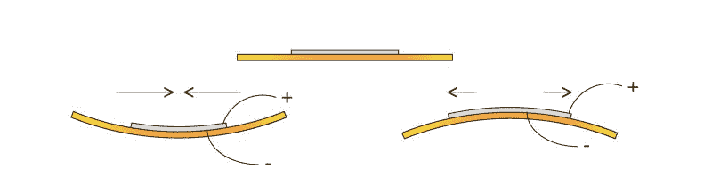
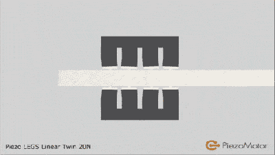
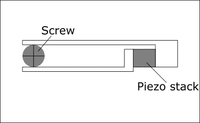

# 深奥的驱动器

> 原文：<https://hackaday.com/2015/12/10/esoteric-actuators/>

马达无处不在；DC 电机，交流电机，步进电机，以及其他主机。在这篇文章中，我将超越这些常见的设备，寻找更深奥和不寻常的电子执行器，可能会在您的某个项目中找到一席之地。无论如何，它们的机制本身就很有趣！休息之后，请和我一起调查压电、磁致伸缩、磁流变、音圈、检流计和其他器件。我也很想听听你最喜欢的致动器和马达，所以请在下面评论吧！

## 压电致动器和电机

The flexing of a piezo buzzer from [arcbotics](http://arcbotics.com/lessons/melody/)

压电材料有时看起来很神奇。对压电材料施加电压，它就会移动，就这么简单。当然，问题是它不会移动太多。你可能最熟悉的压电设备是不起眼的蜂鸣器。你通常用低于 10 伏的电压来驱动这些。虽然蜂鸣器会发出清晰可闻的声音，但你看不到它在弯曲(如上图所示)。

为了测量蜂鸣器的运动，我最近尝试用 150 伏压电驱动器驱动一个蜂鸣器，结果总偏差约为 0.1 毫米。按正常标准来看，这并不算多！

The PiezoMotor LEGS actuator “walks” along a rod, pushing it as it goes.

然而，对于某些应用，分辨率比行程范围更重要。正是在这里，压电致动器大放异彩。压电致动器的典型应用可能是扫描探针显微镜。这些通常需要亚纳米精度(小于 1 毫米的 1000 分之一到 1000 分之一)，以便可视化单个原子。压电堆栈在这里是理想的(虽然黑客也使用了[便宜的蜂鸣器！](http://dberard.com/home-built-stm/scan-head/))。

虽然有时你需要在更大的行程范围内保持高精度。有许多压电配置允许这样做。特别是尺蠖、“腿”和粘滑致动器。

压电马达腿致动器如上所示。如上所述，压电仅产生小的(通常亚毫米)运动。LEGS 不是直接使用这种运动，而是使用这种运动沿着一根杆“行走”，来回推动它。因此，杆以微小的纳米步长移动。然而，压电可以快速移动(每秒弯曲数千次)。并且腿(和类似的尺蠖致动器)允许相对快速、高作用力和高分辨率的运动。

 

桌布魔术(是的，这是假的，孩子没事，别担心。:))

另一种长行程压电致动器使用[“粘滑现象”](https://en.wikipedia.org/wiki/Stick-slip_phenomenon)。这很像上面展示的桌布魔术。如果你慢慢地拉布料，布料和陶器之间会有很大的摩擦力，它们会和布料一起被拖着走。快速地拉它，摩擦会减少，陶器会留在原处。

静态摩擦和动态摩擦之间的这种差异在粘滑致动器中得到了利用。基本机制如下图所示。

Motion caused by a stick-slip motor

当缓慢伸展时，钳夹旋转螺杆，但是如果压电叠堆被快速压缩，螺杆将不会返回。因此，可以使螺杆旋转。通过颠倒该过程(快速伸展，然后缓慢压缩),该过程被逆转，并且螺钉被转向相反的方向。这种配置的巧妙之处在于，它保留了压电元件的大部分原有精度。微型马达的分辨率在很大的行程范围内约为 30 纳米，通常为 25 毫米，它们通常用于光学聚焦和对准，可以在易贝花 100 美元左右买到。哦，它们也可以用来制作音乐。最爱有 *[天梯](https://www.youtube.com/watch?v=isJAQdJs-Wk)* ，[不是 1](https://www.youtube.com/watch?v=JJvFDOUCFu0) 而是 [2 版](https://www.youtube.com/watch?v=Cl7U29eJxng)的*还活着*(来自传送门)。强制*帝国进行曲*示范嵌入此处:

 [https://www.youtube.com/embed/K-W_s0k-X6g?version=3&rel=1&showsearch=0&showinfo=1&iv_load_policy=1&fs=1&hl=en-US&autohide=2&wmode=transparent](https://www.youtube.com/embed/K-W_s0k-X6g?version=3&rel=1&showsearch=0&showinfo=1&iv_load_policy=1&fs=1&hl=en-US&autohide=2&wmode=transparent)

还有许多其他压电配置，但通常用于提供高作用力、高精度的运动。我在我的博客上又记录了一些。

## 磁致伸缩致动器

磁致伸缩是材料在磁场下改变形状的趋势。我们最近一直在谈论磁致伸缩。然而，很像压电，它也可以用于高精度运动。与压电不同，它们需要相对较低的工作电压，并且已经找到了[的利基应用](http://www.cedrat-technologies.com/fileadmin/user_upload/cedrat_groupe/Technologies/Actuators/Magnetic%20actuators%20%26%20motors/fiche_AMA/Magnetostrictive_Actuators.pdf)。

## 磁流变运动

磁流变液非常棒！就像铁磁流体一样，MR 流体会对磁场强度的变化做出反应。然而，与铁磁流体不同的是，改变的是它们的粘度。

 [https://www.youtube.com/embed/SBXQ-6uI8GY?version=3&rel=1&showsearch=0&showinfo=1&iv_load_policy=1&fs=1&hl=en-US&autohide=2&start=257&wmode=transparent](https://www.youtube.com/embed/SBXQ-6uI8GY?version=3&rel=1&showsearch=0&showinfo=1&iv_load_policy=1&fs=1&hl=en-US&autohide=2&start=257&wmode=transparent)

这种新颖的特性已经在许多领域得到了应用。特别是用于半导体和天文应用的精密镜子和透镜的精加工。这种方法使用电磁体来改变用于抛光镜子的浆液的粘度，从而消除瑕疵。哈勃望远镜的高精度镜子显然是用这种技术完成的(尽管希望不是 **[那面](http://www.spacetelescope.org/about/history/aberration_problem/)** 镜子)。几百块钱就能买到[小批量](http://www.lordmrstore.com/lord-mr-products)的 MR 流体。

## 静电电机

磁性电机通过磁场的吸引力和排斥力运行，[静电电机](https://en.wikipedia.org/wiki/Electrostatic_motor)利用电变化的吸引力和排斥力产生运动。静电力比磁力小几个数量级。然而，他们确实有利基应用。一个这样的应用是 MEMS 马达，微型(通常小于 0.01 毫米)纳米制造的马达。在这些比例下，电磁线圈会太大，比功率(每单位体积的功率)比合力的大小更重要。

 [https://www.youtube.com/embed/n3YMjgbhvTA?version=3&rel=1&showsearch=0&showinfo=1&iv_load_policy=1&fs=1&hl=en-US&autohide=2&wmode=transparent](https://www.youtube.com/embed/n3YMjgbhvTA?version=3&rel=1&showsearch=0&showinfo=1&iv_load_policy=1&fs=1&hl=en-US&autohide=2&wmode=transparent)

## 音圈和电流计

音圈是你的基本电磁铁。它们通常用于扬声器，锥体中的电磁体对固定磁体产生反作用，从而产生运动。然而，类似音圈的配置用于其他地方的精确运动控制(例如聚焦光驱的透镜，或者定位[硬盘驱动器](http://rack1.ul.cs.cmu.edu/rotaryvoicecoil/)的读取头)。然而，一个更酷的应用是[镜式检流计](https://en.wikipedia.org/wiki/Mirror_galvanometer)。顾名思义，该设备最初用于测量小电流。流过线圈的电流移动一根连着镜子的杆子。一束光从镜子反射到墙上，有效地产生了一个很长的指针，放大了信号。

当然，如今电流表要灵敏得多，但镜式电流计有了更有趣的应用:

 [https://www.youtube.com/embed/m_CHXwXvWvs?version=3&rel=1&showsearch=0&showinfo=1&iv_load_policy=1&fs=1&hl=en-US&autohide=2&wmode=transparent](https://www.youtube.com/embed/m_CHXwXvWvs?version=3&rel=1&showsearch=0&showinfo=1&iv_load_policy=1&fs=1&hl=en-US&autohide=2&wmode=transparent)

高速激光“galvos”用于定位激光束，产生令人敬畏的光表演。现代系统能够以千赫兹的速度定位激光束，呈现令人吃惊的图像。这些系统实际上是高速矢量图形画线系统，导致了许多有趣的算法挑战。Marcan 的 [OpenLase](https://marcan.st/projects/openlase/) 框架提供了大量有效解决这些挑战的工具，非常值得一试。

在这篇文章中，我试图强调一些有趣的和鲜为人知的在电子系统中创造运动的技术。其中大多数都有科学、工业或艺术应用。但我希望它们也能在你开发自己的黑客软件时提供灵感！如果你有一个最喜欢的，鲜为人知的驱动器或电机，请在下面评论！