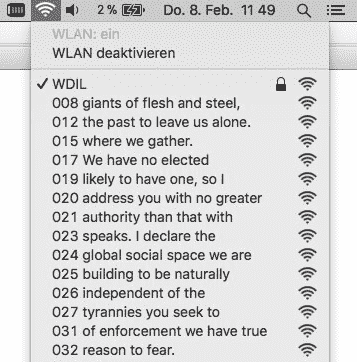

# ESP8266 广播纪念 WiFi 垃圾邮件

> 原文：<https://hackaday.com/2018/02/09/esp8266-broadcasts-memorial-wifi-spam/>

电子前沿基金会和新闻自由基金会创始成员约翰·佩里·巴洛于 2018 年 2 月 7 日去世。说他在互联网上留下了自己的印记，并延伸到现代文化，这是一种轻描淡写的说法。他可能不是一个家喻户晓的名字，但在这种行动主义(在线和离线)、讲座、书面工作和各种创业项目之间，他的 70 年人生肯定没有浪费。巴洛曾经说过“我想成为一个好祖先”，无论从哪个角度来看，他似乎都实现了这个目标。

 为了纪念他的去世，[莫里茨·梅斯]想出了一个相当不寻常的纪念方式。他使用 ESP8266 板上的一点代码，创建了一个设备，可以以 228 个 WiFi ssid 的形式逐行广播巴洛的“*网络空间独立宣言*”[。也许这不是把巴洛的话传达给人们的最有效方式，但我们会给他的风格加分。](https://twitter.com/moritzmetz/status/961574813704839168)

代码本身是基于 [FakeBeaconESP8266](https://github.com/markszabo/FakeBeaconESP8266/) ，顾名思义，允许用户创建假的 WiFi 网络。要传播你选择的宣言，你只需要在代码底部添加适当的`sendBeacon()`行。似乎需要在每一行前面加上一个数字，才能使扫描网络的设备以正确的顺序显示文本行。至少在演示的设备上是这样。

澄清一下:*你绝对不应该这么做。* [用一堆假网络干扰当地环境](https://hackaday.com/2017/08/13/wifi-deauthentication-vs-wifi-jamming-what-is-the-difference/)是一个相当糟糕的主意。但是作为对一个偶尔声称自己是无政府主义者的人的纪念，[你可以做得更糟。另外，我们必须承认“钢铁巨人”是一个很棒的网络名称。](https://hackaday.com/2011/10/04/wifi-jamming-via-deauthentication-packets/)

[https://player.vimeo.com/video/111576518](https://player.vimeo.com/video/111576518)