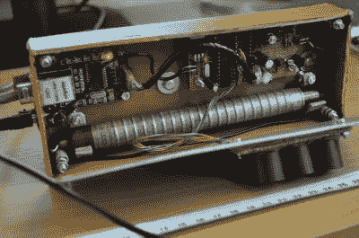
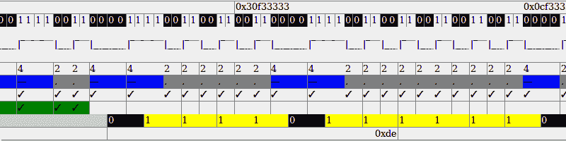

# ESP8266 中发现的以太网控制器

> 原文：<https://hackaday.com/2016/04/01/ethernet-controller-discovered-in-the-esp8266/>

古老的 ESP8266 震撼了物联网世界。最初只不过是一个奇怪的 3 美元的 WiFi-串行桥，一点一点地，ESP 的真正力量已经为人所知，完全可编程，拥有丰富的外围设备，似乎 ESP 不能做的事情很少。在这个列表上，至少直到今天是以太网。

不，尽管有误导性的标题，ESP 没有 MAC 和/或 PHY，但它有一个令人难以置信的 80 MHz DMA-able 移位寄存器，可用于使用新项目[espethernet](http://github.com/cnlohr/espthernet)与 10BASE-T 以太网通信。广告之后，请和我一起观看视频演示，深入了解这是如何实现的。

## 为什么 ESP8266 需要以太网？

ESP8266 具有各种通信和外设，但我发现我想要的一个接口是以太网。我想用某种方式对 ESP 的无线网络做一些奇怪的事情，这将中断它与主机 AP 的连接，因为它支持混杂和网状模式。我开始尝试看看我会在哪里结束..每一步我都不知道这是否可行。我找不到任何在双工模式下使用 I2S 接口的人。没人知道它能跑多快。没人知道它是否会损坏数据。表演会是什么样的？可以发送/接收 1.5kB 的帧吗？在几个月的时间里，所有这些问题的答案都比我预期的要好得多！

 [https://www.youtube.com/embed/XKnyAYKP434?version=3&rel=1&showsearch=0&showinfo=1&iv_load_policy=1&fs=1&hl=en-US&autohide=2&wmode=transparent](https://www.youtube.com/embed/XKnyAYKP434?version=3&rel=1&showsearch=0&showinfo=1&iv_load_policy=1&fs=1&hl=en-US&autohide=2&wmode=transparent)


免责声明:本项目不明确符合 IEEE 802.3 标准。它不会像设计合理的设备那样工作。不要混淆。这是一个党的伎俩，而不是一个合法的工程解决方案。

## 没有麦克？没有 PHY？没问题。



[Early version of uRad Monitor](https://hackaday.com/2012/12/07/online-radiation-monitoring-station/) uses ENC28J60 board seen to the left

10BASE-T 使用差分信令、NLP 来宣布链路存在、前同步码、曼彻斯特比特编码、用于 FCS 的 CRC32s、各种协议校验和以及高达 10 兆比特的数据突发。难怪工程师会使用专用硬件。业余爱好者使用的一些更知名的以太网控制器是 [ENC28J60](https://hackaday.com/tag/enc28j60/) 或它的大兄弟，100BASE-T， [ENC424J600](https://hackaday.com/tag/enc424j600/) 但有一点是肯定的:除了一些**新奇的**项目，如 [ATMega168](http://www.cesko.host.sk/IgorPlugUDP/IgorPlug-UDP%20%28AVR%29_eng.htm) 上的单工或 [ATTiny85](https://github.com/cnlohr/ethertiny) 上的半双工[，人们使用专门建造的以太网硬件。](https://github.com/cnlohr/ethertiny)

ESP 的 I2S 总线是各种项目的家园，包括一个 [MP3 播放器](https://github.com/espressif/ESP8266_MP3_DECODER)、 [WS2812 控制器](https://www.youtube.com/watch?v=6zqGwxqJQnw)、[数控驱动器](https://github.com/lhartmann/esp8266_reprap)和[彩色 NTSC 广播](http://hackaday.com/2016/03/01/color-tv-broadcasts-are-esp8266s-newest-trick/)。通过以 40 MHz 的频率操作 ESP8266 中的 I2S 总线，我们可以捕捉线路上发生的一切，并将其转换为 32 位字。在软件中，我们可以查看接收到了什么，一次一个 32 位字；当信息包滚滚而来时进行解码。在连接到 I2S 总线的 DMA 引擎和 160 MHz 32 位 Xtensa 内核之间，几层解码可以在软件中动态完成。

还有电气兼容性的小问题。虽然 ESP *可以用一个电阻和两个电容*发送和接收帧，但最好使用实际的线路驱动器，如 1.50 美元的 ISL3177，因为它更灵敏、更强大、具有更好的保护和压摆率限制。错误率从大约 5-10%到< 0.1%。它仍然违反 IEEE802.3 标准，只是没有那么严重。

## 以太网帧

以太网帧是用来保存数据包的。帧的存在是为了在黑暗而危险的物理层上传输数据包。它们包含前同步码、接收方和发送方的 MAC 地址以及实际的数据包。数据包包含 TCP、UDP 等内容。它还在末尾包含一个 FCS，以确保数据包在传输过程中不会被破坏。


这些帧不仅仅是以串行流的形式在线发送出去。10BASE-T 以太网通过铜线传输差分信号，采用磁隔离。这些事情的结合意味着我们不能在不破坏磁性的情况下连续发送太多的 1 或 0。

虽然在其他通信技术中使用了许多技术来解决这一问题，如 4B5B(在 100BASE-T 以太网上)或 EFM(在 CD 上),但 10BASE-T 选择了曼彻斯特编码。


曼彻斯特编码用向上或向下转换来描述所有的 1 和 0。“1”位由从低到高的转变表示，而 0 由从高到低的转变表示。这些过渡必须小心地保持同步，否则，将会出现混乱的火车残骸。如果检查到错误的转换，就很容易使位倒退并丢失数据。

作为一名软件工程师，我最初觉得难以置信为什么有人会使用如此敏感的编码方案。答案在于硬件。可以使用 PLL 来同步前同步码中的数据流。一旦锁定，它会找到前同步码的结尾，并获得一个清晰的数据流。然而，对我们来说，我们将不得不用软件进行解码，用这种方法，曼彻斯特显然不太方便。

## 该系统


目标是发送和接收以太网帧。为此，需要采取几个步骤。虽然 I2S DMA 引擎在线路上为我们提供原始的 32 位比特值，但我们仍然需要找到帧、解码帧、检查 FCS 并将帧传递给用户。如果我们将曼彻斯特解码转移到主线程中，那么每个缓冲包将花费惊人的 6208 字节！我们需要在 I2S 中断中进行解码。

一旦传递给主线程，它就可以检查 FCS 和用户层需要的任何东西。FCS 在此应用中至关重要，因为许多因素都可能导致我们的数据包损坏。正常的系统只需要对付电噪声，而我们需要担心中断时间太长、缓冲区溢出以及任何可能破坏我们的包的东西。

如果用户层想要响应或发回任何数据包，它可以将消息组帧，加上 CRC，对数据包进行编码，然后将其传回中断，中断将在下一个可用的机会接收并发送数据包。

## 解码器

所以，现在，ESP 一直在捕捉这个 1 和 0 的流。一旦新的数据块进入，就会调用一个中断，我们的代码就可以开始在数据中搜索数据包。要检查是否有数据包存在，它只需在流中搜索不全是 1 或 0 的 32 位字。一旦我们连续发现 3 帧有情况发生，我们就很有把握我们有一个数据包。

曼彻斯特解码在软件领域要稍微复杂一些。因为我们有一个数字化的信号，它并不总是与信号完全同步。更令人沮丧的是，如果我们的采样频率正好是 40 MHz，高信号与低信号的机会相等，那么可能会出现模糊的情况。为了解决这个问题，我们必须增加一个偏差，这样我们看到的 0 就比 1 多。解释每一位需要很多东西。长短检测、查找错误状态、查找前同步码结尾、解释位状态。这很复杂，所以做了一个 HTML5 GUI。在这里的网站上可以找到它，它允许你玩一个样本包，翻转比特等等。在 ESP 上运行时，它可用于捕获有问题的数据包并检查原始位。



因为这些位是以 40 MHz 的速率输入的，所以每位有 4 个处理器时钟周期(160 MHz)，最多可以计算出如何处理我们的输入流。朴素算法有 140 行代码，一次处理一位，经过大量优化后，在中断处理程序中运行需要大约 10 倍的时间。

为了实现在中断中运行所需的加速，我们使用了一个表。对于输入状态和输入位的每种可能组合，我们计算输出状态。我们必须考虑极性，半字节之前的最后一位是 1 还是 0，一行中相同的位数，检查不匹配的短对，以及 4 位新数据。我们还有 10 位输出数据。这就产生了一个 1024×2 字节的表。

结果是惊人的。通过一次执行一点，并使用表格而不是代码，我们获得了所需的 10 倍性能提升和一些变化！

## 【用户】层

因为还不可能使用 ESP 附带的 TCP/IP 协议栈，所以我们需要使用自己的协议栈。因为我从 ENC424J600 驱动程序中模拟了这个以太网栈，所以很容易将 [avrcraft](https://github.com/cnlohr/avrcraft) IP+ARP+UDP+TCP 栈移植到这个项目中。为了方便起见，这个项目中使用的 HTTP 服务器也是从那里借来的！因此，甚至将 web 服务器移植到我们的 TCP/IP 堆栈也是微不足道的。

## 编码

如果你所能做的只是接收，以太网就没什么意思了。传输数据包也是需要的。IP 堆栈将能够构建一个包含 MAC 地址和有效载荷的帧，但我们必须添加前同步码和 FCS，然后曼彻斯特编码数据。如果一次输出一位，曼彻斯特编码信号可能会很痛苦，但我们也可以利用这里的表格！使用下面的函数可以一次一个字节地对网络上的数据进行编码。

> ```
> static const uint16_t ManchesterTable[16] __attribute__ ((aligned (16))) = {
> 
>     0b1100110011001100, 0b0011110011001100, 0b1100001111001100, 0b0011001111001100,
> 
>     0b1100110000111100, 0b0011110000111100, 0b1100001100111100, 0b0011001100111100,
> 
>     0b1100110011000011, 0b0011110011000011, 0b1100001111000011, 0b0011001111000011,
> 
>     0b1100110000110011, 0b0011110000110011, 0b1100001100110011, 0b0011001100110011,
> 
> };
> 
> 
> 
> void PushManch( unsigned char k ) {
> 
>      *(sDMA++) = ( ManchesterTable[ (k)>>4 ] )|( ManchesterTable[ (k)&0x0f ]<<16 );
> 
> }
> ```

说真的。桌子太棒了。

## 传输会引发硬件问题

ESP 的 I2S 引擎无法接收数据包，除非发射器也在运行。这意味着，即使我们只传输 0，我们仍然必须向 DMA 引擎提供有效的描述符。描述符链接到“下一个”,该“下一个”在它所在的链接之后流出。一旦开始，就没有办法改变活动的 DMA。此外，停止 TX 端的 DMA 子系统，即使是短暂的停止，也会导致 I2S 总线锁定。


不可能只在这里和那里发射一包。更糟糕的是，中断调用可能会被错过，因此无法立即依赖切换链。所有的状态都必须稳定。我们有几个描述符只发送 0([0]到[3])，并且有可能链接一个或多个数据描述符。为了只发送一个数据包，我们必须在从[0]和[1]ping 到发送数据包，以及从[2]和[3]ping 之间进行转换。

这意味着:

*   通常，[0]必须指向[1]，而[1]必须指向[0]。
*   发送数据包时，[1]指向[数据包]，[数据包]指向[3]
    *   系统将在[3]和[2]之间跳跃，直到…
*   您可以通过将[1]与[0]挂钩以及将[3]与[0]挂钩来清除它
*   然后，系统将返回到[0]和[1]之间的空闲状态。

瞧啊。我们现在可以在 10BASE-T 以太网上接收和发送数据包了！

## 从这里去哪里？

仍有许多潜在的改进、大量的维护、算法改进、巨大的开发空间以及与现有(或新的 TCP/IP 堆栈)的集成等等。也许这甚至可以移植到一个无以太网的手臂？不过，这些都不重要。随着以太网的解锁，它释放了 WiFi 接口来做各种不寻常的事情。现在，可以监控来自各种来源的数据包，注入数据包。网状模式下的多组 esp 可以被桥接到以太网。处于监控模式的 esp 可以将他们的发现传达回去，甚至远程注入数据包。但我很期待看到你将创造的项目，甚至无法想象！