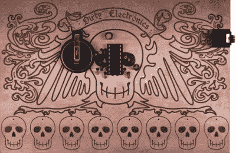
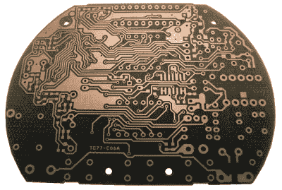

# 每个 PCB 都有自己的位置

> 原文：<https://hackaday.com/2015/10/22/every-pcb-has-its-place/>

每个人都有自己最喜欢的 PCB 制作工艺，只要你是一个快乐的黑客，我认为这并不重要。但是在这篇文章中，我认为描述我的个人过程和一些可用的选项可能会很有趣。

## 在家自制

The Dirty Electronics Skull Etching Synth a great looking maskless board.

蚀刻是家庭黑客的经典 PCB 制作选择。我蚀刻 PCB 已经很多很多年了，但它能产生有趣的结果。有些人不喜欢它，我个人倾向于避免它，因为它是一个混乱和挑剔的过程。但是，如果您只需要 1 或 2 层具有大功能的电路板(通孔元件当然是最好的)，这可能是一个可行的选择。在某些情况下，我认为蚀刻板看起来很棒，非常适合。一个例子是右边显示的[头骨蚀刻](http://www.dirtyelectronics.org/shop.html)。在这种情况下，板的氧化和变色增加了设计的美感。

A simple design milled on an Accurate CNC

对于那些预算较大的人来说，专业铣床可能是一个可行的选择。我过去用过一个[精确的 CNC](http://www.accuratecnc.com)([LPKF](http://www.lpkfusa.com/products/pcb_prototyping/machines/s_series/compare/)和其他公司也生产 mills)，但这是一个昂贵的选择(没有在线定价，但如果 10，000 美元对你来说很多，就不要麻烦了)。准确的轧机是相当可怕的，它可以配备真空床，自动换刀和视觉系统对准。该工厂可以生产高质量的双层板，所有的孔和通孔都钻好了。然而，填充过孔的最后一步是手动的，但是与蚀刻板相比，结果是非常专业的(工厂本身使用研磨的 PCB！).他们声称 0.1 毫米(4 密耳)的轨道大小，我从来没有试过这么小的轨道，但表面贴装元件不是问题。

虽然这是一个有趣的玩具，但如果你真的需要一个 PCB 工厂，这是值得考虑的。它们真正有价值的唯一情况是，如果你想能够在不到一天的时间内迭代一个设计。这在 RF 或低噪声设计中可能很有用，因为您可能想尝试不同的布局，但对于其他项目，一个好的工厂的价格可以支付许多电路板的快速周转(从提交订单到交付需要 1 或 2 天)。

## 商业制造

几年前，商业制造曾经是一个非常昂贵和挑剔的过程。在很大程度上，你需要订购一个完整的面板，使这项服务超出了大多数爱好者的能力范围。根据 fabs 规格生成 gerbers 和 drill 文件也可能是一个充满复杂性的过程。

如今，将设计整合到一个面板上，然后再拆分出来进行分发的服务已经很普遍了。在我的工作中，我大部分时间都与奥什帕克和 T2 seed studio 合作，他们的服务可以很好地互补。我也使用过 [Itead](https://www.itead.cc/) ，发现它们与 Seeed 兼容(额外的好处是它们为开放项目提供免费电路板)。

使用 OSHPark 给我温暖的感觉。作为黑客社区的孩子，诞生于 [DorkbotPDX](http://dorkbotpdx.org/) ，所有 OSHPark 的董事会都是在美国虚构的(查看伟大的 [amphour 访谈](http://www.theamphour.com/the-amp-hour-149-purple-pcb-philosophy/)了解更多细节)。他们的服务仅限于 2 层或 4 层电路板(始终为紫色，并始终镀金(ENIG))、6×6 (6 密耳走线，间距为 6 密耳)或 5×5。我很少尝试 BGA 板，所以 2 层服务很适合我。OSHPark 的最小订单是 3 块板，非常适合做原型。镀金还提供了良好的光洁度，既保护电路板免受氧化，又提供了良好的焊接表面。然而，我使用 OSHPark 的主要原因是，它们对于小型电路板来说很便宜，而且周转相对较快(我最近花 2.40 美元(包括运费)购买了 3 块 20x15mm 毫米的小型电路板，这是无与伦比的)。从美国的 OSHPark 到英国，我的冲浪板大约需要两周才能到达。当有剩余容量时，他们还会自动将主板升级到他们的超快速免费服务。他们的服务非常巧妙，在订购之前提供 gerbers 的渲染图作为最终检查，非常方便。

Zigbee to esp8266 interface fabricated by Seeed (left) and OSHPark (right) [(more complex boards here)](https://hackaday.com/wp-content/uploads/2015/10/oshseeed1.jpg)

另一方面，Seeed 对于较大尺寸的电路板和大量订单来说要便宜得多。它们还提供了更多的颜色和表面处理选项。Seeed 最便宜的选择是带有 HASL 涂层(热风整平)的绿色 PCB。从 Seeed 开始，我的主板通常需要大约一个月的时间才能到达(有几种交付方式，但根据我的经验，这是最快的速度，更快的运输服务通常会使使用 Seeed 变得不那么有吸引力)。

右边的图片展示了我在 OSHPark 和 Seeed 制作的几块非常简单的板子。我从未遇到过任何一种服务的电路板制造问题(尽管我更喜欢 ENIG 完成)。

部分原因是由于使用商业晶圆厂的限制。在设计过程的早期，我将项目发送给 fab，然后切换到另一个设计。当板子回来时，我把它拿上来，按要求博奇，迭代布局。这在两周的周转期内工作得很好，所以我在制作原型时主要使用 OSHPark。

我的主板也倾向于很小(Arduino 盾大小或稍大)。有了这样的小电路板，OSHPark 通常与 Seeed 的订单持平或更便宜(Seeed 的最小数量是 10 块电路板)。对于大约 100x100mm 毫米或更大的板，我认为 Seeed 更便宜。

作为一个业余爱好者，我也很少需要大量的电路板，但对于工作室，当我需要 10 或 20 块电路板时，我会根据我原型的最终迭代从 Seeed 订购。这不仅比 OSHPark 便宜得多，而且我还可以买到各种颜色的木板，让工作坊变得更有趣。

这篇文章描述了一些可用的选项和我个人的过程。我希望这很有趣，但我也很想听听你最喜欢的制造技术、服务和体验，有好有坏。请在下面评论！