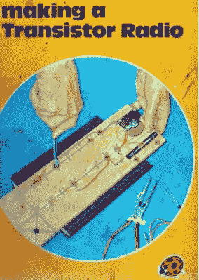
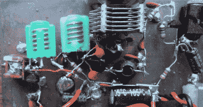

# 每个人都应该建立至少一个再生无线电接收器

> 原文：<https://hackaday.com/2017/02/01/everyone-should-build-at-least-one-regenerative-radio-receiver/>

当我们在 2016 年建设一个电子项目时，有源元件很可能是在小空间内包含大量功能的集成电路。以前我们可能会使用一两个运算放大器、555 定时器或逻辑门，但现在更常见的是使用微控制器，甚至是 ic，尽管它向外界展示的是模拟的一面，但它的所有内部工作都在数字域中完成。

Making A Transistor Radio, 2nd edition cover. Fair use, via [Internet Archive](https://archive.org/details/MakingATransistorRadio-LadybirdBook).

曾经有一段时间，电子管或晶体管等有源元件可能非常昂贵，而集成电路，即使存在，也是大多数制造商力所不及的。在那个时候，人们仍然使用电子设备来做许多和我们今天做的一样的工作，但他们依赖于极其智能的电路，而不是无所不能的超级组件的蛮力。只有几个晶体管或电子管的电路充分利用了器件的所有功能，提供了超出你想象的东西，这种情况并不少见。

我从事的第一个电子项目就是这样一个电路。它来自于一本儿童书籍，瓢虫系列中的一本，对于一定年龄的英国人来说会很熟悉:[George Dobbs，G3RJV]的*制作晶体管收音机*。这本书通过一系列步骤为读者建立了一个带小扬声器的全功能 3 晶体管中波(AM)收音机。

两个晶体管组成了该项目的音频放大器，将无线电部分留给了一个设备。你会问，一个晶体管怎么能构成一个具有足够灵敏度和选择性的无线电接收机的核心呢？答案在于一个极其聪明的电路:再生探测器。将少量正反馈应用于路径中有调谐电路的放大器，其效果是增加其增益并缩小其带宽。它仍然不是世界上性能最高的接收机，但它非常简单，在 20 世纪初，它比当时简单得多的调谐射频(TRF)接收机有了巨大的进步。

![Armstrong's regenerative receiver circuit. Chetvorno [CC0], via Wikimedia Commons.](img/3ba9b9ae701a7fb84f5b5cbfc222511b.png)

阿姆斯特朗的再生接收电路。Chetvorno [CC0]，通过[维基共享资源](https://commons.wikimedia.org/wiki/File:Armstrong_regenerative_receiver_circuit.svg)。多产的发明家埃德温·阿姆斯特朗于 1914 年获得了基本再生接收机的专利，你可能也听说过他是调频(FM)的发明者。阿姆斯特朗的原始电路通过一个与这个三极管的阳极串联的小绕组来应用它的正反馈，并耦合到输入调谐电路。在使用中，耦合被调整直到刚好在电路开始振荡的点之前，在该点它处于其再生高增益和选择性模式。进一步的改进是所谓的超再生接收器，其中反馈增加到超过振荡点，但通过打开和关闭再生检测器的超声波频率反复“熄灭”。

再生接收器的简单性并不是没有问题。在后来的设计中，耦合调整变成了一个小的可变电容，这可以在典型接收机的前面板上找到一个再生控制。每次重新调谐到不同的电台时，这将需要重新调整以获得最佳性能，导致调谐再生无线电成为一种黑色艺术。此外，如果调整不当，它们有时会振荡，并成为自己的发射机。大约十年后，当更复杂但更高级的超外差接收器(阿姆斯特朗的另一项发明)问世时，再生接收器的受欢迎程度开始下降，到 20 世纪 30 年代末，它们几乎完全消失了。今天，它们在业余无线电、玩具对讲机、玩具电子套件以及非常便宜的超高频遥控模块中生存下来。

The receiver section of my 4m (70MHz) G3XBM transceiver. On the left: J310 RF amp, centre: J310 regenerative receiver, right: 2N3904 audio amp.

正是这最后一个应用指出了再生探测器的一个有用的特点。虽然大多数再生接收机是为 AM 广播设计的，但其原理几乎适用于任何频率。可以利用扩展到 UHF 频谱的原理简单地构建接收机，尽管它们不是最好的接收机，但它们的性能会让你大吃一惊。例如，[Roger Lapthorn，G3XBM]发表了一系列带有再生接收机的 VHF 频段收发器的简单设计，包括极简的 [2 米(144 MHz)【Fred box】](https://sites.google.com/site/g3xbmqrp3/vuhf/fredbox)。

再生接收器可能不是有史以来最先进的接收器，也肯定不是最灵敏的。但这是每个人都应该考虑尝试一次的电路之一，因为它的简单和独创性，也因为它能以相对较小的努力获得结果。去吧，在你的长凳上吃一个！

[标题图片 20 世纪 20 年代再生接收器，查尔斯·威廉·陶西格[公共领域]，经由[维基共享](https://commons.wikimedia.org/wiki/File:Early_1920s_radio_and_horn_speaker.png?uselang=en-gb)