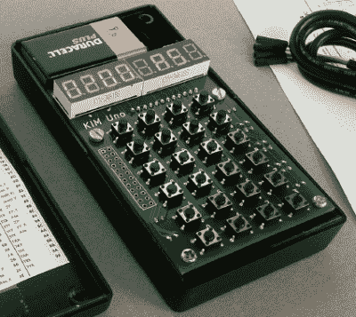

# 开发电子工具包的经验

> 原文：<https://hackaday.com/2015/12/05/experiences-in-developing-an-electronics-kit/>

今年的 Hackaday 奖包括一个最佳产品的类别，也许没有哪个项目比[【奥斯卡·维穆伦】的 PiDP-8/I](https://hackaday.io/project/4434-pidp-8i) 更能激发更多的人把钱砸在他们的电脑屏幕上。这是 1968 年 PDP-8/I 的复制品。[Oscar]的版本使用树莓 Pi 和令人难以置信的[SIMH](http://simh.trailing-edge.com/)模拟器来驱动这台计算机前面的闪光灯和开关，而不是分立的电子设备。实际上，它是一台 50 岁电脑的缩小版，可以放在你的桌子上，由手机充电器供电。

请看下面[Oscar]的演讲视频，然后在休息之后加入我们对他的作品的更多讨论。

 [https://www.youtube.com/embed/cWRDxANRT-I?version=3&rel=1&showsearch=0&showinfo=1&iv_load_policy=1&fs=1&hl=en-US&autohide=2&wmode=transparent](https://www.youtube.com/embed/cWRDxANRT-I?version=3&rel=1&showsearch=0&showinfo=1&iv_load_policy=1&fs=1&hl=en-US&autohide=2&wmode=transparent)

[奥斯卡]像一些业余读者一样，几十年来一直在收集电脑，但在所有这些收藏中，有一台电脑没有被他收集到:PDP-8/I。这台装有开关和闪光灯的电脑在外观上几乎是友好的，而且据每一个把它作为第一台电脑的人说，它甚至比看起来更容易操作。

[Oscar]想要一台这样的机器，但是一台合适年份的机器又大又贵。十年前，业余爱好者发明了一个 PDP-8 的复制品，但是这需要一个非常罕见的芯片。当然，用小小的 Linux 板和模拟器,[Oscar]可以建造一些东西，让他体验一下 PDP。

The KIM Uno: A KIM-1 on an Arduino

这不是[奥斯卡]第一次冒险复制经典电脑。几年前，他制造了 [KIM Uno](https://hackaday.io/project/4802-kim-uno-a-simple-kim-1-replica) ，它是 [KIM-1](https://en.wikipedia.org/wiki/KIM-1) 的复制品，使用了几个按钮、电阻、七段显示器和一个 Arduino pro mini。

虽然 KIM Uno 模仿了 1976 年最初的 6502 单板计算机，但它并不是真正成功的产品。毕竟，它只是一堆按钮和发光二极管——不是能在壁炉架或架子上赢得一席之地的东西。

[Oscar]的注意力转向了 PDP-8 的复制品。有了 Raspberry Pi，模拟变得很容易，并且有足够的 GPIOs 来闪烁一些 led 并读取一些开关。这意味着为 PiDP 设计一个工具包，开发一个工具包与为自己设计一个项目是完全不同的过程。需要进行大量的优化，他需要对整个套件进行白痴验证。

将这个项目转化为产品意味着需要吸取一些教训。零件成本包括故障成本，最便宜的零件通常不是最便宜的。应该使用标准部件，而不是像他第一次使用的 80 年代前中国军队的部件。

[![The PDP-11/70, [Oscar]'s next project](img/1a8f4db3b8821854fd2b6e60f4841731.png)](https://hackaday.com/wp-content/uploads/2015/12/11-70.jpg)

PDP-11/70，[奥斯卡]的下一个项目

当然[奥斯卡]还没有完成开发他的 Pi 驱动的小型机。由于所有的模拟都发生在 Pi 中，而且除了前面板之外，这个项目的一切都是硬件不可知的，[Oscar]理论上可以将 SIMH 下模拟的任何计算机变成一个产品。这包括 Data General 诺瓦斯、IBM 1401、Altair 8800 以及从 PDP-1 到 PDP-15 的整个 PDP 系列。

[奥斯卡]准备的下一个项目是 PiDP-11/70，PDP 之王，可能是马萨诸塞州梅纳德有史以来最漂亮的计算机。这比 PiDP-8/I 需要更多的工程设计；整个电脑周围将有一个真空成型的挡板，开关——漂亮的红色和酒红色拨动开关——将是定制的。

[奥斯卡]的最新项目会成功吗？大概；他已经卖出了 1000 个 PiDP-8/Is，每个对逆向计算有点尊敬的人都渴望得到 11/70。无论如何，把一个像 8/I 这样简单的项目变成一个真正的产品给[奥斯卡]上了很多宝贵的一课，这一次事情肯定会变得更容易。