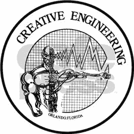
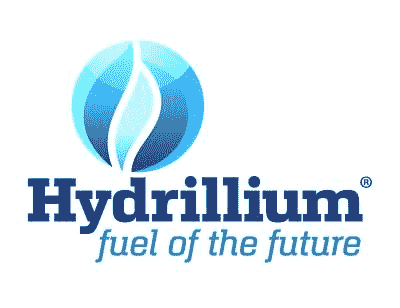
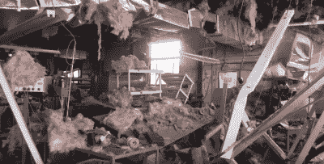

# 实验气体、危险和岩石着火爆炸

> 原文：<https://hackaday.com/2016/02/02/experimental-gases-danger-and-the-rock-afire-explosion/>

2013 年 9 月 26 日早上，奥兰多市发生爆炸。建筑物摇晃，窗户嘎嘎作响，附近轨道上的美国国家铁路客运公司服务暂停。电视台插播特别报道。派出的直升机没有发现火和硫磺，但他们确实发现了一座有一面墙被炸飞的建筑。该建筑位于西杰斐逊街 47 号。对大多数人来说，这只是另一个新闻日，但一些铁杆粉丝认为这座建筑是创造性工程，是另一种爆炸的家园:岩石着火爆炸。

### 发明家和他的机器人团队

我们很多人都听说过摇滚爆炸乐队，这个电子动画乐队从 1980 年到 1990 年一直在娱乐圈披萨的舞台上光彩夺目。对于那些不知道的人来说，这个乐队是由 Whac-A-Mole 的发明者[Aaron Fechter]创建的，他是工程师、企业家和 Creative Engineering 的所有者。当娱乐披萨卖给查克·e·奶酪时，摇滚爆炸的角色被查克·e·和他的朋友们取代了。创意工程失去了最大的客户。一度超过 300 名员工的公司再次缩减到只有[亚伦]。他拥有公司所在的大楼，一个 38，000 平方英尺的商店和仓库。[Aaron]没有卖掉店铺和剩余的硬件，而是继续独自在那里工作。这座建筑的大部分仍然保持着 20 世纪 80 年代的样子。工匠们在工作的最后一天放下的工具仍然存在，慢慢地积满了灰尘。

Creative Engineering’s 1980’s Logo

[亚伦]继续发明，有几个几乎命中，如反重力自由机器(AGFM)。AGFM 是一个基于 6502 的专用电子邮件客户端，在 20 世纪 90 年代中期被万维网取代。大约在 2004 年左右，X 一代开始怀念摇滚大爆炸。YouTube 上出现了获救机器人在地下室、棚屋和一次性餐馆工作的视频。网上组织的粉丝俱乐部。所有这一切在 2008 年一部关于乐队的纪录片中达到了高潮。

从某些方面来说，岩石着火爆炸似乎是被诅咒的。电影中的每个人都经历了某种灾难。(克里斯·思拉什的)摇滚主题游乐场倒闭了。[Snap]过去博物馆的爆炸和他的摇滚艺术展在 2010 年被大火烧毁。对[亚伦]来说，灾难以一项新发明的形式出现:氢化铀。

### 一种实验燃料

[Aaron]第一次从[William Richardson]那里了解到一种新的氢基燃料，他自己没有将这种气体投入市场。[Aaron]雇用[Richardson]作为有偿导师，开始开发一种方法来生产足够量的气体进行测试。

[Aaron]也负责市场营销。他将这种燃料命名为“碳氢化铝”，后来简称为“氢化铝”，称之为“未来的燃料”。从切割钢铁到烹饪美味多汁的牛排，氢化铀无所不能。人们对这种燃料感兴趣，一些餐馆同意试用。[Aaron]现在必须生产足够的燃料来运输和交付给餐馆用于日常运营。

问题是氢的体积能量密度很低。一个人如何绕过它？增加压力。亚伦使用了一个水肺压缩机来完成这个。潜水箱的工作压力高达数千磅/平方英寸。3000 和 4500 PSI 是典型的水肺罐压力。

氢类似于水煤气，水煤气是一种将蒸汽通过热煤产生的合成气体。与其装上煤炉，【亚伦】拿出他的焊机，进行电解水。当提到实验燃料和水时，人们通常会想到布朗气体，或 HHO。这是不同的东西。为了产生氢，在水下通过一对碳电极产生电弧。电流将水分解成氢气和氧气。电极被电弧消耗，碳分子进入混合物。氧分子与碳结合，形成一氧化碳和二氧化碳。所得的气体混合物包含 60-70 %的氢气、25-30 %的一氧化碳和 1-2%的二氧化碳。还会存在少量其它气体，如甲烷、氮气和氧气。不是所有的水都被反应消耗掉了。一些蒸汽会被收集起来。

[Fechter]用一个膨胀的气囊收集气体——类似于在电极上方用一个塑料袋收集布朗气体。充满后，气囊被泵入低压罐。然后，低压罐通过水下呼吸器压缩机送入高压钢罐。这些“K 型”储罐是常见的 56”高储罐，通常用于焊接气体、氧气或任何需要压缩储存和运输的物品。

所以我们有氢气，一氧化碳，和一些其他气体。除了爆炸危险之外，这听起来没有什么危害。不幸的是，事实远非如此。储存在钢瓶里的氢是一颗等待爆炸的定时炸弹。

### 应力腐蚀裂纹

这个问题是化学攻击的组合拳:一氧化碳应力腐蚀开裂(SCC)和氢脆。在这种情况下，主要攻击是 SCC。
20 世纪 50 年代，当储罐和运输罐的压力从 1000 psig 增加到 2000 psig 时，储罐中的 SCC 首次成为一个问题。坦克开始爆炸，导致了几次调查。接下来的研究表明，SCC 的发生需要四个特定的元素。

*   一氧化碳
*   二氧化碳
*   碳钢
*   水

就像普通的铁锈一样，水与二氧化碳反应生成碳酸，碳酸溶解铁。不过，在这种情况下，一氧化碳抑制了大面积的生锈。这种酸会侵蚀局部区域，导致金属晶体破裂。这种称为穿晶裂纹的裂纹会继续生长，直到钢断裂。

### 氢脆

氢和钢也是不好的组合。氢是一种光滑的小原子。单个氢原子可以扩散到钢的粒状结构中。氢原子然后重组为氢分子。这增加了钢铁自身内部的压力。这些截留的氢会产生巨大的应力，最终使金属从内向外开裂。压力和温度越高，裂解过程越快。

### 储罐故障

2013 年 9 月 26 日，亚伦的一辆坦克的钢铁终于失效了。裂缝越来越大，拉开了坦克的拉链，打开了两个挡板，就像一个闪光器打开了一件风衣。水箱中 200 立方英尺的氢扩散到整个房间，对外墙产生了超过 2 PSI 的压力波。这足以把砖墙炸到邻近的停车场。爆炸区域的屋顶从支撑物上被抬起。地板被推得比原来的位置低了整整一英尺。新挖的洞也是一个可取之处。释放的氢气迅速扩散到大气中，避免了二次爆炸和火灾。尽管如此，消防队员仍然忙得不可开交，因为大楼里还有 10 多瓶氢氧化锂。最终决定将每一个都排放到大气中。这个过程大约需要 7 个小时。

爆炸发生后，[Aaron]修复了大楼，并继续进行黑客攻击。这位发明家又回到了他的拱廊之根。他最近发布了一款名为《T2》的新游戏。岩石爆炸仍然在进行。他们最后一次被看到是在奥兰多报道火车事故。

我们能从这一切中学到什么？我们都喜欢我们的项目，但知道什么时候你在冒险进入一个危险的区域——比如大型电池、压缩气体、高压和化学反应等等。当你朝那个方向前进时，尽你所能学习如何安全地工作。不要害怕问专家。它可能会拯救你的车间——或者你的生命。