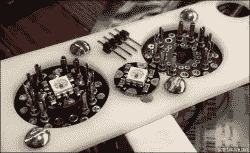
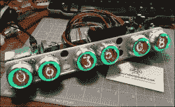

# 制作精美的数码管风铃

> 原文：<https://hackaday.com/2016/11/26/exquisitely-crafted-nixie-tube-weatherclock/>

**[风向标](http://slothfurnace.com/sabers/NixieClock_06_WC_01.html)** 不仅仅是一个展示谢妮管和霓虹灯的时钟。在构建日志中，有比美妙的工艺和大而漂亮的图片更多的东西。[布拉德利]的天气时钟不仅可以联网，它还可以自动查询当地天气，并设置数字的背光以反映当前的天气情况。例如，绿色表示大致室温，蓝色表示寒冷，红色表示温暖，蓝色闪烁表示下雨，白色闪烁表示闪电，白色滚动表示雾和冰，等等。

 外壳是定制的，灯管的插座安装在激光切割的塑料框架中。在安装插座时，[Bradley]注意到一个 Adafruit Neopixel RGB LED 分线板与显像管引线之间的*完全吻合。通过在每个谢妮指示器后面放置一个新像素，每个数字都可以有一个可编程的背光，只是碰巧看起来很棒。*

Wit  一个用于无线网络的电动 Imp 板天气时钟的功能在内部得到了完善。在外面，一个定制的外壳将它们连接在一起。[Bradley]说，他的家人已经习惯了让气象钟向他们展示外面的情况，当它停机维护或工作时，他们真的很想念它——这不应该再发生了，因为项目已经基本完成。

看到谢妮钟的新特点很有趣。谢妮电子管具有如此持久的吸引力，以至于单独使用它们也有其自身的魅力，至少有一位敬业的工匠真的从头开始制作新的电子管。