# 美国宇航局喷气推进实验室的课外参观

> 原文：<https://hackaday.com/2016/12/20/extra-curricular-tour-of-nasas-jet-propulsion-laboratory/>

上周，哈卡戴有机会参观了位于加利福尼亚州帕萨迪纳市的美国宇航局喷气推进实验室(JPL)。JPL 一直都有导游，但我们的很特别。史蒂夫·柯林斯邀请我们，并担任我们的导游，与米歇尔·伊斯特的新友谊让我们得以参观正在为 2020 年火星任务建造设备的实验室。

自从 2014 年在 Hackaday 10th 周年小型会议上被他的演讲震撼后，我认识 Steve Collins 已经有几年了。他邀请我和他一起去 JPL 旅行，但是因为我不住在洛杉矶，所以一直都有日程安排的问题。

从那以后，史蒂夫成为了 Hackaday 大家庭的一员，参加了多个 Hackaday LA meetups，并在去年 11 月的 Hackaday SuperConference 上发言。他组织了这次旅行，不仅是为了我，也是为了 Hackaday 的艺术总监乔·金(Joe Kim)、凯蒂·格雷格(Katie Gregg)和汤姆·米克斯，他们是组织我们现场活动的老手(你会记得他们都来自 SuperCon)，以及亚历山大·布拉迪克(Aleksandar Bradic)，他是一名自由撰稿人和 Supplyframe 霸王(他拿着相机)。

## 在博物馆里快速转了一圈

 [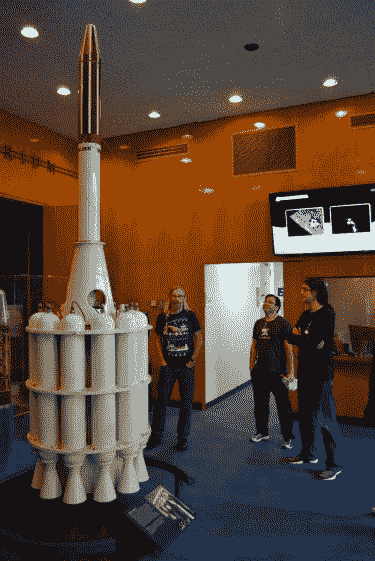](https://hackaday.com/2016/12/20/extra-curricular-tour-of-nasas-jet-propulsion-laboratory/dsc_0425/) Steve Collins explaining Explorer 1 [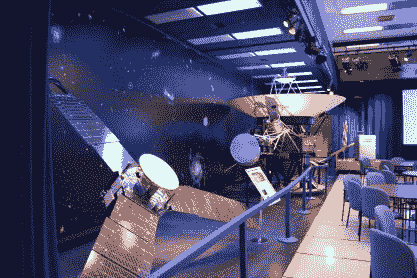](https://hackaday.com/2016/12/20/extra-curricular-tour-of-nasas-jet-propulsion-laboratory/dsc_0429-2/) Voyager probe in the background [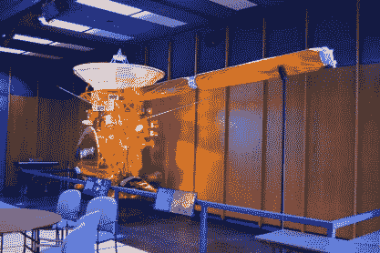](https://hackaday.com/2016/12/20/extra-curricular-tour-of-nasas-jet-propulsion-laboratory/dsc_0430-2/) Model of the Casini Probe [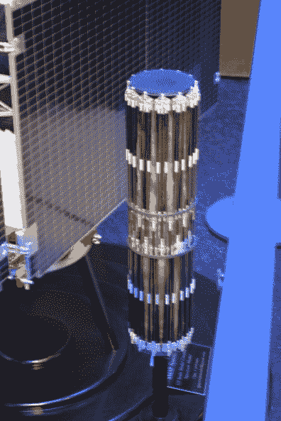](https://hackaday.com/2016/12/20/extra-curricular-tour-of-nasas-jet-propulsion-laboratory/dsc_0433/) SMAP deployable antenna all folded up [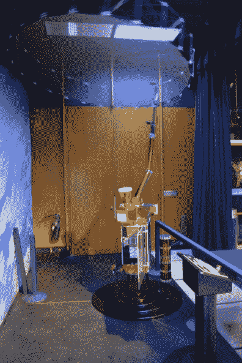](https://hackaday.com/2016/12/20/extra-curricular-tour-of-nasas-jet-propulsion-laboratory/dsc_0435/) [SMAP](http://smap.jpl.nasa.gov/) model with dish deployed

当你是美国国家航空航天局的时候，展示你的工作的一个问题是，所有成功的东西实际上已经不在地球上了。幸运的是，他们有一个博物馆，保留了一些原型，并填充了许多任务的模型。

当你走进去，首先映入眼帘的是[探索者 1](http://www.jpl.nasa.gov/missions/explorer-1/) ，它是将第一颗美国卫星发射到太空的硬件。SMAP 项目的[模型也在展览中，它包括一个抛物面雷达反射器，作为可展开的发射。看看上面的折叠版本和展开版本——这么小的空间能装这么多东西，真是令人惊讶。](http://smap.jpl.nasa.gov/)

 [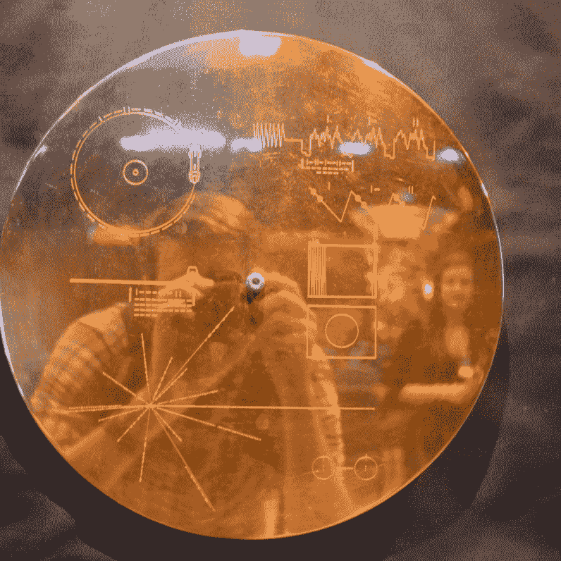](https://hackaday.com/2016/12/20/extra-curricular-tour-of-nasas-jet-propulsion-laboratory/dsc_0431/) Golden record container [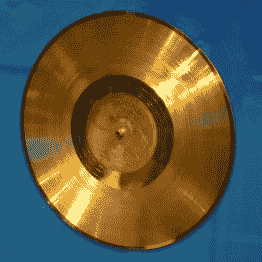](https://hackaday.com/2016/12/20/extra-curricular-tour-of-nasas-jet-propulsion-laboratory/dsc_0432-2/) Golden record [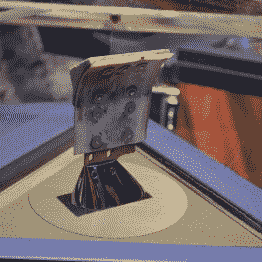](https://hackaday.com/2016/12/20/extra-curricular-tour-of-nasas-jet-propulsion-laboratory/dsc_0440/) This shovel has been to space [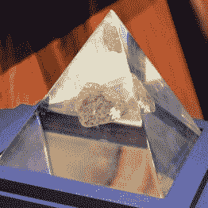](https://hackaday.com/2016/12/20/extra-curricular-tour-of-nasas-jet-propulsion-laboratory/dsc_0441/) Actual moon rock

每个人都听说过航海家号发出的金唱片。听史蒂夫解释记录盒上的图表是如何解释探头来自哪里以及如何解码其中的信息是很有趣的。他确实指出了展出的两件他最喜欢的东西:一件来自月球漫游车的挖掘铲(看，铆钉！)，是的，这实际上是和旁边展示的月岩一起从月球带回来的。

 [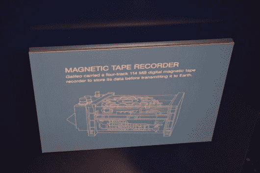](https://hackaday.com/2016/12/20/extra-curricular-tour-of-nasas-jet-propulsion-laboratory/dsc_0444/)  [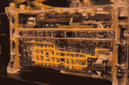](https://hackaday.com/2016/12/20/extra-curricular-tour-of-nasas-jet-propulsion-laboratory/dsc_0446/)  [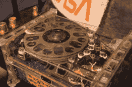](https://hackaday.com/2016/12/20/extra-curricular-tour-of-nasas-jet-propulsion-laboratory/dsc_0448/)  [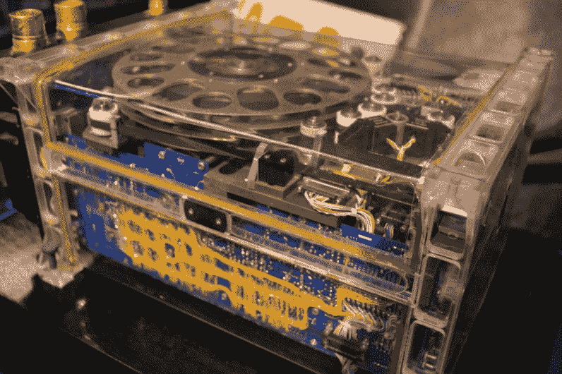](https://hackaday.com/2016/12/20/extra-curricular-tour-of-nasas-jet-propulsion-laboratory/dsc_0449/) 

展出的最引人入胜的硬件之一是伽利略号上发射的磁带录音机，它记录仪器读数和图像，然后在通信允许的情况下广播回地球。看看那上面的色情网站。幸好他们有所有的机载存储设备，因为探测器最终在天线部署方面出现了问题。通信从来没有超过每秒 8-10 比特，鉴于这种意想不到的限制，美国宇航局完成了一些史诗般的数据压缩黑客从探测器上取回数据。

## 会飞的硬件

 [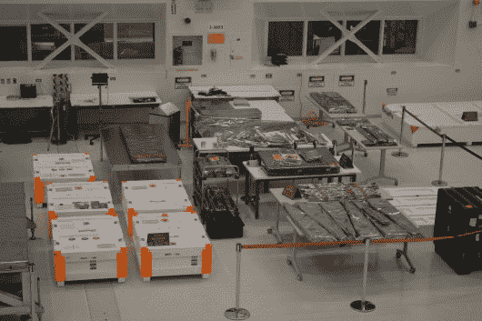](https://hackaday.com/2016/12/20/extra-curricular-tour-of-nasas-jet-propulsion-laboratory/dsc_0459/) Flight ready equipment seen from the high bay [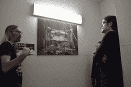](https://hackaday.com/2016/12/20/extra-curricular-tour-of-nasas-jet-propulsion-laboratory/dsc_0461/) Steve explains cold-chamber testing [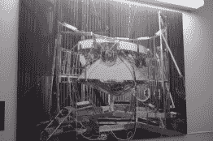](https://hackaday.com/2016/12/20/extra-curricular-tour-of-nasas-jet-propulsion-laboratory/dsc_0462/) Better look at cold-chamber testing [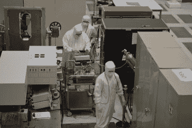](https://hackaday.com/2016/12/20/extra-curricular-tour-of-nasas-jet-propulsion-laboratory/dsc_0464-2/) Clean-room assembly taking picture of oscilloscope [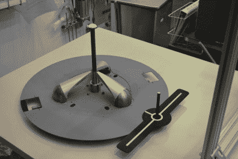](https://hackaday.com/2016/12/20/extra-curricular-tour-of-nasas-jet-propulsion-laboratory/dsc_0466-2/) Grapple fixture for the OCO-3 mission

参观完博物馆后，我们慢吞吞地去了正在洁净室里组装飞行硬件的建筑。很高兴看到抓钩将被用来将一些硬件与国际空间站上的机械臂对接。检查跟踪模式，包括一个长长的白线和一个圆圈围绕一个职位。在那个柱上有一个白点，帮助在夹具上调零时正确对准。

从高处，我们看到工程师们正在测试用于轨道碳观测站 3(OCO-3)的电子设备。看着他们查看电路板并用智能手机拍下测试读数，不知何故感觉非常棒。出去的时候，史蒂夫给我们看了一张校园内一个试验箱的照片，里面有液氮导管穿过它，在真空下将被测设备带到类似太空的低温环境中。房间的顶部有巨大的镜子，反射氙灯的光，模拟阳光的温暖力量，同时保持寒冷的环境。

## 火星 2020 钻头原型

 [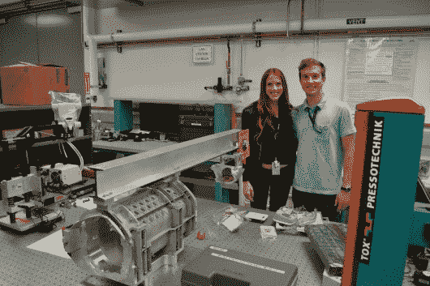](https://hackaday.com/2016/12/20/extra-curricular-tour-of-nasas-jet-propulsion-laboratory/dsc_0481-2/) Michelle Easter and Mieszko Salamon with parts of Mars 2020 drill prototype [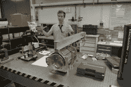](https://hackaday.com/2016/12/20/extra-curricular-tour-of-nasas-jet-propulsion-laboratory/dsc_0470/) Drill enclosure [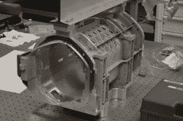](https://hackaday.com/2016/12/20/extra-curricular-tour-of-nasas-jet-propulsion-laboratory/dsc_0471/) This is 3D printed aluminum [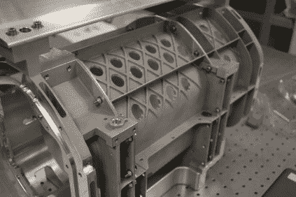](https://hackaday.com/2016/12/20/extra-curricular-tour-of-nasas-jet-propulsion-laboratory/dsc_0476-2/)  [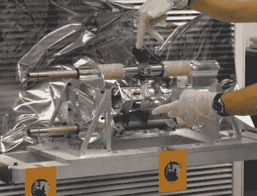](https://hackaday.com/2016/12/20/extra-curricular-tour-of-nasas-jet-propulsion-laboratory/dsc_0472-cropped/) The drill shuttle

供应商框架设计实验室的常驻工程师 Dan Hienzsch 为我们联系了 JPL 的另外两位工程师:Michelle Easter 和 Mieszko Salamon。我们得以去了 Mieszko 在校园里的实验室，那里有来自其他美国政府机构的旧设备。你永远不会知道，这个实验室挤满了牛逼。

在他的工作台上是火星 2020 漫游车的钻头原型。这将是一个锤钻，可以采集铅笔橡皮大小的岩石样本。这个想法是将大约 46 个这样的样本装入一个垒球大小的容器中，并将其发射回火星轨道，以便未来的火星任务将样本返回地球。非常疯狂！

这里看到的是 3D 打印的铝钻外壳。你看到的工字梁是装配辅助工具。钻梭本身有大约 1 毫米的间隙，以适应外壳内部，但一旦安装后，横梁将被移除。钻孔机还没有安装在穿梭机上，但是你可以看到左边的两个探针，这将指示钻孔机的位置正确，并有助于钻孔过程中的稳定。

不幸的是，我们没有机会去米歇尔的实验室看看她正在研究的远程通信硬件。但是我们怀疑在接下来的几个月里我们会看到更多的米歇尔。她是头脑制造者项目的创始人，并将在供应框架设计实验室主持他们的一些活动。如果可能的话，我们会试着组织下一次去她的实验室的旅行。

## 落地了。很难。

   [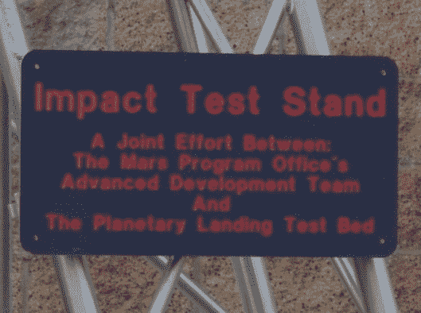](https://hackaday.com/2016/12/20/extra-curricular-tour-of-nasas-jet-propulsion-laboratory/impact-test-bed-sign/) 

当那些火星钻探样本返回地球时，它们将会经历一次艰难的重返。显然，你不希望容器破裂，损坏样品或更糟。他们已经用一个巨大的冲击台测试过了。基本上就是一个瞄准地面的弹弓。对于每一种可能的情况，都要对不同性质的土壤进行测试。

## 火星漫游车场

 [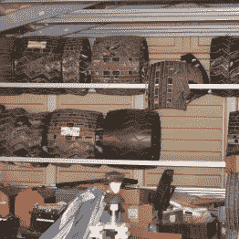](https://hackaday.com/2016/12/20/extra-curricular-tour-of-nasas-jet-propulsion-laboratory/dsc_0491-2/) Rover wheel graveyard [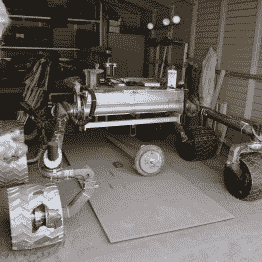](https://hackaday.com/2016/12/20/extra-curricular-tour-of-nasas-jet-propulsion-laboratory/dsc_0492-2/) “Scarecrow” — test rover with no brain  Precision winch to test rover traction

我们旅行的最后一部分是在火星漫游车测试场。他们有一辆名为“稻草人”的无脑漫游者，用于测试车轮的耐用性。因为地球的重力比火星上的强，所以它被砍掉了头以平衡重量。在看稻草人的时候，我们遇到了两位工程师，他们正在测试一个精密的绞盘装置。它被连接到测试中的漫游者，以提供可测量的负载，该负载可以为各种情况建立牵引数据。

 [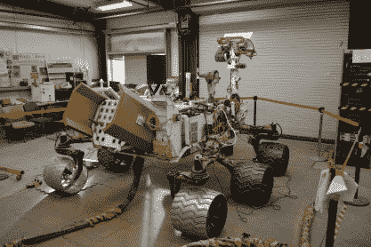](https://hackaday.com/2016/12/20/extra-curricular-tour-of-nasas-jet-propulsion-laboratory/dsc_0497/) Full rover (minus nuclear battery) [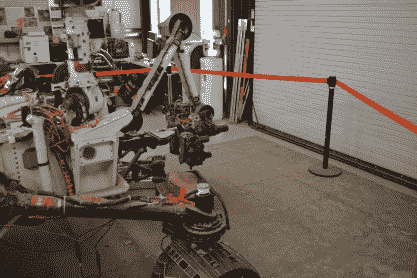](https://hackaday.com/2016/12/20/extra-curricular-tour-of-nasas-jet-propulsion-laboratory/dsc_0498-2/) Robot arm on front of rover [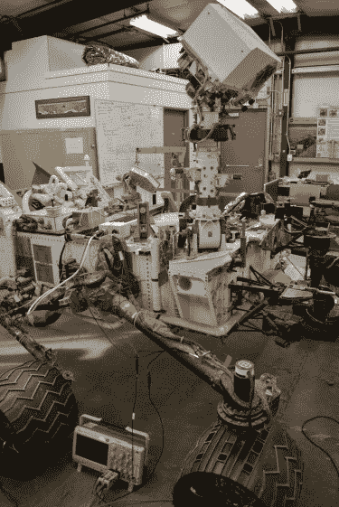](https://hackaday.com/2016/12/20/extra-curricular-tour-of-nasas-jet-propulsion-laboratory/dsc_0500/)  [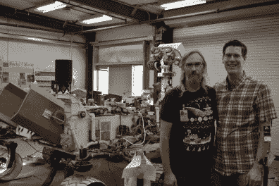](https://hackaday.com/2016/12/20/extra-curricular-tour-of-nasas-jet-propulsion-laboratory/dsc_0503/) Steve was integral in landing this rover safely on Mars [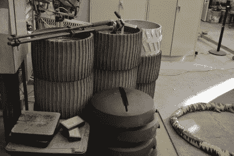](https://hackaday.com/2016/12/20/extra-curricular-tour-of-nasas-jet-propulsion-laboratory/dsc_0508-3/) These are probably wheel designs being tested for the 2020 mission

史蒂夫·科林斯是 JPL 公司的姿态控制工程师。他在房间里确保好奇号火星车安全抵达火星表面。和他一起去看看那个设备是非常酷的。这一惊人的工程壮举似乎是不可能的，但成千上万的人一起努力实现了这一目标，这是令人敬畏的。

我们得以一睹好奇号双胞胎仓库的内部，这甚至不是你普通旅行的一部分。这是一个令人印象深刻的硬件，每当真正的好奇心遇到问题时，这里就是找到解决方案的地方。

这是不可思议的一天。看到历史，听到史蒂夫对他参与的任务的回忆，与他以及米歇尔和米什科谈论火星 2020 和其他努力是令人愉快的。感谢史蒂夫·科林斯和 JPL 使这次旅行成为可能。