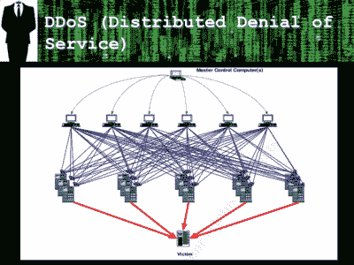

# 特大拒绝服务攻击使用 DVR、网络摄像头

> 原文：<https://hackaday.com/2016/09/26/extra-large-denial-of-service-attack-uses-dvrs-webcams/>

振作起来。其余媒体将称之为“物联网 DDOS ”,炒作将失去控制。抛开宣传不谈，实际情况让它看起来像是一个非常大的分布式拒绝服务攻击(DDOS)刚刚被执行[主要使用家用电器](https://twitter.com/olesovhcom/status/778830571677978624) (145，607 个！)而不是运行在奔腾处理器上的老款 Win XP 系统。

Replace computers with DVRs. Slide from [this talk](http://slideplayer.org/slide/906693/) by Lisa Plesiutschnig

我们可以整天争论数字录像机(DVR)或 IP 网络摄像头是否是“物联网”设备，以及这种 DDOS 攻击是否是迄今为止最大的攻击，或者仅仅是其中之一，但被利用的设备类别肯定不是传统计算机，这是一个大热门。这些设备中的大多数都在闪存之外运行固件，这取决于最终用户([不是系统管理员](http://hackaday.com/2015/09/17/tiny-headless-servers-everywhere/))保持固件最新，或者面对黑客[的愤怒](http://console-cowboys.blogspot.com/2013/01/swann-song-dvr-insecurity.html)。毫无疑问，随着更多面向互联网的设备的部署，黑客的攻击面将会扩大。

为什么 DDOS 网络使用这些特殊的设备？我们在猜测，但我们猜测这是难以更新的固件和用户“便利”功能的结合，如 [uPnP](https://en.wikipedia.org/wiki/Universal_Plug_and_Play) 。引用[联邦调查局](https://www.ic3.gov/media/2015/150910.aspx)的话:“通用即插即用描述了一个设备在没有认证的情况下自动远程连接和通信的过程。”您可以看到这对不了解技术的攻击者和怀有敌意的攻击者都有好处，对吗？(现在关闭路由器上的 UPnP。)

我们在战场上交替扮演哲基尔和海德。一方面，我们喜欢让自己家里的所有东西都连接到本地 WiFi 网络，并运行 Python 脚本。另一方面，将每一个设备连接到更广阔的互联网并保持其安全性将是一个令人头痛的系统管理问题。普通用户希望获得后者的便利，而不必支付前者的安装和技术成本。现在，[他们被冷落](http://hackaday.com/2015/10/08/get-your-internet-out-of-my-things/)。他们的烤面包机正在搞垮互联网服务提供商。