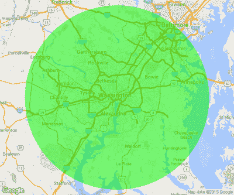

# 美国联邦航空局禁止超过 600 万人使用无人机

> 原文：<https://hackaday.com/2015/12/29/faa-bans-drones-for-more-than-six-million-people/>

最近几周，美国联邦航空局向“无人机”行业的爱好者和公司征求意见，制定了规则和规定，并为所有四轴飞行器和飞行玩具建立了一个注册系统。联邦航空局是否被允许这样做是一个留给法院的问题，但现在，联邦航空局肯定已经扼杀了 600 多万人的爱好。美国联邦航空局对 DC 华盛顿州周围 30 英里半径范围内引入了最新的临时飞行限制(TFR) 。

The 30-mile TFR area

此前，在里根国家机场内一个点的 15 英里半径范围内，无人机、UAS 和模型飞机都被全面禁止。这一点涵盖了哥伦比亚特区、贝塞斯达郊区、学院公园和亚历山大——基本上是环城公路以内的所有地方，以及一两英里以外的地方。新的无人机飞行限制覆盖了更大的区域——整个 DC 都会区、安纳波利斯、半个巴尔的摩的以及整个北弗吉尼亚州。这个地区有 600 多万人口。

自 9/11 以来，DC 大都会区已经成为整个国家最复杂的空域之一。这里有几个军事基地、阿伯丁试验场、美国海军学院，当然还有白宫、国会大厦和五角大楼。即使是商业航班[也要遵守一些非常有趣的规定](http://www.fly.faa.gov/Information/east/zdc/dca/atcCharts/DCA_CVFP_00443RIVER_VIS19.pdf)。出于同样的原因，每当总统访问洛杉矶时，通用航空公司就会在南加州关闭，你根本不能在环城高速公路内驾驶模型飞机；这是一项安全措施，到目前为止，DC 地区的飞行俱乐部已经处理了这些限制。

新 TFR 实际上已经关闭了十几个与模型航空学院有关的飞行俱乐部。DCRC 俱乐部在马里兰州的一片农田中拥有一块场地，现已关闭，等待进一步通知。因为 TFR，[首都地区飞人协会](http://www.soarcasa.org/)也关闭了。

虽然被称为临时飞行限制，但这是一个将会持续一段时间的规则。联邦航空局称这一限制是永久性的。