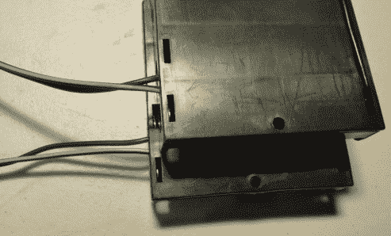
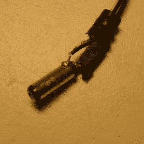

# 本周故障:电池组插孔接线颠倒

> 原文：<https://hackaday.com/2016/03/06/fail-of-the-week-battery-pack-jack-wired-backwards/>

上周六，我邀请了一群青少年黑客来用一套工具组装 Arduino 循线机器人。机械装配一切顺利，所有电线都插在正确的针脚上。第一项测试是检查电机是否在正确的方向上运行。我写了一个 Arduino 程序来测试这个。第一个男孩的机器人工作正常，除了交换了一组电机引线。这是预料之中的，因为你不能完全提前确定马达的运行方向。

第二个机器人的马达根本没有转动。当我检查线路时，我闻到了可怕的热电子气味，但我没有看到任何烟雾。我迅速从 Arduino 上拔下电池插孔，哇！电线很烫。这不是好兆头。我检查了一下，电池工作正常。与另一个包装的比较表明，进入包装的电线位置正确。我插上另一包，但马达仍然没有运行。

我拿出万用表，检查了插孔上的电压，从中心连接器到枪管的电压是-5.97 V。另一组读数为 6.2 V。我有一个备用的电路板和组件，所以交换了它们，机器人工作正常。很明显，极性的颠倒使电机控制集成电路失灵了。在那之后，每个人都在我布置好的路线上玩得很开心，带着他们的机器人高兴地回家了。

  Wires going into pack were correct.  Shaved jack showing positive lead on outside of jack.

他们离开后，我用欧姆表检查电池组，发现接线是反的，正如你在特写照片中看到的。仔细检查发现，带有白线的电线(通常表示正极)确实连接到了蓄电池正极端子。我把桶连接器刮到电线上，白线连接到桶的外面。失败！

对于电池组供应商来说，这是一个特别严重的失败，因为弄乱两根电线有多难？你真的不能责怪机器人套件供应商，因为谁会认为电池组是坏的？供应商给了我一个新的电池组和主板，所以我很满意。为什么我有一个额外的板和包，实际上是一整套工具？正是因为这个原因；一定会出问题的。尽管我想象的是其中一个学生弄坏了一个机械零件或者改变了线路，然后电击了什么东西。相反，我们面对的是一套自毁装置。谨慎得到了回报。