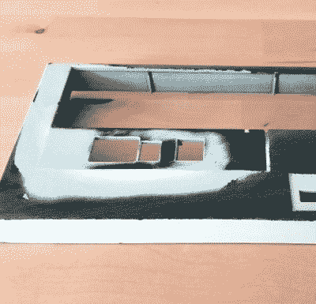

# 本周失败:谨慎的案例模式是徒劳的

> 原文：<https://hackaday.com/2018/07/12/fail-of-the-week-careful-case-mod-is-all-for-naught/>

今天的条目来自[罗伯特·汤姆森]，他好心地记录了这个悲惨的故事，让我们都知道什么是真正的心碎。如果你曾经辛苦地用身体填充物获得完美的表面光洁度，这一次会很痛。事实上，你现在可能只想点击“返回”按钮，前往安全的地方。可能有一个令人愉快的故事，关于一些 3D 打印的东西与某种树莓派一起使用，你可以阅读。

 对于那些有足够勇气继续下去的人来说，今天我们将看看【罗伯特】认为是足够简单的项目。看到 USB 3.0 外部硬盘驱动器上的电路板在他的零件箱中乱踢，他有了一个相当不寻常的想法。想要给他的电脑增加一个额外的驱动器，但是喜欢能够独立控制其电源的想法，[他决定将外部驱动器集成到机器的前面板](https://robert-tomsons.de/_text/htf.html)。这不仅允许他在不使用时关闭辅助驱动器，还意味着如果他想从笔记本电脑上下载文件，他只需将笔记本电脑插入前面板即可。

所有[罗伯特]需要做的就是让它看起来不错。他小心翼翼地将外部驱动器背板的边缘切成大致相当于计算机 3.5 英寸驱动器托架开口的大小。然后，他用胶水将碎片粘好，并开始使用身体填充物将一切抹平的艰巨任务。这是一个许多黑客读者都非常熟悉的舞蹈:填充、沙子、底漆、沙子、填充、沙子、底漆、沙子，等等。最后，最后的结果看起来很完美；你永远不会想到前面板不是股票。

本来应该很容易的。只要把箱子合起来就完事了。但是，当[罗伯特]终于把机器扣好，看着前面，嗯，可以肯定地说，他的一天不能再糟糕了。也许胶水不能胜任这项任务。也许是因为他对案件的重新审理是多么兴奋；肌肉协调性的暂时丧失。每秒多几英尺磅的能量，每秒。谁能说呢？

[Robert]说他会回到项目中，但现在他需要休息。我们同意。有趣的是，他在他的帖子中提到他的[身体填充物工作是受【Eric Strebel】](https://hackaday.com/2018/04/07/you-can-build-anything-out-of-what-is-holding-your-97-eagle-talon-together/)的启发，这个[的名字在这些地区](https://hackaday.com/2017/11/19/tips-for-basic-machining-on-a-drill-press/)广为人知。考虑到它爆炸前看起来有多好，我们会认为这是高度赞扬。