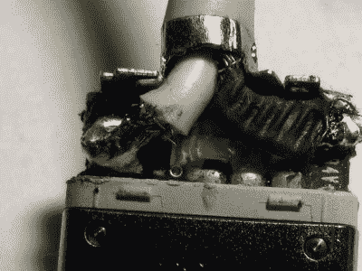

# 本周失败:如何不修理 MagSafe 充电电缆

> 原文：<https://hackaday.com/2017/08/17/fail-of-the-week-case-of-the-ill-advised-ground/>

所以我做了一个糟糕的，蹩脚的，“我修好了”级别的修复，我需要和盘托出。这确实是一个不明智的理由。

我十三岁的女儿请求帮助修理她的 Macbook 充电线。Macbook 充电器真的不应该弯曲很多，如果你是那种在膝上使用笔记本电脑的人，那么，带着充电器，它会弯曲。插头插入笔记本电脑的地方，其外壳周围的绝缘层迟早会破裂，电线束也会露出来。这种电缆由一根绝缘导线和一根绞合接地线组成。这种配置的问题是，绞线也会弯曲，直到它断裂，一次一股，直到电缆停止工作。

我女儿的 Macbook 电缆也是如此。我没有钱给她买新的，我想我们可以修好它。我们拿出她的 WLC100，坐下来焊接。她开始工作，我负责监督，后来我接手。

我们首先用 Xacto 切掉足够的绝缘层，露出大约半英寸的绞线。我们把电线从绝缘的铅丝上拉开，拧成一股与铅丝平行的单股绞合线。我们抓起熨斗，在地上镀锡，并在上面焊上一根 22 号的实心线。接地连接到插头的方法是穿过一个导电环。我的想法是将 22 号线的另一端焊接到金属环上。这就是事情开始出错的地方。顺便说一下，这是我接手的部分，所以你可以责怪我，而不是我的孩子。

我女儿用的是 WLC100 的默认提示。我应该拿起我自己的熨斗，一把 WES51，或者至少换上它忍者般锋利的尖端。WLC100 的默认尖端是一个很大的楔形物，它太大了，无法放在插头旁边，导电环很快被熔化的塑料覆盖，我无法焊接任何东西。更糟糕的是，我不小心烧穿了保护导线的绝缘层，不得不用绝缘胶带把它包起来。

iFixit cracked it open and [started from scratch](https://www.ifixit.com/Guide/Repairing+MagSafe+Connector/1753).

现在怎么办？我们根本无法使用电缆。一种选择是等到胶冷却后，用 Dremel 打磨干净，然后尝试用合适的尖端重新焊接。然而，这听起来工作量很大。实心线仍然牢牢地焊接在地上，所以我可以把它插到插头旁边的插座里，而不是试图把它连接到插头的电缆端。插头的商业端有一个大的银色接地围绕着小的金色正极引线，用电线接触接地应该没问题，对吧？

确实如此。电脑的充电速度和你想象的一样快。然而，我有一种明显的感觉，我不知道，这个解决方案可能会更干净。当然，[这里显示的 iFixit 路线](https://www.ifixit.com/Guide/Repairing+MagSafe+Connector/1753)通过从外壳上滑下，剪断损坏的电线，并重新开始，变得更加干净。虽然这很干净，但它只是等待着以同样的方式再次发生。

所以，弟兄们，姐妹们，继续用砖头打我，告诉我哪里做错了。你用什么方法来解决电缆在插头外壳处断裂的问题，你如何改善未来的情况？