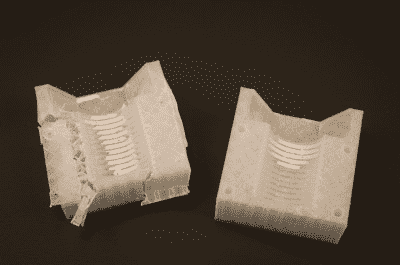

# 本周失败:在 3D 打印的模具中铸造一个螺栓

> 原文：<https://hackaday.com/2018/04/15/fail-of-the-week-casting-a-bolt-in-a-3d-printed-mold/>

这里有一个奇怪的话题作为本周失败。[Pete Prodoehl]开始用错误的方法制造一个螺栓，看看他是否能做到。好样的[皮特]！这是一个学习非显而易见的经验教训的好方法，也是一个很好的话题引子，这也是我们在这里展示它的原因。

这个项目一开始很棒，在 OpenSCAD 中画出了螺栓的模型。这是用来创造一个空白的一块，然后成为两个部分，与钉索引两半完美。现在是时候做铸造过程，这是它偏离轨道的地方。[Pete]手头没有任何柔性细丝，也没有合适的脱模剂。考虑到这些限制，他仍然做得很好，在涂了一层漂亮的红色喷漆后，达到了上面看到的石膏粗体。

One side of the mold didn’t make it

他失去了将两个模具分开的部分螺纹，然后需要牺牲半个模具来取出完全卡住的铸件。我们在这里看到了相当多的 3D 打印模具，但它们通常不是直接打印的。例如，这里有一个用于铸造金属的漂亮模具[，但它是使用传统的硅来创建 3D 打印原型的模具。](https://hackaday.com/2018/02/25/casting-metal-parts-and-silicone-molds-from-3d-prints/)

回过头来想想，直接 3D 打印的模具往往是牺牲性的。这种锡合金铸造的方法就是一个很好的例子。从树脂模具中生产出的华丽而细致的零件可以经受住高温，但必须被破坏才能取出零件。

所以我们问你:有人完善了可重复使用的 3D 打印模具的方法吗？你用什么印刷工艺和材料？脱模剂怎么样——我们有[关于树脂浇铸的指南](https://hackaday.com/2016/02/09/learn-resin-casting-techniques-duplicating-plastic-parts/)赞美脱模剂的优点，但是没有任何 DIY 替代品。什么对你起到了释放剂的作用？请在下面的评论中告诉我们。