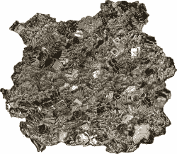
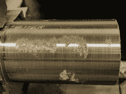

# 本周失败:加工铋

> 原文：<https://hackaday.com/2016/08/24/fail-of-the-week-machining-bismuth/>

[戴维·库克]的总结如下[他用铋锭工作的经历的记录](http://robotroom.com/Bismuth-Casting-and-Machining-1.html)很简洁。

我浪费了一个周末的时间来学习为什么金属零件不常用元素铋。

这是对他花费时间种植不起眼的铋晶体，铸造一个开裂的铋圆柱体，加工铋只留下一个非常粗糙的表面的公正评价。但是，尽管他承认这个实验不成功，他确实为我们提供了一个元素物理性质的迷人视角。

[![This is what [David] wanted to make. Alchemist-hp + Richard Bartz with focus stack. (Own work) [CC BY-SA 3.0], via Wikimedia Commons](img/ef95ad5e9af5d06e91d50e1d461bd7c3.png)](https://hackaday.com/wp-content/uploads/2016/08/bi-crystal.jpg)

This is what [David] wanted to make. Alchemist-hp + Richard Bartz with focus stack. (Own work) [CC BY-SA 3.0], via [Wikimedia Commons](https://commons.wikimedia.org/wiki/File:Bi-crystal.jpg)

铋是你在学校化学课中会遇到的元素之一，它可以应用于加工合金和作为铅的替代品，但我们大多数人从未在现实世界中遇到过它。它是重金属中的一种，在元素周期表中位于锑之下，铅的右边。好奇的小学生可能听说过，它像水一样凝固时会膨胀，或者它是反磁性的，我们大多数人可能都见过它的晶体涂上彩色虹彩氧化物的壮观照片。

这是一个关于这些水晶的普通故事，吸引了大卫对这种金属的兴趣。它的熔点很低——271.5 摄氏度——可以在家用炉子上液化，所以他很在意自己的婚姻和谐，如果他破坏了任何厨房电器，他从亚马逊买了一个便宜的电戒指来搭配他的铋锭。开始工作。

他的第一个发现是，户外的廉价电炉不是非常有效的冶金炉。搬到厨房，冒着激怒配偶的风险，他最终还是熔化了他的铋，并在它重新凝固后把最上面的一层拿掉，露出了一些晶体。

These are the bismuth crystals he made.

对他来说不幸的是，迎接他的不是壮观的色彩和巨大的水晶，而是一个没有多少光彩的景象。没有彩虹色的小灰色晶体。看起来这些漂亮的样品是通过缓慢冷却液态铋，然后快速倒出剩余的熔融金属制成的。他向我们保证，未来的努力将包括隔热砂模和仔细的温度监控。

他没有被吓倒，继续用他的铋储备着手制造一个圆筒。早期使用粘土模具的努力导致气缸破裂，所以在绝望中，他在铝烤盘上铸造了整个金属，并将得到的铸锭切割成粗坯用于车削。

Poor finish on machined bismuth.

随着铋被放入车床，他开始直面他在上面的结论中提到的问题，为什么加工过的铋零件不是你会遇到的东西。他的圆柱体表面有明显粗糙的斑点，因为铋既是晶体又是易碎的。他建议，如果这种金属可以用更少的晶体来固化，就可以做出改进，但很明显，元素铋本身并不是转折点上的赢家。

我们建议你看看[大卫]的文章。在这里，它可能被描述为本周的失败，但事实上，它更多的是一系列没有成功的实验，而不是一场彻头彻尾的灾难。其结果是一个有趣的和记录良好的阅读，我们相信大多数 Hackaday 读者将有所收获。

除了上面提到的铋晶体，我们还在 Hackaday 这里介绍过几次铋。[一种低温焊接工艺将它用于一种合金](http://hackaday.com/2016/03/09/solder-at-room-temperature/)，我们甚至让某人[将它用于另一种合金，用 RepRap](http://hackaday.com/2012/05/18/printing-circuitry-on-a-reprap/) 进行印刷。

谢谢你的提示。

* * *

**Fail of the Week is a Hackaday column which celebrates failure as a learning tool. Help keep the fun rolling by writing about your own failures and [sending us a link to the story](mailto:tips@hackaday.com?Subject=[Fail of the Week]) -- or sending in links to fail write ups you find in your Internet travels.**