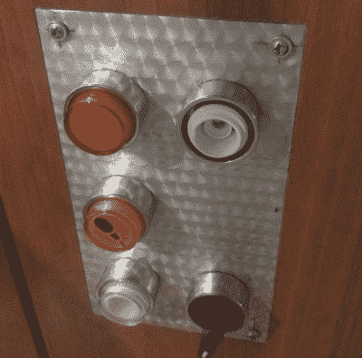
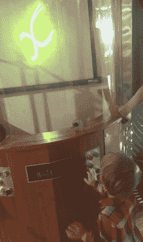
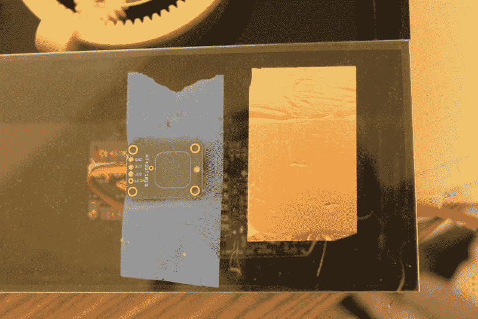

# 本周失败:博物馆按钮

> 原文：<https://hackaday.com/2017/06/16/fail-of-the-week-museum-buttons/>

博物馆的展品很难制作，而且总是出故障；尤其是那些互动的。这是预算、一次性建筑和他们对儿童极其严厉的虐待的结合。

我的第一个展览是一个互动的激光表演，它把音乐的波形变成激光图案，不同类型的音乐有非常不同的图案。我从与博物馆工作人员的交谈中得知，工业按钮是一种必需品，但事实证明，工业按钮是在假设微小生物不会不断捣碎、扭曲和舔按钮的情况下制造的。过了一会儿，按钮(和可怜的旋钮)都被扔掉了。

The button face has been removed, and the knob is spinning freely.

Buttons at toddler level are in a vulnerable position.

第二个展品也是交互式的，但在这种情况下，它只是一个简单的按钮，可以打开一个东西一会儿，然后关闭它。你可以在项目页面阅读更多关于[运动周期表](https://hackaday.io/project/6682-periodic-table-of-motion)的内容。在这里我想:还是用电容触控吧，把传感器放在两层亚克力后面做保护，然后就不会有什么运动部件坏了。我做了一堆单元，测试了几个星期，然后安装。尽管我很努力，还是立即失败了。

 [https://www.youtube.com/embed/E7hxYUh99GM?version=3&rel=1&showsearch=0&showinfo=1&iv_load_policy=1&fs=1&hl=en-US&autohide=2&wmode=transparent](https://www.youtube.com/embed/E7hxYUh99GM?version=3&rel=1&showsearch=0&showinfo=1&iv_load_policy=1&fs=1&hl=en-US&autohide=2&wmode=transparent)

我的测试环境中的安装有些不同。这可能是第二层丙烯酸贡献。可能是电源和奇怪的接地问题。也许房间的荧光灯正在产生电磁场，干扰传感器，或者地毯正在产生静电，不知何故导致 midichlorians 反转极性，并通过预制铝化物的[基板放电。在一些牢房里，按钮不起作用。在其他细胞中，它是极其敏感的。在表格的一列中(列在 5 个单元格中共享一个公共的丙烯酸片)，一次触摸将触发所有 5 个单元格。](https://www.youtube.com/watch?v=rLDgQg6bq7o)

该电路是一个 ATtiny，在两个引脚之间有一个 2.2M 的电阻，其中一个引脚通过一根短线连接到一个焊接点，该焊接点连接到丙烯酸片下侧的一片铜带。ATtiny 使用的是具有自动重新校准功能的 capsense 库。由于它的安装方式，我不能在外壳内重新编程来调整它们的灵敏度，所以安装后调整它们不是一个选项。我认为我可以隔离问题，并使用 AT42QT1010 的现有电容触摸传感器分线点，只连接到电源，但它有完全相同的问题，这意味着它要么是电源，要么是外壳，要么是房间。

Side-by-side tests of copper tape+Arduino and AT42QT1010 had similar problems.

我现在有三条路可走:

1.  找到问题并解决它
2.  改用光敏电阻
3.  请愿黑客日寻求更好的解决方案

找到问题并解决它将是一条漫长而艰难的道路，尤其是因为博物馆环境与测试环境莫名其妙地不同。光敏电阻选择有希望；当用户将手放在纸张按钮上时，亮度会发生变化。一些早期测试表明，它很容易检测到瞬时变化，跟踪平均值和调整阈值使其足以适应一天中不断变化的照明条件。此外，这是对代码的简单更改，现有的电路板将适应这种调整。

至于第三种选择…

你为儿童兼容的触摸界面做了什么，这些界面足够强大，可以处理不确定的环境和恶劣的虐待？你用过哪些按钮、旋钮和其他互动元素？