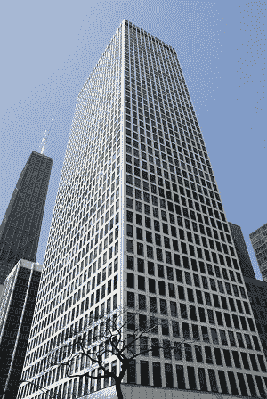
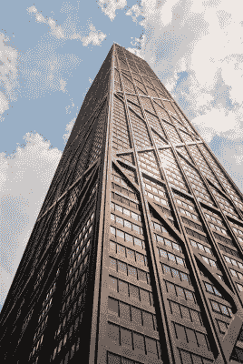
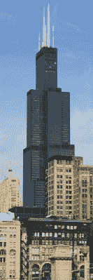

# 一个来自孟加拉的穆斯林移民如何成为美国的建筑大师

> 原文：<https://hackaday.com/2016/02/09/fazlur-khan-americas-master-builder/>

如果美国有一种国家建筑形式，那就是摩天大楼。建造一座高耸入云的塔的想法和创世纪一样古老，但是它花了一些 19 世纪的美国人的时间将这种异想天开的想法发展成有形的、有利可图的建筑。虽然我们把早期的摩天大楼装扮成旧世界的风格(大都会人寿大厦是意大利的钟楼，伍尔沃斯大厦是法国的哥特式大教堂)，但大多数外国人都认为摩天大楼只适合我们这个格格不入的国家。几十年来，美国人独自建造它们。即使是那些梦想着沿着弗里德里希大街和塞瓦斯托波尔大道建起闪闪发光的高楼的欧洲现代主义者，也不得不穿越大西洋，寻找实现自己抱负的机会。到第二次世界大战开始时，地球上 150 座最高的可居住建筑中有 147 座位于美国。

没有一种建筑风格能更好地代表美国人的勤奋、偏执狂的贪婪、对传统的漠视，以及渴望尝试被更成熟的文化视为淫秽的壮举。虽然这些粗俗的特征促使美国人建造摩天大楼，但正是我们的开放和多元文化给我们带来了最伟大的摩天大楼建造者:一位名叫法兹鲁尔·拉赫曼·汗的孟加拉穆斯林移民。

可汗 1929 年 4 月 3 日出生于孟加拉国达卡(达卡，当时是英属印度)。他的父亲是一名数学教师，培养了年轻的法兹鲁尔对技术学科的兴趣，并鼓励他在加尔各答的孟加拉工程学院攻读学位。他在那里学习成绩优异，毕业后获得富布莱特奖学金，进入伊利诺伊大学。在美国，可汗学习结构工程和工程力学，仅用三年时间就获得了两个硕士学位和一个博士学位。在巴基斯坦逗留了一段时间后，Khan 回到了美国，并被世界上最著名的建筑和工程公司之一 Skidmore，Owings & Merrill (SOM)的芝加哥办事处聘为工程师。

尽管法兹鲁尔·拉赫曼·汗博士出生在一个没有高层建筑历史的国家，但他通过自己的努力，在结构工程领域掀起了一场革命，并建造了美国最自豪的地标。

### 不合理的要求

摩天大楼设计中最具挑战性的方面不是抵抗结构的巨大重量，而是抵抗将建筑推倒的横向载荷——如风和地震。事实上，有些人认为“摩天大楼”这个词的定义是任何一座足够高的建筑物，风荷载是主要的设计考虑。

建筑物上的垂直荷载，包括结构的重量(称为“恒载”)及其居住者的重量(“活载”)，都是由重力引起的。因此，合成的垂直力是相对可预测的、静态的和单向的。另一方面，风载荷更难以量化，作用于任何方向，并可能引入更深奥的效应，如旋涡脱落。(当然，还有地震载荷，我在本文中甚至无法着手处理。我要指出的是，细长的建筑由于其固有的柔韧性，在地震条件下往往表现良好。)

当风吹向建筑物的侧面时，建筑物会有弯曲的趋势。为了抵抗这种弯曲，建筑必须有一定的刚度，否则它会像意大利足球运动员一样倒下。早期的摩天大楼如伍尔沃斯大厦和帝国大厦通过采用力矩框架(也称为门式框架)来抵抗这种倾覆。本质上，柱和梁是刚性连接的，因此它们不会相对于彼此旋转。当框架平行于它们要抵抗的风载荷放置时，证明是足够刚性的。这些早期的摩天大楼也受益于厚重的石头、砖块和赤陶的外墙，它们也作为一种摩天大楼的压舱物。

然而，这种横向系统固有的低效率使得“超高层”建筑(大致定义为超过 1000 英尺高的塔)建造起来极其昂贵。摩天大楼的垂直负荷随着高度线性增加:在没有锥度的建筑中，第 80 层和第 40 层的重量相同。然而，风载荷产生的倾覆力矩随着高度的增加而二次增加。换句话说，一栋 80 层的建筑要比一栋 40 层的建筑多承受四倍于 T2 的弯矩。(实际上甚至高于四倍，因为风速本身被认为是随着建筑物的高度而增加的。)

开发商建造摩天大楼的主要动机是尽可能多地建造楼层，以最大限度地扩大出租空间并获得高投资回报。正如建筑师卡斯·吉尔伯特所说，摩天大楼是“让土地赚钱的机器”然而，旧的、低效的力矩框架的材料和劳动力成本带来了财务上的“高度溢价”，这相当于 40 层左右的建筑回报递减。没有一个更有效的横向系统，超高层建筑就不值得。

### 框架管

在为芝加哥 43 层高的 Chestnut-DeWitt 公寓开发横向抵抗系统的过程中，Khan 看到了一个机会，可以从传统的横向设计中退一步，尝试一种更全面的三维方法。汗没有将建筑设计成一系列离散的抗弯框架或剪力墙来抵抗横向荷载，而是将整个建筑想象成一个中空的矩形管，牢固地固定在地基上。他必须刺穿这根管子来做窗户，但建筑本身的行为就像一个大悬臂箱形梁:风载荷引起的弯曲不仅会受到平行于风的侧面的抵抗，还会受到垂直面的抵抗。迎风面将被迫拉伸，背风面将被迫压缩。作为奖励，通过将结构向外推到周边，他还在建筑内部提供了更通畅的无柱空间。

切斯特纳特·德威特[ [图片来源](http://www.chicagocondofinder.com/blog/plaza-on-dewitt-condos.html)

1964 年完工的切斯特纳特·德威特大楼只是另一座四四方方的摩天大楼，就像人造卫星只是一个装满机器人内脏的金属篮球一样。这座建筑在芝加哥的天际线上并不特别突出，但它的横向系统被证明是革命性的。其他工程师立即认识到框架管的效率，它的影响可以在芝加哥阿莫科大厦(现在的怡安中心)和纽约世界贸易中心的设计中看到。

即使 Chestnut-DeWitt 建筑是成功的，Khan 也认识到他的框架筒设计有一个缺陷:由于混凝土梁和柱的累积柔性，他不能实现他所寻求的真正的弯曲效果。相反，一种被称为“剪力滞”的现象从建筑中抢走了一些刚度，并阻止了理论上理想的应力分布。幸运的是，几年后他将有机会再次讨论这个问题。

### 约翰·汉考克中心和桁架管

[Image by Antoine Taveneaux](https://commons.wikimedia.org/wiki/File:John_Hancock_Center2.jpg) CC-BY-SA

约翰·汉考克中心最初是由开发商杰里·沃尔曼设计的，是位于芝加哥密歇根大道上的两座较小的建筑。SOM 的建筑师对设计感到困惑，最终选定了一座大型多功能塔楼。为了适应办公室的大地板和公寓的小地板，该团队开发了一种随着高度逐渐变细的建筑，形成了一个高大的截顶金字塔。

可汗认为这是一个实施捆绑式管道设计的机会，这是他和他在伊利诺伊理工学院的学生 Mikio Sasaki 一起开发的概念。与 Chestnut-DeWitt 的梁柱网不同，这座新塔的刚性将来自于四面都由坚固的对角钢构件构成的桁架。桁架管的极端刚度将减少剪力滞效应，更均匀地分布垂直载荷，并实现更加开放的无柱内部空间。

汉考克中心的独特设计需要 SOM 的建筑和工程团队之间的密切合作。经过大量的设计迭代，Fazlur Khan 和建筑师 Bruce Graham 找到了一个最佳的尺寸、坡度和楼层高度，使建筑方案与结构设计相吻合。该建筑将从 165 英尺乘 265 英尺的底部逐渐缩小到 100 英尺乘 160 英尺的屋顶，6 层大胆的交叉支撑在 1107 英尺高的立面上行进。

然而，在确定了建筑的桁架管的布局后，开发商提议移除最顶层的对角线，以消除高价值空间的视觉障碍。汗知道这在结构上是可行的，但他觉得这会破坏由较低的 900 英尺连续交叉支撑建立的强大的“结构-视觉连续性”。在自然终止于塔顶之前停止支撑就好像《卡萨布兰卡》中的最后一幕是用粘土动画拍摄的，或者贝多芬第七交响曲的第四乐章是为迪吉里杜管谱写的。他最终说服了业主，用工程师最有力的修辞手段将支架留在原处:故意使用难以理解的技术术语，意在迷惑对方，使其屈服。可汗如愿以偿，建造了顶层对角线。

汉考克大厦于 1969 年竣工，是第二座 100 层的摩天大楼。102 层的帝国大厦每平方英尺需要 42.2 磅钢材，而约翰·汉考克中心每平方英尺只需要 29.7 磅。这 30%的原材料节约足以建造一座完全独立的 40 层摩天大楼。材料的有效利用也等同于更少的交付、施工图、起重机选择和工时。通过削减“高度溢价”，汗开始向开发商证明，一栋 100 层的建筑不一定比两栋同等的 50 层建筑更贵。

格雷厄姆和汗的决定暴露了桁架管框架也使约翰汉考克中心立即成为建筑图标。作为结构表现主义最纯粹和最优雅形式的一个例子，汉考克让路人毫不怀疑它令人难以置信的高度是如何实现的。我对这座建筑如此推崇，以至于我拒绝购买乐高汉考克中心，因为它令人作呕的不准确。

我也相信，但无法证明，约翰·汉考克中心是模拟城市 2000 中普利茅斯生态建筑的灵感来源。

### 西尔斯大厦和捆绑式地铁

[Image by J. Crocker](https://commons.wikimedia.org/wiki/File:2004-08-16_800x2400_chicago_sears_tower.jpg)

当西尔斯在芝加哥南瓦克大道买下一块 3 英亩的土地时，该公司聘请 SOM 为其总部和其他租户设计了一座 200 万平方英尺办公空间的大楼。Khan 现在是 SOM 的合伙人，他认为这是一个机会，可以实现他在开发 DeWitt-Chestnut 公寓时就想好的想法。意识到剪力滞效应限制了他的框架管设计的效率，Khan 认为他可以通过沿每个建筑面引入次级加强筋来增加刚度。换句话说，他会将一个大管分成一个由较小管子组成的网格，而这个“管束”的剪力滞会小得多。可汗用拳头紧紧握着一束吸管来说明这种设计:每根单独的吸管都很脆弱，但当所有的吸管捆在一起时，它们就会变得坚固。

同样，Khan 与 Bruce Graham 和项目工程师 Hal Iyengar 密切合作，开发一个符合客户需求的设计策略。在试验了多种配置后，该团队最终选择了 75 英尺×75 英尺的最佳 3×3 管束，使该塔的占地面积为 225 平方英尺。这九个管道向上延伸了 50 层，在这一点上，其中两个下降，只剩下七个继续上升到 66 楼。只有 5 根管子继续通到 90 楼，只有两根通到 108 楼的屋顶。

由于塔架的高度和不寻常的不对称风剖面，横向载荷分析被证明是异常复杂的。鉴于其设计的前所未有的性质和与这种建筑的动态响应相关的不确定性，Khan 和 Iyengar 在计算其横向系统的应力时故意保守。因此，最终的设计足以抵抗芝加哥 1000 年来最猛烈的风暴所产生的两倍于 T1 的力量。

当西尔斯大厦(现在叫做威利斯大厦)于 1973 年竣工时，它赢得了世界最高建筑的称号，并保持了 22 年之久。

### 只有钢铁般的男人

Khan 还设计了新奥尔良的 One Shell Square、墨尔本的 BHP House、密尔沃基的美国银行中心、芝加哥的 Onterie Center 和 One granular Mile，以及吉达的阿卜杜勒阿齐兹国王国际机场的朝觐航站楼。每个项目都带来了一个新颖的结构解决方案和工程设计的又一个进步。如果不是他在 52 岁时英年早逝，我敢肯定我们都会生活在云城，一个来自《帝国反击战》的漂浮的贝斯平矿区前哨基地。

除了他的抗横向载荷系统，Khan 在处理高层建筑设计中更神秘的主题，如摩天大楼摇晃时的人体舒适度，以及温度变化对结构系统的影响方面表现出了开拓性的态度。他还撰写或合作撰写了一百多篇工程论文，指导了一大批学生，并在世界各地进行学术演讲。为了表彰他在结构工程领域的贡献，高层建筑和城市人居委员会以他的名字命名了他们的终身成就奖。如果说前几代工程师把标杆定得很高，那么 Khan 就跳过了标杆，来到了阳光下。

法兹卢尔·汗对建筑世界的影响是如此重大，以至于他值得不仅仅是像我这样的古怪工程师的赞赏。虽然这个人已经去世，他的最高建筑已经被超越，但汗的作品几乎影响了世界上每一座超高摩天大楼的设计。无论你住在芝加哥、迪拜、莫斯科、伦敦还是深圳，你都会发现自己生活在法兹鲁尔·拉赫曼·汗的阴影下。

* * *

亚历克斯·温伯格是一名居住和工作在纽约市的结构工程师。你可以在 a@alexweinberg.com 给他发电子邮件。

> 要了解更多关于法兹鲁尔·拉赫曼·汗博士的信息，请参见 Yasmin Sabina Khan(汗博士的女儿)的*工程建筑:法兹鲁尔·汗的愿景*和 Mir Ali 的*摩天大楼艺术:法兹鲁尔·汗的天才*。