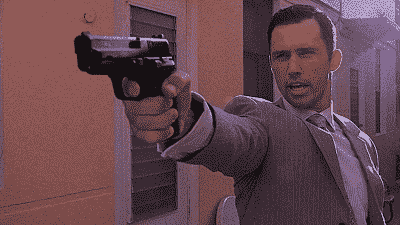
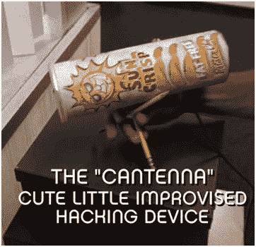

# 虚构黑客:迈克尔·韦斯顿

> 原文：<https://hackaday.com/2016/11/07/fictional-hacking-michael-westen/>

我不知道这在今天是真是假，但在小说中，间谍依赖于许多高科技设备。我知道在第二次世界大战期间，各种各样的秘密机构，比如战略情报局和国有企业，确实有类似 T2 的秘密发射器和秘密武器。但是，就像【詹姆斯·邦德】[的手榴弹发射墨水笔](https://en.wikipedia.org/wiki/List_of_James_Bond_gadgets)，到【麦克斯韦·斯马特】的鞋子电话，那些小玩意来自一些有组织的实验室。(当你看下面的视频时，请记住，在那个时候，剧院里响起的私人电话是未知的，因为手机是未来的事情。)

 [https://www.youtube.com/embed/pArBEnKcoMw?version=3&rel=1&showsearch=0&showinfo=1&iv_load_policy=1&fs=1&hl=en-US&autohide=2&wmode=transparent](https://www.youtube.com/embed/pArBEnKcoMw?version=3&rel=1&showsearch=0&showinfo=1&iv_load_policy=1&fs=1&hl=en-US&autohide=2&wmode=transparent)

 有一部名为《燃烧的通知》的电视剧已经连续播放了七季，这部剧与众不同。有问题的间谍[迈克尔·韦斯顿](见右图)，由于某种原因已经被解雇了，他正试图用他的智慧和少数几个还在和他说话的人找出原因。有趣的是，[韦斯顿]使用各种各样的小工具，从临时的 x 光机到用微波炉和一些家用产品制成的炸弹，[韦斯顿]用他能在周围找到或在家得宝买到的任何东西制作各种小工具。

 像任何虚构的作品一样，我不确定这些东西有多少会真的起作用。在我看来，用电击枪用足够高的电压电击真空管产生 X 射线似乎有点可疑。然而，有趣的是，当[威斯汀]正在修改手机，使其像窃听器或其他东西一样工作时，他至少有一些适当的工具(如烙铁)，似乎正在实际做一些事情。他通常还会解释——至少是最低限度地解释——他在做什么，并给出一些貌似合理的解释。他确实制作了一个 cantenna，这个 cantenna 本可以直接从 YouTube 教学视频中获得(见左图)。

 [https://www.youtube.com/embed/pwBkpU04o1Q?version=3&rel=1&showsearch=0&showinfo=1&iv_load_policy=1&fs=1&hl=en-US&autohide=2&wmode=transparent](https://www.youtube.com/embed/pwBkpU04o1Q?version=3&rel=1&showsearch=0&showinfo=1&iv_load_policy=1&fs=1&hl=en-US&autohide=2&wmode=transparent)

这与大多数间谍秀大相径庭，在间谍秀中，小工具只是出现，而没有提到它们可能真正如何工作。事实上，一些像 24 小时(这是一种间谍节目)这样的节目经常给出有缺陷的解释，以至于你想知道作者怎么会有这样的误解(我最喜欢的是当有人使用 GPS 获得地址的方向时，政府可以访问卫星找到地址；如果这对你有意义，去读一下 [GPS 是如何工作的](http://hackaday.com/2015/11/12/hackaday-dictionary-the-global-positioning-system-gps/)。当然，真正的间谍工作大概更多的是[记下数字](http://hackaday.com/2015/10/29/secret-radio-stations-by-the-numbers/)和[操作广播电台](http://hackaday.com/2015/11/23/swans-pigs-and-the-cia-an-unlikely-radio-story/)。对[邦德]、[韦斯顿]甚至[斯马特]来说都是相当无聊的东西。

如果你包括电脑黑客，电视和电影中会出现很多黑客(从合理可信的[机器人先生](http://hackaday.com/2015/08/24/hollywood-finally-gets-hacking-right-with-mr-robot/)到你可以在下面看到的 NCIS 中完全牵强的场景)。想知道普通大众如何看待像[Westen]这样的硬件黑客会很有趣。他肯定不是典型的书呆子黑客。显然，普通大众现在有了一个用*特设*技术解决问题的想法——也许是由【麦克盖弗】开创的。诚然，许多描绘并不太准确，但可能不比医生或律师的描绘差。

 [https://www.youtube.com/embed/u8qgehH3kEQ?version=3&rel=1&showsearch=0&showinfo=1&iv_load_policy=1&fs=1&hl=en-US&autohide=2&wmode=transparent](https://www.youtube.com/embed/u8qgehH3kEQ?version=3&rel=1&showsearch=0&showinfo=1&iv_load_policy=1&fs=1&hl=en-US&autohide=2&wmode=transparent)

【主要图片来源:[迈克尔·韦斯顿](http://www.usanetwork.com/burnnotice/cast/michael-westen)来自美国*的封杀通告*