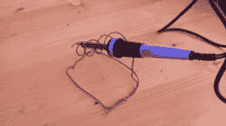

# 现场权宜之计解除你对焊接站的渴望

> 原文：<https://hackaday.com/2017/09/19/field-expedient-quenches-your-thirst-for-a-soldering-station/>

在第一世界问题的范畴内，似乎这些天没有人对一个普通的旧烙铁感到满意。今天，每个人都想要一个有铃铛、口哨和特色的电台。如果你只有铁，鼓起勇气。抓起一瓶苏打水，喝了它，然后复制[Kalvin178's] [临时焊接站](https://imgur.com/U1f2tsH)。

这个想法很简单:切开或撕开一个汽水罐，向两边挤压，制成一个 V 形熨斗托架。罐子的一小部分可以放一张湿纸巾、一块海绵或一些铜擦洗垫来清洁你的小费。

 我们试着考虑用一根棒棒糖棒来夹住你的焊料，但是我们没有想到任何足够聪明的方法。一些便宜的老花镜可以用来放大，一元店的 USB 或电池风扇可以吹烟雾。

我们已经看到了用来帮助别人的衣夹。我们也看到人们用硬金属丝制作快速而肮脏的铁架。

如果你真的想做自己的[大牌](https://hackaday.com/2015/10/11/homemade-soldering-station-does-it-better/)站，你可以。如果这对你来说还不够粗糙，那么你可以随时[带上热电偶](https://hackaday.com/2014/08/10/homemade-soldering-stations-for-cheapy-irons/)。