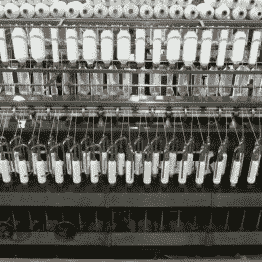
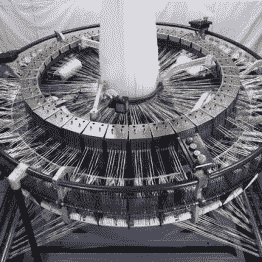
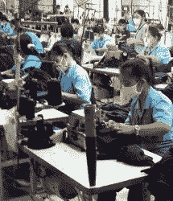
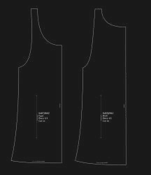
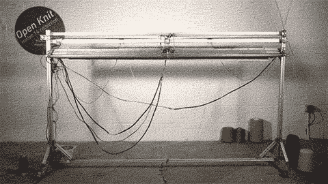
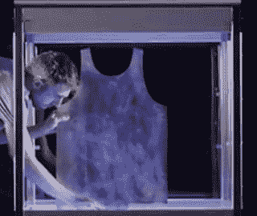
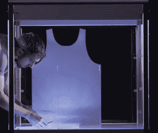
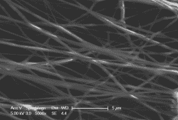

# 填补服装制造的自动化空白

> 原文：<https://hackaday.com/2016/08/16/filling-the-automation-gap-in-garment-manufacturing/>

即使在这个可穿戴技术的时代，我们 t 恤和衣服中的实际面料可能仍然是我们穿着的最高科技的产品。从基因工程棉花种子，虽然一个自主的机器世界，这种产品是在世界上最大的自动化泡沫之一。自动驾驶采棉机收割并预处理棉花。更多的机器将原料混合、梳理、加捻并纺成纱线，最后，一台织布机输出一张张纤尘不染的棉针织面料。自动化程度不能再高了。除了对种子、棉纤维和纱线进行测试以满足严格规格的实验室之外，机织织物来自一个由技术和经济控制的几乎没有人类的区域。

  Cotton Picker by [Kimberly Vardeman](https://www.flickr.com/photos/kimberlykv/4087947444/) CC-BY-SA 3.0  Cotton spinning machine by [Les Chatfield](https://www.flickr.com/photos/elsie/7185794507/in/photostream/)  Circular weaving machine by GCL [image source](http://www.alibaba.com/product-detail/circular-weaving-looms-_116534342/showimage.html)

## 自动化差距

RMG garment factory in Thailand by [Greg Walters](https://www.flickr.com/photos/gregwalters/2098268794/)

然而，织物织成之后，自动化就戛然而止了——衣服仍然主要是手工制品。正是在所有部件最终组合在一起的地方，出现了一个巨大的自动化差距。为了批量生产一件衣服，例如一件衬衫，需要将数百层布料叠放在一起，在上面放上裁剪图案的印刷纸样。然后，技术人员使用一种特殊的工具([电动直刀切割机](http://www.eastmancuts.com/product/brute/))来描绘模板的轮廓，同时切割数百个零件。勤奋的下水道运行着一队缝纫机，然后嗡嗡嗡地将这些碎片聚集在一起，制成衬衫、t 恤或裤子。组装服装是一个艰苦的过程，RMG 工厂(成衣)自然会在劳动力廉价的地方出现。

Cutting pattern for a shirt by [Liberumia](https://en.wikipedia.org/wiki/Pattern_(sewing)#/media/File:A-shirt_model_SUBTJEMIZ.svg) CC-BY-SA 4.0

如果你看看服装是如何构成的，那就说得通了:你能想象出另一种方法来可靠地对齐所有柔软的布料，并在适当的位置缝上一条缝吗？服装是为手工缝制而设计的。自工业革命以来，织物变得更轻，缝纫技术也取得了进步，只要发达的制造链允许，短阶段的自动化就被拼接进来。增加了功能性面料、超声波缝纫技术、CNC 模板切割、自动化缝合和各种印刷技术，但整体工艺本身保持不变。

## 填补空白

不幸的是，没有其他材料像 automation bubble 生产的柔软、柔韧的棉针织面料那样便宜、丰富和舒适，因为它本身不适合进一步自动化。它实际上不能粘合或焊接，这是一种难以进入自动化过程的顽固材料，这使得为自动化制造重新设计服装成为一个巨大的挑战。然而，这种重新设计的过程现在正在发生，它遵循着我们以前在其他制造领域看到的模式。从桌面机器的发展，到全新的制造方法，为廉价的棉花铺平了道路，一切似乎都有可能。

### 开放式针织

The [Open Knit](http://openknit.org/) prints textiles from yarn. ([video source](https://vimeo.com/102520966))

电脑横机使用数百个机械或电子锁定织针的大阵列将纱线变成任意的、可穿戴的形状。杰拉德·卢比奥(Gerard Rubio)在 2014 年开始 [OpenKnit](http://openknit.org/) 作为一个开源项目来开发这样一台机器，从那时起该项目就大大成熟了。杰拉德最近成立了[针织公司](http://www.kniterate.com/)，并宣布在 Kickstarter 上发起一项活动，资助一台台式机器*打印成衣*。针织技术在粗线的情况下效果最好，通常用于套头衫、帽子和冬袜。针织仍然不适合生产轻薄的面料，但是如果你现在就想*打印*自己的套头衫，[实际上没有必要等待](https://github.com/g3rard/OpenKnit)。

### 非洲人

如果你喜欢它紧，你至少已经有了模具。Fabrican 利用你的身体作为一件完美合身的无缝衣服的模型。1995 年，时装设计专业的学生马内尔·托里斯通过改编[傻弦](https://en.wikipedia.org/wiki/Silly_String)的树脂状成分，装备了一个研发设备并完善了他的想法，发明了 Fabrican。Fabrican 基本上是一个喷雾罐，其中含有一种含有高挥发性溶剂的聚合物溶液。涂抹后，溶剂会迅速溶解，留下一层柔软的无纺布聚合物。

A Fabrican T-Shirt being made. ([video source](https://www.youtube.com/watch?v=AE_Q7aafKnM))

虽然这种配方似乎已经达到了可以制作非常精细、轻便、可洗的服装的程度，但 Fabrican 并没有取得商业上的成功。最有可能的原因可能是人们不想在身上喷洒化学物质来制作自己的服装，尽管大多数视频演示也表明喷涂织物不是很柔韧，容易撕裂，因此不太实用。这项技术有可能通过将纤维填充材料与柔性聚合物结合使用而得到改进。鉴于非人类的模具和更实用的材料，该方法为全自动化服装生产提供了一个很好的起点。

### 电动织机

[Electroloom](http://www.electroloom.com/) 采用静电纺丝工艺，将无纺布应用到平面或三维金属模具上，实现无缝服装的自动化生产。不幸的是，[的 Kickstarter 活动](https://www.kickstarter.com/projects/electroloom/electroloom-the-worlds-first-3d-fabric-printer/description)和美国国家科学基金会(NSF)的研究拨款不足以资助开发可用于服装生产的静电纺丝工艺。创始人最近宣布了电动织布机的[终结。尽管如此，去年 Electroloom 展示的技术还是很有前景的。](https://medium.com/electroloom-blog/thanks-and-farewell-b0c128c3043f#.nmc0t3s0j)

  The electrospinning process ([video source](https://www.kickstarter.com/projects/electroloom/electroloom-the-worlds-first-3d-fabric-printer/description))  The mold ([video source](https://www.kickstarter.com/projects/electroloom/electroloom-the-worlds-first-3d-fabric-printer/description))  The finished garment ([video source](https://www.kickstarter.com/projects/electroloom/electroloom-the-worlds-first-3d-fabric-printer/description))

Electrospun fabric, [image source](https://en.wikipedia.org/wiki/Electrospinning#/media/File:Electrospun_pcl.png)

该过程需要在导电发射器喷嘴和金属模具(例如上面所示的金属罐顶)之间施加高电压。然后，聚合物溶液从喷嘴中缓慢分配，其中静电排斥力迫使细纤维在被加速朝向模具表面之前从液体中散发出来。纤维被拉伸，细化到几百纳米，并在飞向模具的过程中变干，在那里它们逐渐形成一种精细的、类似织物的材料。在此过程中，移动或旋转模具，以确保材料堆积均匀。一旦铺好足够的材料，这个过程就停止了，一件衣服就可以从模具上剥离下来。

静电纺丝最初是作为一种纺织品制造工艺发明的，但从未被广泛采用。目前，静电纺丝的常见应用是过滤材料、伤口敷料材料、组织工程和其他需要少量非常细的吸收性组织的使用案例。尽管 Electroloom 宣布的服装打印机永远不会发布，但他们对实用、轻便服装的全自动生产流程的愿景依然存在。

## 自动化，现在！

我们正处于 2016 年 Hackaday 奖的[“自动化”阶段，这是一项通过创造来推动社会变革的竞赛。服装制造业是一个对自动化有巨大需求的行业，也是一个打破一些古怪的加工链的机会。如果你有一个关于如何制造比现在更好的服装的想法，跳到](https://hackaday.io/prize/details#four) [hackaday.io](https://hackaday.io/) ，从社区获得反馈并实现它，同时赢得一些令人敬畏的奖品！还有其他想法吗？请在下面的评论中告诉我们！

感谢[【Regan 67】](https://www.flickr.com/photos/j_regan/7612628332/)题图中缝纫机的照片！