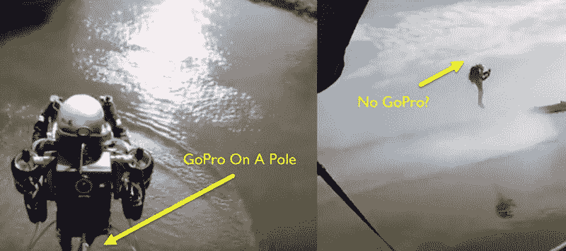

# 最后。工作中的喷气背包

> 原文：<https://hackaday.com/2015/11/09/finally-a-working-jetpack/>

嗯，这要么是一个非常好的剪辑视频，要么[喷气背包航空]实际上已经提出了一个工作喷气背包。

[根据他们的网站，](http://jetpackaviation.com/specifications/)这款喷气背包已经开发了 25 年，目前的版本速度可达 100 英里/小时，持续时间超过 10 分钟。就在上周，他们[让它绕着自由女神像](http://jetpackaviation.com/the-worlds-only-jetpack-soars-past-the-statue-of-liberty-new-york/)飞来飞去做宣传——然而这是我们第一次听说它…

明年会有一部关于它的发展的[纪录片上映，所以如果这只是一个恶作剧的话，看起来要花很多努力…](https://www.facebook.com/owntheskydoco)

休息后观看他们的首次飞行，让我们知道你的想法！

 [https://www.youtube.com/embed/kh-rRzyUgQA?version=3&rel=1&showsearch=0&showinfo=1&iv_load_policy=1&fs=1&hl=en-US&autohide=2&wmode=transparent](https://www.youtube.com/embed/kh-rRzyUgQA?version=3&rel=1&showsearch=0&showinfo=1&iv_load_policy=1&fs=1&hl=en-US&autohide=2&wmode=transparent)

我们在视频中发现的一个奇怪的事情是，在这个镜头中，有一个 GoPro 独脚架绑在喷气背包的后面，但紧接着…没有 GoPro。

所以要么这些照片是从不同的地方拍摄的，要么有猫腻。叫我们怀疑，但我们会超级高兴被证明不是这样！

你怎么想呢?开始侦查。是的，我们知道[真正的喷气背包确实存在](http://hackaday.com/2011/11/21/human-flight-at-190-mph-with-no-steering/)，但是那些不允许像这个一样垂直起飞！