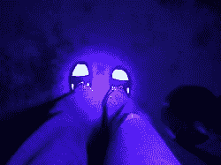

# 用科学寻找掉的牙！

> 原文：<https://hackaday.com/2016/12/31/finding-a-lost-tooth-with-science/>

有时，黑客是电路设计、工艺、3D 打印和编程的杰作。其他时候，诀窍是知道哪种工具适合这项工作，即使这项工作不是你的常规工作。[约翰]的儿子在他们的砾石车道上掉了一颗牙，所以[约翰]出发去找它。

White socks fluoresce under UV

当[约翰]开始帮助他的儿子找到牙齿时，他需要一个攻击计划——有一大片区域要覆盖，当[约翰]看着这片砾石时，术语“针”和“干草堆”浮现在脑海中。仅仅扫描地面是行不通的，他需要一种方法来区分牙齿和背景。幸运的是，他手边有一个紫外线手电筒，在他自己的牙齿上测试后，他意识到他儿子的牙齿在紫外线下会发出荧光，而沙砾不会。

约翰晚上用手电筒去找那颗牙。他很快意识到许多东西在紫外线下会发荧光——塑料碎片、岩石中的石英晶体、他的袜子。[约翰]最终找到了牙齿，他的儿子现在更开心了。没有涉及焊接，没有开发试验板，没有高压，但这是一个更多地解决问题而不是把微控制器扔在一个位置的黑客之一。不过，最终每个人都开心，这才是最重要的。