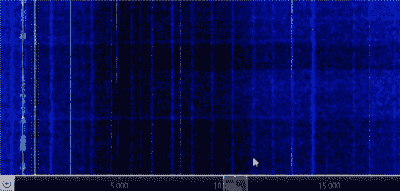

# 用天线寻找噪音

> 原文：<https://hackaday.com/2018/03/01/finding-noise-with-an-antenna/>

[K5ACL]，又名[SignalSearch]，最近将他的有源接收环形天线从屋顶上拿下来，对其进行检查并执行任何必要的维护。当它在小屋里的时候，他抓住机会讨论它在室内的表现如何。判决结果？不理想。如果 HOA 允许，他会把它安装在离房子 50 英尺的地方。

房屋，以及随后的大多数火腿窝棚，充斥着严重干扰高频的噪声源。因此，在花了一分钟左右的时间收听 SDR 后，[K5ACL]展示了这种紧密调谐天线的另一种用途——作为噪声检测器。

【K5ACL】房子里的罪魁祸首就是就在窝棚里的吸顶灯。当他打开和关闭时，你可以看到噪音在瀑布上形成条纹。但是与其他一些普通的家用物品相比，灯发出的噪音是微不足道的，比如那些将室内电线变成网络电缆的电源线适配器。这些产生如此多的噪音，甚至一个活跃的循环真的不是对手。休息之后请继续收看[K5ACL]在噪音中工作。

如果你被困在公寓大楼或拥挤的城市里，环形天线非常有用。它们很容易制作，无论你想要的是便携式的[还是永久性的](https://hackaday.com/2017/02/25/loop-antenna-is-portable/)。

 [https://www.youtube.com/embed/B7i88EqmWyM?version=3&rel=1&showsearch=0&showinfo=1&iv_load_policy=1&fs=1&hl=en-US&autohide=2&wmode=transparent](https://www.youtube.com/embed/B7i88EqmWyM?version=3&rel=1&showsearch=0&showinfo=1&iv_load_policy=1&fs=1&hl=en-US&autohide=2&wmode=transparent)

通过[ [RTL-SDR](https://www.rtl-sdr.com/identifying-noise-sources-shack-using-sdr-active-receive-loop/)