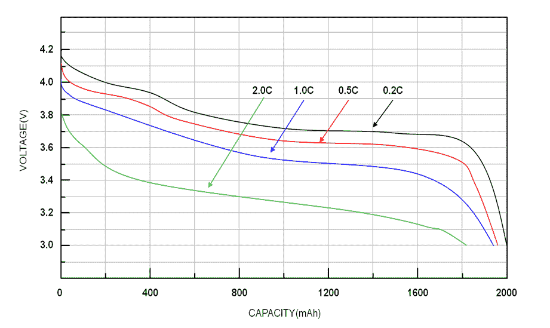
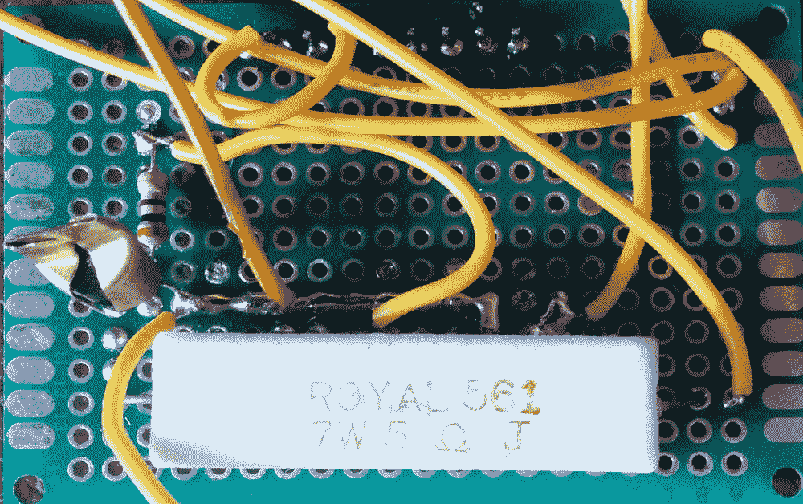
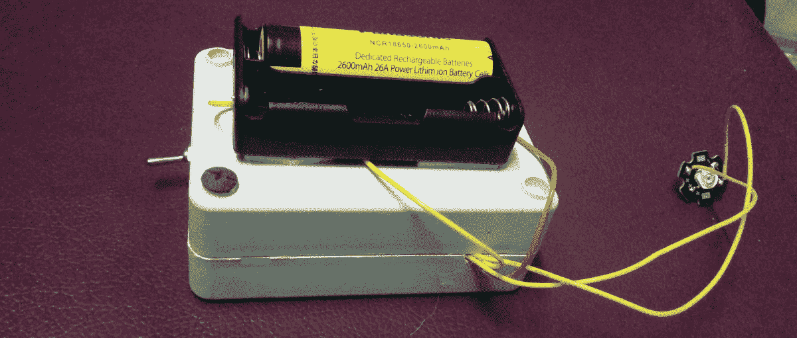
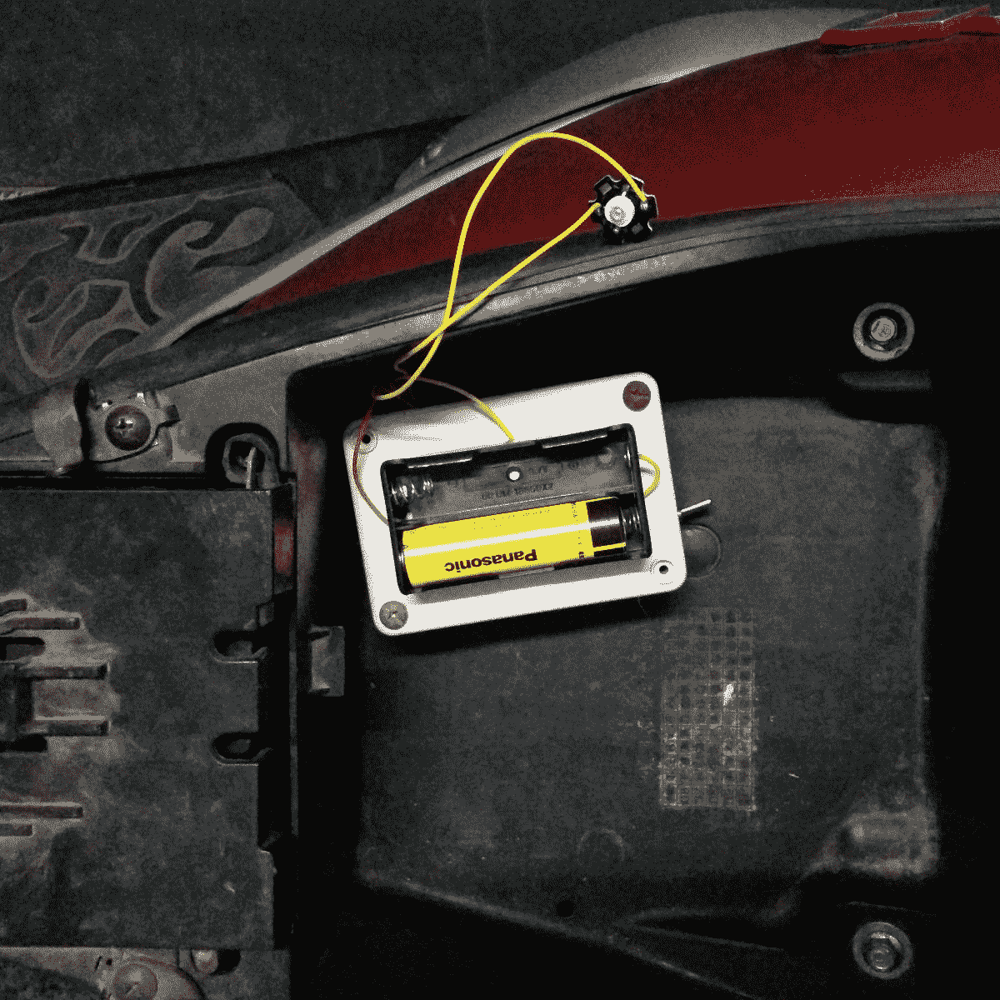

# 使用 Wi-Fi 查找您的摩托车

> 原文：<https://hackaday.com/2018/01/05/finding-your-motorbike-using-wi-fi/>

一位城市规划者曾经告诉我，每辆车需要的空间至少是它们实际占用空间的四倍。每个人都需要一个停车位和三个停车位:一个在家里，一个在工作场所，一个在商店。摩托车要小很多，但大部分时间还是停着。

摩托车是东南亚的主要交通工具，学习安全驾驶摩托车是适应这里生活的重要组成部分。假设不是倾盆大雨，你没有被淹过脚踝，这实际上是一个相当愉快的经历…直到你不得不停车。

不像你熟悉的停车场，你的自行车不可能不被移动。事实上，它很可能会停在另一层楼，另一个停车场，或者停在屋顶数百辆无法通行的自行车后面。在后一种情况下，服务员会耸耸肩，建议你几个小时后再来。最终，这甚至不会被视为一种挫折——你会简单地认为这里有很多其他更方便的事情，比如天气(除了最近的台风)或每月 5 美元的无限制对称光纤到户。

也就是说，在等待自动化停车场变得普遍的同时，通过一点技术，这个问题可以减轻一点。偶尔我会看到人们用小无线电发射器让他们的前灯闪烁，但这在这里并不常见，并且需要在我已经满了的钥匙链上再带一个东西(这里的家庭通常使用几种不同的锁)。使用我的智能手机和运行 NodeMCU 的 ESP8266 似乎很容易实现类似的事情。我一直想尝试睡眠模式，以节省电池电量，所以我去了。

### 特定网络出现时发出信号

使用 NodeMCU 可以做的一件很酷的事情是扫描特定的 Wi-Fi 网络，而不连接到该网络，如果检测到该网络，则运行一个功能:

```
scan_cfg = {}
scan_cfg.ssid = &quot;my_network&quot;
scan_cfg.show_hidden = 1
wifi.sta.getap(scan_cfg, 1, my_function)
```

扫描时，如果检测到“我的网络”,则调用函数“我的功能”。从逻辑上讲，我所要做的就是打开我手机的无线热点，并调用一个在检测到它时闪烁灯光的功能。然而，这样做时的电流消耗约为 80mA。我不打算将它连接到摩托车的电气系统，因为我想可能在自行车或其他物体之间共享它…所以我需要使用睡眠功能来节省电力。

### ESP8266 的睡眠模式

NodeMCU 提供了三种睡眠功能:调制解调器睡眠、轻度睡眠和深度睡眠。[这里有一个很好的总结](http://www.losant.com/blog/making-the-esp8266-low-powered-with-deep-sleep)，但简而言之:调制解调器睡眠只是关闭 Wi-Fi，浅睡眠另外禁用系统时钟并使 CPU 空闲，深睡眠关闭除系统时钟之外的一切。

因为我不介意等一会儿找到我的摩托车，所以每 20 秒扫描一次似乎是合理的。第一步是在迷你 D1 上连接引脚 D0 和 RESET，这样芯片可以在需要时退出深度睡眠模式。请注意，深度睡眠计时器以微秒计，而不是像程序中的其他计时器那样以毫秒计。经过一些尝试和错误，我发现允许扫描运行 2.5 秒就足以可靠地找到我的手机(偶尔 2 秒失败):

```
scan_cfg = {}
scan_cfg.ssid = &quot;my_network&quot;
scan_cfg.show_hidden = 1
wifi.sta.getap(scan_cfg, 1, listap)

function sleeping()
node.dsleep(20000000)
end

function listap()
– code to run when access point found goes here
end

tmr.alarm(0,2500,0,sleeping)
```

运行得很好，用我的万用表我计算出平均电流消耗约为 8mA。我买了一对可能是正品的松下 2600mAh 电池，大约 27 天的运行时间似乎相当不错。事实上，运行时间应该少一点，这不仅是因为电池容量的说法经常被夸大，而且还因为 Wemos 迷你 D1 上的 3.3v 电压调节器的压差。它使用了一个 [RT9013 低压差稳压器](http://www.richtek.com/assets/product_file/RT9013/DS9013-10.pdf) (PDF)，因此这意味着在我们使用的电流下，当电池电压降至 3.35v 左右时，该设备将会断电。根据 [LDO 制造商的锂离子放电曲线示例](http://www.richtek.com/battery-management/en/designing-liion.html)，当电池达到该电压时，我已经使用了电池中存储的大部分能量:



Typical Discharge Curves of a 2000mAh Li-Ion Battery at different C ratings. Source: [Richtek](http://www.richtek.com/battery-management/en/designing-liion.html)

发现电池寿命可以接受，我使用 2N2222 晶体管来控制 1W 的红色 LED。我有点担心测试期间晶体管过热(当灯亮了更长时间时)，所以我在它周围压了一块废黄铜片。



The perfboard was tinned on both sides, the pins visible above are from the Mini D1 soldered to the other side.

功率电阻器可以小得多，电线规格更低，但我有剩余的零件可以使用，它似乎足够好。在测试了几个不同的计时后，我发现 LED 每半秒闪烁 12 毫秒，持续 10 秒是相当明显的。10 秒钟后，它调用深度睡眠功能:

```
function listap(t)
	print &quot;Found&quot;
	tmr.alarm(2,10000,0,sleeping)
	tmr.stop(0)
	tmr.alarm(1, 500, 1, function ()
	if on == 0 then
		tmr.interval(1, 12)
    		gpio.write(pin, gpio.HIGH)
    		on = 1
	else
		tmr.interval(1, 500)
		gpio.write(pin, gpio.LOW)
		on = 0
	end
end)

end
```

在完成一段时间的深度睡眠后，设备会自动重置，愉快地再次经历整个过程。在我的桌子上经过几个小时恼人的闪光灯后，我得出结论，它的工作相当可靠，是时候把它放在一个盒子里并安装在我的自行车上了。盒子本来可以小得多，但我有很多这样的盒子可以用:



因为我可能想在其他自行车或东西上使用这个设备，也因为我是你见过的最糟糕的机械师，所以我现在只是把它扔在座位下面。那里有足够的空间，温度保持在安全的范围内，而且它受到了合理的保护，免受各种因素的影响。请注意，电池座已经重新布线，以在 1S2P 配置中工作——如果我放入另一个电池，它们将是并联的，而不是串联的。



There was plenty of room, so the large box turned out not to matter.

实际上，这个范围是可以接受的，但是在白天，LED 不是很明显。另一方面，在光天化日之下，一张 [EFF 贴纸](http://supporters.eff.org/shop/eff-sticker-pack)就足以发现我的自行车。在黑暗的停车场或晚上，光线足够亮而不令人讨厌。完整的计划如下:

```
print &quot;starting&quot;
wifi.setmode(wifi.STATION)
wifi.setphymode(wifi.PHYMODE_B)
tries = 0
pin = 2
gpio.mode(pin, gpio.OUTPUT)
on = 0

function listap(t)
	print &quot;Found&quot;
	tmr.alarm(2,10000,0,sleeping)
	tmr.stop(0)
tmr.alarm(1, 500, 1, function ()
	if on == 0 then
	tmr.interval(1, 12)
    gpio.write(pin, gpio.HIGH)
    on = 1
	else
				tmr.interval(1, 500)
				gpio.write(pin, gpio.LOW)
				on = 0
				end
end)

end

scan_cfg = {}
scan_cfg.ssid = &quot;my_network&quot;
scan_cfg.show_hidden = 1
wifi.sta.getap(scan_cfg, 1, listap)

function sleeping()
node.dsleep(20000000)
end

tmr.alarm(0,2500,0,sleeping)
```

### 未来使用的提示

给每个人的一个提示[在加载你的程序](http://davidjohntaylor.co.uk/index.php/2015/07/30/avoid-init-lua-hell)之前使用 init.lua 作为延迟(它使调试更容易):一旦对设备性能满意，记得用你完成的代码替换 init.lua。通常，我并不介意，因为这很方便，多几秒钟的启动时间对我来说并不重要，但在这里，它会显著增加你的功耗，因为设备会花更多的时间脱离睡眠模式。每次它在睡眠后重置，都会在 init.lua 延迟循环中花费几秒钟。

事后看来，我能想到三种方法让这个项目更实用。首先，使用绿色 LED，因为它更容易被看到，因为我们的眼睛对绿光更敏感。第二，使用带有天线连接器的 ESP8266 板(如迷你 D1 Pro)将显著增加范围，而不会对成本产生太大影响。最后，我根本没有考虑闪光灯应该放在哪里:随意挂在座位上能见度很低，沿着自行车走一条线到一个更容易看到的位置，比如靠近前灯，可能用磁铁把 LED 粘在上面以便于移除，这并不是太多额外的工作。

但是不管你怎么看，我已经完成了我的目标。现在，我需要做的就是打开我手机的热点，寻找闪烁的红灯来定位我的摩托车。