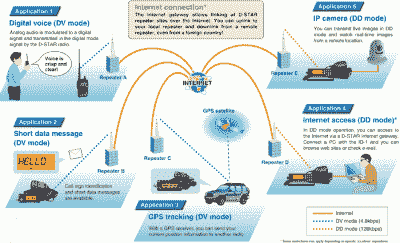

# 好生意，好伙伴:卡车司机的业余无线电

> 原文：<https://hackaday.com/2016/08/25/fine-business-good-buddy-amateur-radio-for-truckers/>

在美国，夏天是家庭自驾游的季节，今年我的家人开始大规模地在公路上旅行。我们完成了一次跨国搬迁，从康涅狄格州到爱达荷州。在路上的五天意味着许多加油站，我们看到了许多卡车站，因此也看到了许多长途卡车司机。我开始思考他们独特的生活方式，并试着想象自己做那份工作。我一个人在卡车的驾驶室里，一小时又一小时地想知道自己在做什么。我想我可能会听很多有声书，但后来我意识到有一个完美的旅行爱好——业余无线电。所以我决定看看卡车司机是如何使用业余无线电的，并思考一个卡车司机版本的我如何实践世界上最好的爱好。

### CB 还是非 CB

卡车司机长期以来一直与公民波段(CB)电台联系在一起。11 米业余无线电波段的一部分在 1958 年被 FCC 留作穷人的商业无线电波段，到 20 世纪 70 年代，每辆卡车上都有 CB 设备。CB 收音机仍然是每个卡车司机似乎都有的工具，但即使有强大得离谱的线性射频放大器，CB 在范围部门也有严重的问题。随着联邦通信委员会在执法方面的行动失踪，27 MHz 频段是一个野生和羊毛的地方，在那里很难达到超过几英里的移动。

除了范围问题之外，CB 上的对话也不是很吸引人。当然，作为一名卡车司机，我想知道前方五英里的交通情况，或者哪个称重站是开放的，但除此之外，我不认为自己会陷入人们似乎在 CB 上听到的典型的脏话连篇的长篇大论中。但事实上并不是这样。更多的是缺乏技术挑战，使 CB 对我没有吸引力。购买 CB 钻机，安装钻机，开始在 19 频道讲话。这有什么运动可言？

### 带中继器的本地和远程传输

进入业余无线电。长途卡车司机驾驶室里的业余无线电是一个更好的技术挑战。总的来说，这和火腿每天操作手机没什么区别。但是，大多数火腿在一天工作结束时不会发现自己已经走了 600 英里，这就是挑战所在。

ICOMs D-Star digital system. Source: [ICOM](http://www.icomamerica.com/en/products/amateur/dstar/dstar/)

大多数时候，在移动中工作的 ham 要么在 144 到 148 MHz 的 2 米 VHF 波段上工作，要么在 420 到 450 MHz 的 70 厘米 UHF 波段上工作。调频通常是这些波段的首选模式，尽管还有许多其他模式可供火腿使用，包括越来越受欢迎的数字模式，如 [D-Star](http://www.icomamerica.com/en/products/amateur/dstar/dstar/) 或[系统融合](http://systemfusion.yaesu.com/)。但 VHF 和 UHF 信号的传播特性甚至比 CB 更差——一般来说，频率越高，就越难通过电离层跳跃实现真正的远程通信。即使火腿在这些波段上享有更高的法定权力限制，也真的很难伸出手去直接触摸 10 英里左右以外的人。

为了避开视线限制，移动火腿通常依靠固定中继器。中继器允许 hams 在更大的区域内保持联系，但是在每个移动单元和中继器之间仍然有视线要求。与 IRLP 等协议链接的中继器通过从一个中继器向所有与其链接的中继器联播信号来扩展覆盖范围。但是中继器的安装和运行是非常昂贵的，所以它们分布得非常分散，而且通常集中在人口集中的地方。在密西西比河以东和西海岸沿线的人口密集地区，甚高频和超高频中继器可以很好地用于运输火腿，但在往返于美国平原和山区广阔空间的高速公路上，就不那么管用了。

卡车司机利用他或她的票的另一种方式是 [APRS](http://www.aprs.org/) 。自动数据包报告系统是一种数字协议，在其众多功能中，允许 hams 将其当前位置传输到中央网络，并将其显示在地图上，供任何人和所有人查看。我知道这对我的家人来说是一个极大的安慰:“看，爸爸在蒙大拿州罗斯巴德和福塞斯 I-94 之间。”而且，有了适当的装备，卡车运输火腿将能够看到其他移动火腿的位置，以便有机会快速驶过 QSO。同样，这将需要访问中继器，但它仍然是一个很好的能力，有在驾驶室。

### 长途运输，长途谈话

尽管 VHF 和 UHF 在驾驶室中很有用，但最终的移动业余爱好者体验必须在 3 到 30 MHz 的高频波段上工作。使用高频波段是大多数技术员级别的 ham 升级到普通或额外级别的主要原因。高频特权允许你使用容易被电离层折射的频率，这样你就可以到达数百或数千英里之外。许多火腿在他们的私人车辆上使用移动设备工作在高频波段，所以不难想象在卡车的驾驶室里有一个滚动的高频火腿小屋。

不过，高频天线对滚动火腿来说有点问题。大多数固定的业余无线电台天线都很大，很笨拙，因为高频波段的波长很长，它们在卡车上工作不太好。但幸运的是，通过对黄金标准的四分之一波长偶极子进行一些妥协，移动 ham 仍然可以获得性能良好的 HF 天线。Hamstick 是这种天线的通称，从 6 米到 75 米的每个波段都有这种天线。

Ready to talk to the world – a remotely tunable HF antenna. Source: [Hi-Q Antennas](http://www.hiqantennas.com/)

与四轮车相比，18 轮车的火腿具有显著优势。大多数长途卡车来自工厂，有足够的地方安装天线和无线电。另外，一辆大卡车可以炫耀一个大天线；一根 75 米长的腿筋在起亚上看起来会很笨拙，但在福莱纳或彼得比尔特上就能融入其中。

与乘用车和轻型卡车相比，OTR 卡车的电气系统更强大。高频钻机拉了很多果汁-一个 100 瓦输出火腿收音机将需要几乎所有的 20 安培在 12 伏。你可以很容易地在卡车上获得这种动力，而在乘用车上则需要一些欺骗。

所以我想我的梦想移动小屋将是一个双波段调频钻机当地中继器的工作和 APRS，随着一个良好的高频钻机工作 DX。我会在一面镜子上安装一个 20 米长的腿棒，在另一面镜子上安装一个 40 米长的腿棒，可能会在卧铺车厢里塞一台笔记本电脑，用于记录和访问 WinLink 系统，通过高频发送电子邮件——无需依赖断断续续的 truckstop WiFi 覆盖来保持联系。

哦，我想我还得在出租车里放个对讲机。但那只是为了工作。火腿钻塔会很有趣。