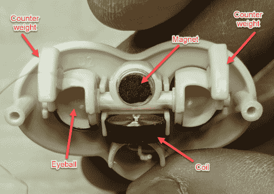

# 指弹开膛供你娱乐

> 原文：<https://hackaday.com/2017/12/28/fingerling-disemboweled-for-your-entertainment/>

由于这篇文章的图片性质，小孩和老人可能想离开房间。这个假期最热门的玩具之一已经像鱼一样被掏空了，这样我们可以更好地了解它存在的本质。或者仅仅是 WowWee 的工匠们设法把什么样的传感器和马达塞进一个建议零售价只有 15 美元的“机器人”里。

[【Josh Levine】在他的博客](https://wp.josh.com/2017/12/26/fingerlings-fart-monkey-autopsy/)上毫不留情地将一只小猴子撕成碎片，并指出一些有趣的设计决策。虽然玩具的一些元素相当聪明，但在小鱼体内也有一些令人挠头的东西。有趣的是，我们看到了一个决策过程的最终结果，这个决策过程不得不在这样一个玩具相对艰苦的生活和日益重要的生产成本之间取得平衡。

 这种眼睑是经过精心设计的，通过给嵌在塑料中的磁铁下的线圈充电来操作。在没有单独的马达或变速箱的情况下打开和关闭眼睑不仅更容易且更便宜，而且防止了如果儿童试图强行睁开眼睛或以其他方式操纵该机构而造成损害的可能性。

其他节省成本的措施包括使用箔带作为电容传感器，以及使用简单的球填充倾斜传感器来检测方向，而不是昂贵的加速度计。

有趣的是，相比之下，玩具的其他部分似乎过于复杂。凸轮和限位开关用于检测指鱼的头部何时转到最大角度，而简单地检测电机失速电流会更便宜、更容易。

[如果你有兴趣看看是什么让流行玩具滴答作响](https://hackaday.com/2009/11/07/mindflex-teardown/)，我们有[数量的玩具拆除](https://hackaday.com/2015/11/24/hello-barbie-records-your-children/)，这些[一定会让你满足](https://hackaday.com/2011/11/09/reverse-engineering-mykeepon/)，直到下一个大型节日玩具到来。

 [https://www.youtube.com/embed/RIAVKKzOocc?version=3&rel=1&showsearch=0&showinfo=1&iv_load_policy=1&fs=1&hl=en-US&autohide=2&wmode=transparent](https://www.youtube.com/embed/RIAVKKzOocc?version=3&rel=1&showsearch=0&showinfo=1&iv_load_policy=1&fs=1&hl=en-US&autohide=2&wmode=transparent)

