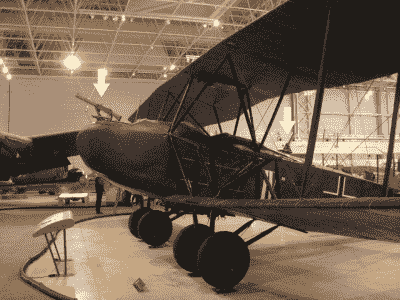
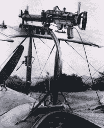
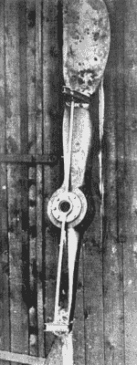
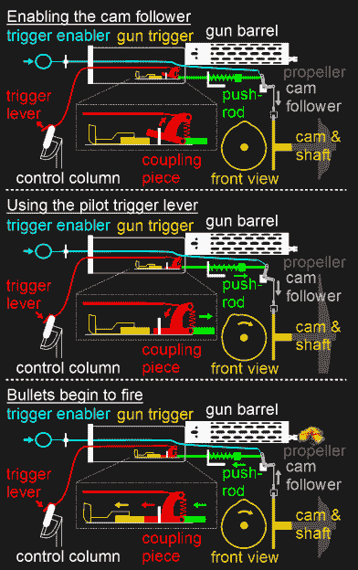
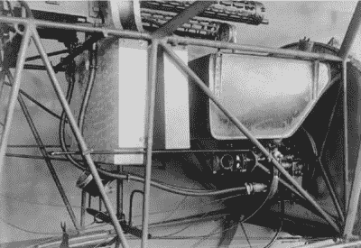

# 通过螺旋桨发射子弹

> 原文：<https://hackaday.com/2018/04/25/firing-bullets-through-propellers/>

早期的空降战斗更像是驾车射击，因为飞行员使用手持武器向其他飞机开火。谁能增强火力和精确度，谁就能占上风，所以飞机上增加了机枪。但这肯定不仅仅是把一个螺栓固定在底盘上那么简单。

那是在第一次世界大战期间，时间跨度从 1914 年到 1918 年，可控飞机在 T1 之前仅仅 11 年就被发明了。大多数飞机仍然使用木制框架，织物覆盖的机翼和外部电缆支撑。工程师们变得相当有创造力，甚至找到了让子弹穿过木制螺旋桨叶片的方法，同时又不至于把它们撕成碎片。

## 早期空战

AEG G.IV bomber with two gunner positions. Image source: [CASM](https://ingeniumcanada.org/aviation/index.php)

战争开始时，空战包括飞行员用手持手枪或步枪互相射击，甚至抛出绳子缠住敌人的螺旋桨。手枪不准确，步枪击中关键部件的几率很小。飞行员既要驾驶飞机，又要同时发射武器，这些都不是很有效。

直到 1914 年下半年机枪开始使用，空战才真正开始。一些更大的飞机确实搭载了专门的炮手，比如图中的德国 AEG G.IV 轰炸机，但是专门的战斗机只搭载了飞行员。

你可能会问，为什么不在机翼上安装前向机枪？在第一次世界大战期间，机翼使用电缆支撑，不像机身那样提供刚性的安装位置，导致振动，降低了精确度。此外，由于火炮距离太远，飞行员无法清除堵塞或重新装弹。尽管后来有了多机组人员轰炸机，机械师们确实经常冒险到机翼上进行维护。

## 在螺旋桨上方开火

对于双翼飞机，上翼提供了一个位置来安装一个面向前方的机枪，它将在螺旋桨上方开火。由于在机翼上而不是机身上，它确实因振动而失去了准确性。但是它允许飞行员同时驾驶飞机和开枪。这里展示的英国福斯特装裱就是这样一个例子。

机枪安装在一个弯曲的轨道上，这样飞行员就可以把它拉下来清除任何堵塞和重新装弹。然后，它可以通过弹簧和橡皮筋的组合升起来。

飞行员发现他们也可以用枪沿着栏杆发射，这样它就指向上方。这使得他们可以从下方和后方向敌人射击。

## 偏转射向推进器的子弹

最有效和首选的单飞行员战斗机机枪安装在飞行员前面的机身上，那里振动最小。飞行员可以用同样的动作驾驶飞机和瞄准火炮，还可以清除堵塞和装弹。然而，有一个小问题，有一个螺旋桨的方式。在飞行中切掉木质叶片的末端是不行的。令人惊讶的是，第一个解决方案根本不是真正的解决方案，而更像是一个拼凑起来的变通办法。

一种至少能最小化螺旋桨损坏的方法是在叶片背面安装一个钢楔，与子弹飞行的方向一致。任何击中它的子弹都被偏转到一边。这里显示的是一个螺旋桨与楔安装在正确的径向距离中心和拉杆支撑。这个是罗兰加洛斯在 1915 年 4 月使用的，作为同步方法的备份，我将在下面详细讨论。虽然他打中了几个猎物，但由于发动机故障，他被迫着陆，这可能是由于子弹击中偏导器导致发动机曲轴紧张造成的。

但是除了给引擎带来压力之外，导流板还引发了另一个问题。螺旋桨叶片通常由层压木材制成，尽管冲击被钢制偏转器偏转，但仍会导致胶水变弱，各层分离。因此，最好避免撞击螺旋桨。

## 通过螺旋桨点火:引擎真的扣动了扳机

同步是避免子弹击中螺旋桨的答案。最早发明的机械装置之一是福克·斯坦根斯特鲁恩齿轮。它用传动轴上的凸轮推动一根推动枪扳机的杆。

凸轮被调整到只有子弹路径畅通时才开火。当然，枪不应该在每次引擎转动时开火，所以有一个扳机杆，飞行员必须按下它作为开火机制的最后一部分。下面一个博物馆展览的视频展示了这种机制的作用，但也有一些微妙之处，下面的图表可以解释清楚。

**启用凸轮从动件:**该系统包括一个使能机构，该机构断开凸轮从动件以最小化磨损。到了战斗时间，飞行员向前推动触发装置，降低凸轮从动件，使其接触凸轮。请注意，在这一点上，飞行员没有按下扳机杆，因此连接件保持向上枢转。只要连接件向上枢转，推杆和连接件就被阻止推动枪扳机。

**使用飞行员扳机杆:**当飞行员想要开枪时，他推动扳机杆，扳机杆向下转动连接件。请注意，根据凸轮旋转的位置，枪扳机可能位于连接件向下枢转的路径上(如第一张图所示)。但是在凸轮旋转的某个点，推杆将会在推进器的方向上拉动耦合件足够远，使得耦合件可以向下枢转。但是枪还没有发射。

**子弹开始开火:**在螺旋桨转动过程中，枪只在一个点开火:凸轮上的凸起在凸轮从动件下面的时候。当凸起向上推动凸轮从动件时，凸轮从动件将推杆推向飞行员，进而推动耦合件，耦合件推动枪扳机，枪扳机在枪中发射一发子弹。凸轮的排列确保子弹从螺旋桨叶片之间穿过。

下面的视频展示了一架德国单座福克 E 型单翼飞机的同步装置。这是来自加拿大航空航天博物馆的一个展览，模拟了上述所有行动，并展示了战斗结束后如何恢复到非战斗状态。

 [https://www.youtube.com/embed/faZiS1CYZs0?version=3&rel=1&showsearch=0&showinfo=1&iv_load_policy=1&fs=1&hl=en-US&autohide=2&start=15&wmode=transparent](https://www.youtube.com/embed/faZiS1CYZs0?version=3&rel=1&showsearch=0&showinfo=1&iv_load_policy=1&fs=1&hl=en-US&autohide=2&start=15&wmode=transparent)

## 推进器和机枪同步的困难

同步器有一些困难，正如你所期望的任何机械系统在如此高的振荡率下运行。

金属棒中的温度变化引起热膨胀，这导致它们的长度变化。在如此紧迫的时间要求下，子弹迟早会击中螺旋桨叶片。

螺旋桨速度在飞行过程中也有变化。虽然你可能认为这无关紧要，因为凸轮以与螺旋桨相同的速度旋转，但枪的发射需要的时间长度与螺旋桨速度无关。对于初速较低的枪支，甚至子弹必须行进的距离也是一个问题，并且当行进距离足够大时。在一些系统中，飞行员必须盯着显示发动机转速的转速表，以知道何时可以安全开火。

如果上述所有问题都可以解决，许多制造同步器的尝试仍然失败，因为许多枪的制造都不可靠。甚至子弹制造商的不准确性也意味着一些子弹会在错误的时间发射，击中螺旋桨叶片。

## 其他同步器

The pipes with drive shafts in the Zentralsteuerung system

在战争期间，许多同步器设计被开发出来，其中一些引入了改进。德国的 Fokker Zentralsteuerung 齿轮去掉了凸轮和推杆，取而代之的是将一根柔性驱动轴连接到发动机的凸轮轴上。这就把旋转带到了枪本身。

定时调整现在可以在枪上完成，而不是在传动轴上的单个凸轮上。这在使用多门火炮以最大化击中敌机关键部位的机会时特别有用。每个枪都有一个单独的柔性驱动轴。由于每支枪的定时略有不同，这意味着每支枪都可以单独调整。此外，如果一把枪失灵，其他的还能工作。

还有其他与推进器位置同步的方法是电动的，使用推进器轴周围的触点来激活枪扳机处的螺线管，以及[液压](https://en.wikipedia.org/wiki/Synchronization_gear#The_Constantinesco_synchronization_gear)。黑客的现代实现当然会使用微控制器和气枪。

## 同步器的终结

许多事情导致了同步器的终结。其中一个原因是飞机速度的增加使得它们更难以同步器的射速击落。更强大的轰炸机在步枪口径的机枪无法穿透的重要区域使用更重的装甲。从钢索支撑机翼到更坚硬的悬臂机翼的转变意味着火炮可以安装在机翼上。当然，喷气发动机的最终引入意味着不再有螺旋桨可以发射。最后的同步炮在 20 世纪 50 年代初的朝鲜战争中使用。