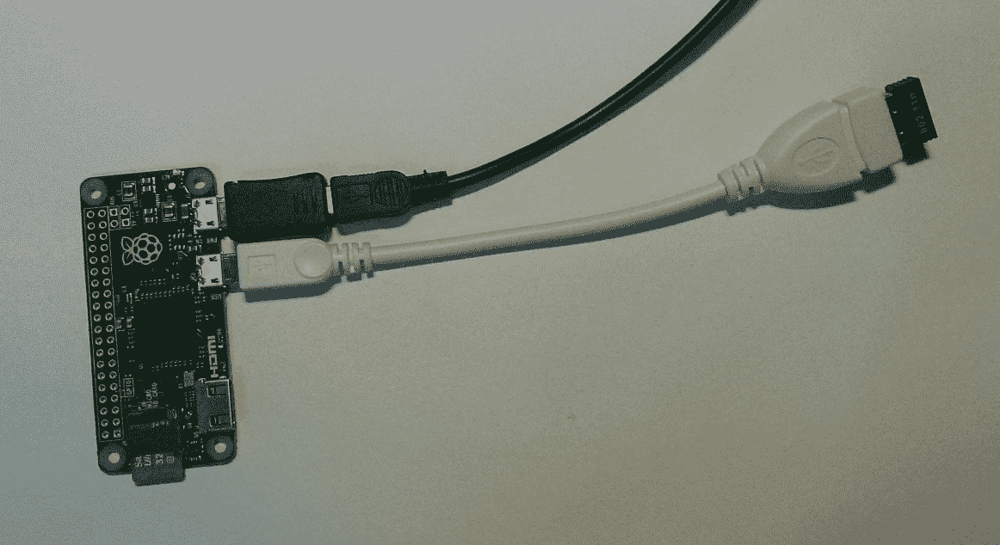
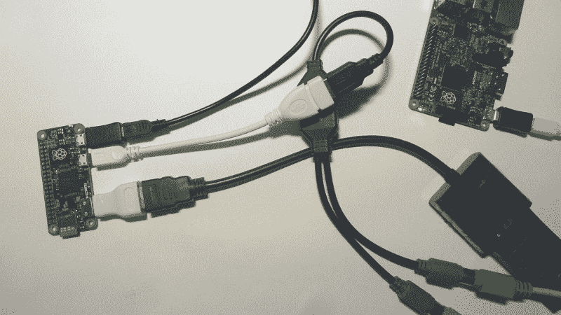
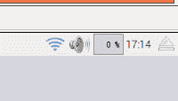

# 点燃一个树莓派零度

> 原文：<https://hackaday.com/2015/12/23/firing-up-a-pi-zero/>

他们刚发布的时候，我就在他们的启动包里订购了一个树莓派 Zero。我的工作台上已经有一些大于零的 Pis (GTZPi ),所以我的购买是出于好奇，而不是必要。不急着送货，它终于来了，我终于有时间去看它了。我与圆周率家族的交往始于圆周率 B+以及之后不久的圆周率 2。他们之间的速度差异是显而易见的，所以我决定潜水，并进一步测试零的性能。

# 首次尝试



Pi Zero with WiFi dongle on USB OTG

第一个零黑客只是使用了 GTZPi 中现有的 SD 卡，所以我尝试了一下。我用 WiFi 加密狗将 USB On the Go (OTG)电缆和 mini-HDMI 端口连接到我的键盘-视频-显示器(KVM)开关。通电后，活动 LED 亮起…然后闪烁八次，稳定闪烁八次，重复该模式。很明显，出了问题。互联网来拯救我们！

闪烁的 LED 意味着 Zero 无法读取 SD 卡上的文件系统。进一步的搜索建议在 GTZPi 上运行 SD 卡时更新它，我这样做了。这些命令是更新 Linux 系统的标准:

```
sudo apt-get update
sudo apt-get upgrade
sudo apt-get dist-upgrade

```

我把 SD 卡放回零位，结果闪了八次。好了，该创建新的 SD 卡了。

# 第二次尝试

我去 Pi 网站寻找 NOOB 的最新版本。这是我见过的最慢的 1 Gb 文件下载，但它最终完成了。我格式化了 SD 卡，解压缩了 NOOB 文件，并将结果目录复制到 SD 中。我将 OTG 上的 WiFi 转换器换成了 USB 转 PS2 键盘和鼠标电缆，然后再插入 KVM 电缆。



Pi Zero connected to KVM with Pi 2 in corner

Zero 启动，显示器显示 NOOB 设置屏幕，但鼠标和键盘都没有响应。我的 KVM 太旧了，有时 USB 到 PS2 电缆的组合并不总是被识别，需要重新启动。我关机再试一次。仍然没有成功，所以我看得更仔细了。

我有点脸红地发现，我把电源线和 OTG 线弄反了。如果你想知道如何通过 OTG 港口给 Zero 供电，我可以告诉你这是可行的。我不确定我会推荐这样做，除非你完全确定你只连接了一个电源。Pi 电源电路在 USB 电源输入端有一个阻塞二极管，用于防止电源冲突。标准 USB 端口和 GPIO 引脚没有该二极管。Pi 基金会建议在通过 GPIO 端口给 Pi 供电时[增加一个阻塞二极管](https://github.com/raspberrypi/hats/blob/master/backpowering-diagram.png)。

Adafruit 网站是零起点网站的一个很好的资源。这是我去检查哪个连接器是电源和哪个 OTG。是的，它被印在黑板上，但是房间有点暗，而且，嗯，我只是没有看到标签。在 Adafruit 的页面上，我重读了所有内容以唤起记忆，并发现了一个通知:

Raspbian 呼哧呼哧 5-15 或更早不支持零！试试杰西吧

唉！我应该早点看这里。有了正确版本的操作系统和正确连接的电缆，我终于获得了一些成功！！Zero 使用键盘、鼠标和显示器运行。

# WiFi？？

现在我需要让 WiFi 工作。我的工作台上有一个电源集线器，可以将 Arduinos 连接到我的台式机。我将 OTG 电缆连接到集线器的输入端，插上键盘、鼠标和 WiFi。零启动良好，并看到所有的 USB 设备。



Pi Zero GUI showing WiFi network icon

在 GUI 的右上角有一个网络图标。右击产生无线网络列表。点击我家网络的名称，会出现一个对话框，用于输入公共共享密钥(PSK)。那对我不起作用，因为我只使用 WEP 安全。我的路由器支持 WPA，但并不是家里所有的电话、笔记本电脑、电视等都可以处理它，所以我一直保持这个(不)安全级别。

我的记忆是 *wpa_gui* 是和 Raspbian 一起安装的，但要么是我的记忆有误，要么是他们在这个发行版中放弃了它。 *wpa_gui* 是一款让你设置 WiFi 的 gui 应用。没有 *wpa_gui* ，我无法通过 gui 使用 WiFi。我使用桌面浏览器搜索命令行设置，但是使用 Pi 2 似乎更容易。

我拿出一个 Pi 2，接上，插上专门做这个用的 100 英尺网线，从零开始弹出 SD 卡。它启动良好，比零快得多。随着网络的工作，我加载了 wpa GUI。当我在速度更快的网络上时，我运行更新和升级以获得最新的软件版本。没有太多变化。因为我想使用 RDP 通过网络访问 Zero，所以我也加载了 *xrdp* 。

```
sudo apt-get update
sudo apt-get upgrade
sudo apt-get install wpagui
sudo apt-get install xrdp
```

仍然在 Pi 2 上，我使用 *wpa_gui* 毫无麻烦地让 WiFi 工作，并使用 Pi 配置实用程序——它在*菜单|首选项*——将主机名改为 *pizero* ，以区别于我的其他 Pi。我有多达 3 个 pi 同时运行，所以它们需要不同的名字。

我还从我的桌面上设置并测试了 RDP 访问。我的桌面是 Ubuntu 14.04，所以我的 RDP 应用程序是 Remmina RDP。我复制了其他 Pi 连接中的一个，并将目标机器的名称改为 *pizero.local* 以使其全部工作。Pi 上的 *xrdp* 服务器不需要任何设置。


Pi Zero GUI via RDP running web browser

所有这些都在 Pi 2 上完成后，它又回到了零。这一切都与 KVM 和 WiFi 插入 USB 集线器的工作。

勇敢起来吧。我断开 USB 集线器和 HDMI 电缆，将 WiFi 加密狗放在 OTG 电缆上，然后通电。等了一会儿后，我尝试了 RDP 连接。再次成功！

此时，prudence 开始发挥作用，我保存了 SD 映像。

# 将喘息升级为杰西

零点所要求的 Raspbian 的分布叫做 Jessie。之前的版本，我试着用的那个，有点喘。你可能从在桌面上使用各种操作系统中知道，你可以将一个版本升级到另一个版本。所以我试了一下。

我回到 Pi 2 上的那张呼哧呼哧的 SD 卡，运行以下命令:

```
# remove packages of really large size
sudo apt-get  remove --remove wolfram-engine
sudo apt-get remove --remove libreoffice*

# update to the latest Wheezy and clean out debris
sudo apt-get update -y
sudo apt-get upgrade -y
sudo apt-get dist-upgrade -y
sudo apt-get clean
sudo apt-get autoremove

# change the distribution from wheezy to jessie
sudo sed -i /deb/s/wheezy/jessie/g /etc/apt/sources.list
sudo sed -i /deb/s/wheezy/jessie/g /etc/apt/sources.list.d/*.list

# get the jessie version of everything
sudo apt-get update -y
sudo apt-get upgrade -y
sudo apt-get dist-upgrade -y
sudo reboot

```

这个过程花了很长时间。你不能走开，因为自始至终都有提示需要回答。你能做的最好的事情就是做点别的事情，关注 Pi 的活动 LED。只要它在闪烁，这个过程就在工作。如果没有，它在提示符下等待。

它最终完成并运行。仍然没有零的运气。它在 LED 上产生同样的 8 次闪烁。

我还没有在 Pi 2 上运行很长时间，所以不能向你保证这是对 Jessie 的可靠升级。尝试这样做的原因是，有许多安装需要一段时间才能在全新安装上复制——Eclipse、Robot Operating System (ROS)、OpenCV。我可能不希望它们在零上——可能在 ROS 上——但这是一个尝试发行版升级的好借口，因为当我升级到 Jessie 时，我希望它们在 Pi 上。

在为 Zero 安装了新的 Raspbian Jessie 并尝试在 Pi 2 上升级后，我现在知道在 Zero 或 Pi 2 上处理一个严肃的项目时该做什么了。我对升级感到不舒服，可能不会走那条路。我的下一步是将 Jessie Lite 版本放在 Zero 上，并设置从我的桌面到那个系统的交叉编译能力。

零是圆周率家族的一个很好的补充。虽然比它的兄弟姐妹慢，但差别不是很大。例如，图形用户界面不够简洁，但是可用性很差。作为一个嵌入式控制器，它肯定是非常有用的，尤其是考虑到它的成本仅为 5.00 美元。