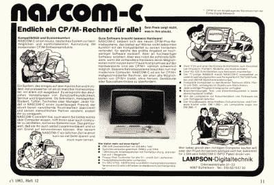
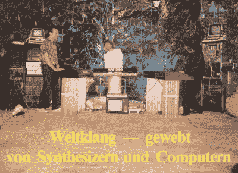

# 德国计算机杂志的第一版是来自过去的一个爆炸

> 原文：<https://hackaday.com/2015/12/19/first-edition-of-german-computer-mag-is-a-blast-from-the-past/>

我们偶尔会怀念过去的计算机时代。在这里，我们开始怀念甚至不属于我们自己的过去，但可能会给所有德国黑客带来一丝微笑。《c't magazine》第一期在他们的网站上发布(PDF，via FTP) ，即使你一个德语单词都看不懂，也值得一试。

 日期是 1983 年 11 月/12 月，你肯定是在这里跳上 [WABAC 机](https://en.wikipedia.org/wiki/WABAC_machine)。封面图片是一个鼓励你为自己建造的终端电脑项目，杂志上充斥着那些典型的早期电脑时代的广告，其中许多是为你制造这样一个设备所需的物理键盘。后来，c 't .提供了一个完整的带绘图仪的 DIY 电脑的计划，其中一个我们在 2015 年柏林老式电脑节上看到还在运行。

这期杂志充满了代码，你可以在家里自己的电脑上输入。如果你没有电脑，当然有当时所有流行机型的评论；TRS-80 型号 100 获得高分。如果你需要购买一个基本的解释器，有一篇文章比较了微软的 MBASIC 和 CBM 的 CBASIC。皇家战役！

 其他热门话题包括让 ZX81 的视频输出更清晰的修改，必须将编码加密狗插入电脑才能运行某些软件的麻烦(早期的反盗版方法)，甚至还有一个电脑音乐乐队，他们的 groovy 武库中(至少)有一个 Commodore 64 和一个 CBM 机。

众所周知，我们喜欢旧电脑及其相关杂志。无论您喜欢 PDP-11 的[物理](http://hackaday.com/2015/04/08/restoring-a-vintage-pdp-1104-computer/)还是[虚拟](http://hackaday.com/2015/12/05/experiences-in-developing-an-electronics-kit/)，我们都能满足您的需求。如果你的怀旧倾向于英语，看看[这个字节杂志封面的重拍。](http://hackaday.com/2015/11/26/byte-magazine-nostalgia-photo/)